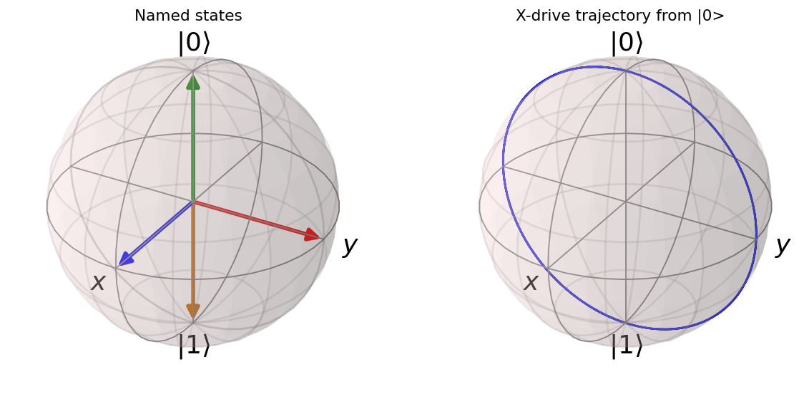

# Qubit states and the Bloch sphere

Theory: [chapter](../../tutorial/07-single-qubit-gates.md)

## What you simulate

A single qubit lives in a two dimensional Hilbert space. Every pure state can
be drawn as a point on the surface of the Bloch sphere, and the three Pauli
operators are the measurement axes of that sphere. In this lab you build the
computational basis states and two superpositions, read off their Bloch
vectors as Pauli expectation values, plot them on a sphere, and then apply a
coherent X drive to watch the qubit oscillate from the ground state toward the
excited state. Everything runs in QuTiP with no hardware involved.

## Run it

```bash
pip install qutip matplotlib numpy scipy
python bloch.py
```

The script prints the expectation values and the Rabi checkpoints, then opens
two interactive Bloch spheres and saves a copy under `figures/bloch.png`.

## The code explained

**States and operators.** We use the convention `|0> = basis(2, 0)` (ground)
and `|1> = basis(2, 1)` (excited). The superpositions `(|0>+|1>)/sqrt(2)` and
`(|0>+i|1>)/sqrt(2)` are built with `.unit()` to guarantee normalisation. The
Pauli operators come from `sigmax()`, `sigmay()`, `sigmaz()`.

```python
ket0 = basis(2, 0)
ket1 = basis(2, 1)
plus   = (ket0 + ket1).unit()
plus_i = (ket0 + 1j * ket1).unit()
```

**Bloch vector by expectation value.** For a pure state the triple
`(<sx>, <sy>, <sz>)` is exactly the Bloch vector. We compute it with
`expect(...)` for each named state and print it, then drop each state onto a
`Bloch()` sphere with `add_states`.

**Coherent X drive.** The Hamiltonian `H = (Omega/2) * sigmax` rotates the
state about the x axis. Starting from `|0>`, `sesolve` integrates the
Schrodinger equation and returns the three expectation values over time. The
drive strength is written as `2*pi*(MHz)` and time in microseconds, so the
predicted pi pulse time is `pi/Omega`.

```python
Omega  = 2 * np.pi * 5.0
H      = 0.5 * Omega * sigmax()
result = sesolve(H, ket0, tlist, e_ops=[sigmax(), sigmay(), sigmaz()])
```

**Trajectory plot.** The resulting `<sx>, <sy>, <sz>` arrays are added to a
second sphere with `add_points(..., meth="l")` so the path appears as a curve
sweeping through the y and z axes.

## Expected output

The first block prints the Bloch vector of each named state. You should see
`|0>` at `<sz>=+1`, `|1>` at `<sz>=-1`, the plus state at `<sx>=+1`, and the
plus_i state at `<sy>=+1`, with the other components near zero. The second
block reports the drive strength, the predicted pi pulse time, `<sz>` starting
at `+1`, and the minimum `<sz>` over the sweep approaching `-1` as the
population flips from ground to excited.



The left sphere shows the four named states as points; the right sphere shows
the X drive carrying the state from the north pole down through the equator.

## Try this

1. Change `Omega` to `2 * np.pi * 10.0` and confirm the pi pulse time halves
   and the qubit completes more oscillations within the same `tlist`.
2. Import `mesolve` and `destroy`, then swap `sesolve` for `mesolve` with
   `c_ops=[np.sqrt(2.0) * destroy(2)]` to add relaxation. Under the continuous
   X drive the trajectory spirals inward toward the driven steady state; if you
   turn the drive off afterward, relaxation carries it to `|0>`.
