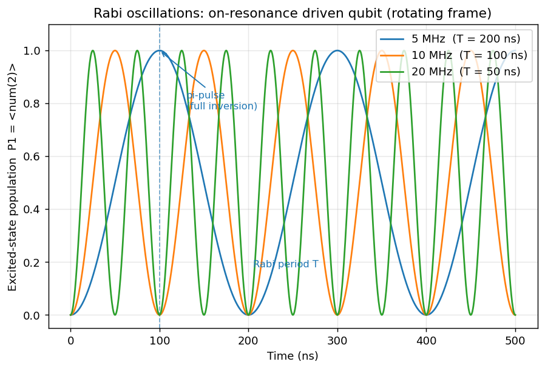

# Rabi oscillations

Theory: [chapter](../../tutorial/07-single-qubit-gates.md)

## What you simulate

A single qubit driven on resonance, viewed in the rotating frame. There the
drive reduces to a time-independent Hamiltonian

    H = (Omega / 2) * sigmax

with Omega the Rabi frequency. Starting from the ground state |0>, the
excited-state population follows P1(t) = sin^2(Omega t / 2): it cycles with the
Rabi period T = 2*pi / Omega and reaches full inversion at the pi-pulse time
t = pi / Omega. You run three drive amplitudes to confirm that the Rabi
frequency grows linearly with Omega.

Convention used throughout: |0> = basis(2, 0) is the ground state, |1> =
basis(2, 1) is the excited state, and num(2) = |1><1| reads out the excited
population directly.

## Run it

    pip install qutip matplotlib numpy scipy
    python rabi.py

## The code explained

Set up the static rotating-frame Hamiltonian and the initial ground state. The
operator num(2) is the excited-state projector, so its expectation value is P1.

    H = 0.5 * Omega * sigmax()
    psi0 = basis(2, 0)
    P1_op = num(2)

Evolve the closed system with the Schroedinger solver sesolve over a time grid
in microseconds, asking directly for the expectation value of P1.

    result = sesolve(H, psi0, tlist, e_ops=[P1_op])
    P1 = result.expect[0]

For each drive we compute the analytic Rabi period T = 2*pi/Omega and pi-pulse
time pi/Omega, and we extract the Rabi frequency back out of the simulated
trace by finding the first time P1 crosses 0.5 (a quarter period). Looping over
three amplitudes overlays three traces on one plot.

The figure is written to figures/rabi.png next to the script, then shown
interactively.

## Expected output

The script prints, for each drive (5, 10, 20 MHz), the angular drive strength
Omega in rad/us, the analytic Rabi frequency, the Rabi frequency extracted from
the simulated curve (these match), and the Rabi period and pi-pulse time in
nanoseconds. Doubling Omega halves the period and the pi-pulse time and doubles
the frequency, confirming the linear scaling. For example the 10 MHz drive gives
a Rabi period of 100 ns and a pi-pulse at 50 ns.

The plot shows three sinusoidal population curves; faster drives oscillate more
rapidly, with the pi-pulse (full inversion) and Rabi period annotated for the
slowest trace.

## Try this

1. Add a detuning term by using H = 0.5 * Omega * sigmax() + 0.5 * Delta *
   sigmaz() with Delta != 0. Watch the oscillation speed up (effective Rabi
   frequency sqrt(Omega^2 + Delta^2)) and the population stop reaching 1.
2. Switch to an open system: replace sesolve with mesolve and pass
   collapse operators c_ops=[np.sqrt(gamma) * destroy(2)] for relaxation. The
   Rabi oscillations should now decay toward a steady state as gamma grows.
