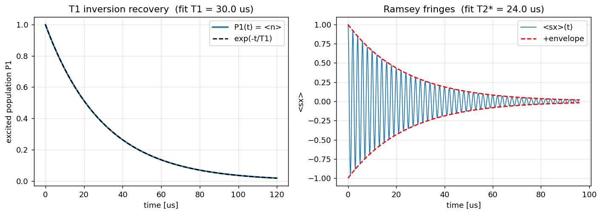

# T1 relaxation and T2 dephasing

Theory: [chapter](../../tutorial/09-coherence-noise.md)

A real qubit is never perfectly isolated. Two processes erode its quantum
information: energy **relaxation** (the excited state leaks energy into its
environment and falls to the ground state, characterised by T1) and **dephasing**
(random fluctuations scramble the relative phase of a superposition,
characterised by Tphi). The transverse coherence time T2 combines both.

## What you simulate

Using the Lindblad master equation (`mesolve`) on a single qubit, you reproduce
the two textbook experiments:

1. **T1 inversion recovery.** Prepare the excited state `|1>`, attach the
   relaxation collapse operator `sqrt(1/T1) * destroy(2)`, and watch the excited
   population `P1(t)` decay as `exp(-t/T1)`.
2. **Ramsey with pure dephasing.** Prepare `(|0> + |1>)/sqrt(2)`, add a small
   detuning so `<sx>` oscillates, and include both relaxation and pure dephasing
   collapse operators. The fringes decay under an envelope set by T2*.

You then numerically verify the coherence relation `1/T2 = 1/(2*T1) + 1/Tphi`.

## Run it

```bash
pip install qutip matplotlib numpy scipy
python t1_t2.py
```

## The code explained

**Operators and the basis convention.** We fix `|0> = basis(2,0)` (ground) and
`|1> = basis(2,1)` (excited). The relaxation operator is `destroy(2)`, which
sends `|1> -> |0>`. This choice is load-bearing: using `sigmam()` instead would
act the wrong way on this basis and the excited population would not decay.

```python
a = destroy(2)                       # lowering operator |1> -> |0>
c_ops_T1 = [np.sqrt(1.0 / T1) * a]   # one relaxation channel
res_T1 = mesolve(0 * sz, basis(2, 1), t1_times, c_ops_T1, e_ops=[a.dag() * a])
```

**T1 fit.** Because `P1(t) = exp(-t/T1)`, a straight-line fit to `log(P1)`
recovers T1 from its slope.

**Ramsey and dephasing.** A detuning Hamiltonian `0.5 * detuning * sz` drives the
oscillation, while two collapse operators set the decay. Relaxation contributes
`1/(2*T1)` and pure dephasing `sqrt(1/(2*Tphi)) * sigmaz()` contributes `1/Tphi`
to the transverse rate.

```python
H = 0.5 * detuning * sz
c_ops_T2 = [np.sqrt(1.0 / T1) * a,
            np.sqrt(1.0 / (2.0 * Tphi)) * sz]
res_T2 = mesolve(H, psi_plus, t2_times, c_ops_T2, e_ops=[sigmax()])
```

**Envelope fit and consistency check.** We pick the local maxima of `|<sx>|` as
samples of the decay envelope, fit `log` of those peaks to get T2*, and compare
`1/T2*` against `1/(2*T1) + 1/Tphi`.

## Expected output

The script prints the input vs fitted T1 (they agree to a fraction of a
percent), the predicted vs fitted T2*, and the consistency check. With the
default parameters (T1 = 30 us, Tphi = 40 us) you get T2 = 24 us, and the
measured `1/T2` matches `1/(2*T1) + 1/Tphi` to within about 0.1 percent:

```
=== T1 relaxation ===
  input  T1            = 30.00 us
  fitted T1            = 30.00 us
=== T2 Ramsey (dephasing) ===
  predicted T2         = 24.00 us
  fitted    T2*        = 23.99 us
=== Consistency: 1/T2 = 1/(2 T1) + 1/Tphi ===
  relative error       = 0.05 %
```

The left panel shows the T1 population decay with the `exp(-t/T1)` reference; the
right panel shows the Ramsey fringes hugging their decaying envelope.



## Try this

1. **Dephasing-limited vs relaxation-limited.** Set `Tphi = 5.0` (much shorter
   than `2*T1`) and rerun. T2* should collapse toward `Tphi`, showing that fast
   dephasing dominates the coherence budget.
2. **Spin echo intuition.** Increase `detuning` to `2*np.pi*2.0` and watch the
   fringes get denser while the envelope is unchanged: the decay time depends on
   the noise, not on the detuning you choose to read it out with.
