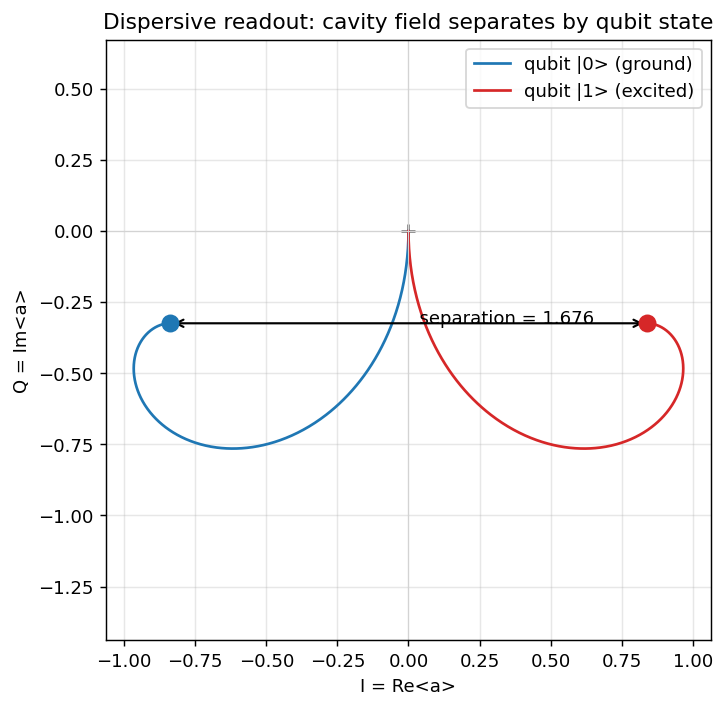

# Dispersive readout (qubit-state-dependent cavity)

Theory: [chapter](../../tutorial/06-readout.md)

## What you simulate

A qubit coupled to a microwave cavity in the **dispersive regime**, where the
interaction reduces to `chi * sigmaz * a.dag() * a`. The cavity frequency is
pulled one way when the qubit is in `|0>` and the other way when it is in `|1>`.
Driving the cavity therefore parks its steady-state coherent field `<a>` at two
distinct points in the IQ plane, one per qubit state. That separation is exactly
what a real readout chain measures to tell the qubit apart. The simulation drives
the cavity, lets it relax through `kappa`, and watches `<a>` settle for the qubit
prepared first in `|0>` and then in `|1>`.

## Run it

```bash
pip install qutip matplotlib numpy scipy
python dispersive.py
```

## The code explained

**Operators and Hamiltonian.** We build the joint qubit-and-cavity space with
`tensor`. The cavity lowering operator is `a = tensor(qeye(2), destroy(N))` with
`N ~ 20` Fock states, and `sz = tensor(sigmaz(), qeye(N))`. Working in the frame
rotating at the drive frequency, the Hamiltonian is a bare cavity detuning, the
dispersive pull, and a coherent drive:

```python
H = delta * a.dag() * a + chi * sz * a.dag() * a + drive * (a + a.dag())
```

We place the drive at the symmetric point (`delta = 0`) halfway between the two
qubit-pulled resonances, so each qubit state sees an effective cavity detuning of
`+chi` or `-chi` and the two fields are pushed to opposite sides of the IQ plane.

**Dissipation and initial states.** The cavity leaks photons at rate `kappa`, so
the single collapse operator is `c_op = sqrt(kappa) * a`. The qubit starts in
`|0> = basis(2, 0)` (ground) or `|1> = basis(2, 1)` (excited), with the cavity in
vacuum. Note the convention: `destroy(2)` is the qubit lowering operator that
sends `|1> -> |0>`.

**Solve and measure.** Two `mesolve` calls evolve each initial state while
tracking the expectation `<a>` through `e_ops=[a]`. Because `<a>` is complex, its
real part is the I quadrature and its imaginary part is the Q quadrature. We take
the last time point as the steady state and report the distance between the two
landing points.

**Plot.** The script traces both `<a>(t)` curves in the IQ plane, marks the two
steady-state points, and draws the separation arrow between them.

## Expected output

The script prints the chosen `chi`, `kappa`, and `drive`, then the steady-state
field for each qubit state as `(I, Q)` coordinates and their magnitudes `|<a>|`,
and finally the **IQ separation** between the two qubit states. With the default
parameters the two states land at mirror-image points near `I = +/-0.84`,
`Q = -0.32`, each with `|<a>|` about `0.90`, giving an IQ separation of roughly
`1.68`. A larger separation means the two states are easier to distinguish in a
single shot. Because the cavity settles on a timescale of about `1/kappa` (tens of
microseconds here), the time grid is run out to several cavity lifetimes so the
field truly reaches steady state.



The two trajectories spiral out from the origin (vacuum) and settle at mirror-image
points, the visual signature of the qubit-state-dependent cavity pull.

## Try this

1. **Sweep the dispersive shift.** Loop `chi` over a few values (for example
   `2*pi*[1, 5, 20]` MHz) and print the IQ separation for each. You will see the
   separation grow as `chi` increases relative to `kappa`, which is why a strong
   dispersive shift improves readout fidelity.

2. **Vary the drive strength.** Increase `drive` and watch the steady-state
   magnitudes `|<a>|` grow. More photons spread the two states farther apart, but
   try pushing `drive` high enough that you approach the `N = 20` Fock cutoff and
   confirm you need a larger `N` for the result to stay trustworthy.
