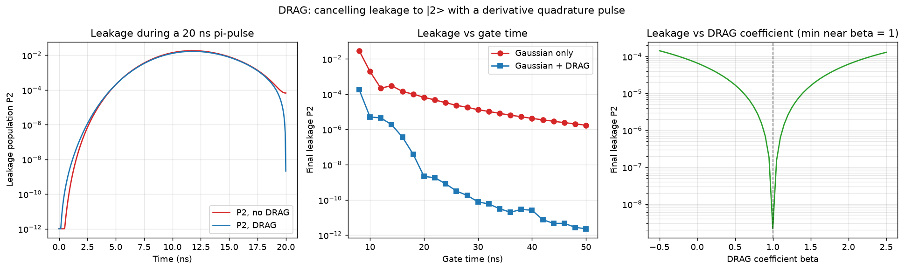

# Leakage and DRAG pulses

Theory: [chapter](../../tutorial/07-single-qubit-gates.md)

## What you simulate

A transmon is only approximately a two-level system: a third level |2> sits
one anharmonicity alpha (here -200 MHz) below where a harmonic ladder would
put it. A short pi-pulse has spectral width ~ 1/t_gate, so as gates get
faster the drive starts to excite |1> -> |2> and population leaks out of the
qubit subspace.

You drive a three-level transmon, in the frame rotating at the drive
frequency, with the Hamiltonian

    H(t) = alpha |2><2| + (Ox(t)/2) (a + adag) + (Oy(t)/2) i(adag - a)

using a Gaussian pi-pulse envelope Ox(t). The DRAG correction (Derivative
Removal by Adiabatic Gate) adds a quadrature envelope proportional to the
derivative of the main pulse,

    Oy(t) = -beta * dOx/dt / alpha ,

which cancels leakage to first order at beta = 1. You compare leakage with
and without DRAG, sweep the gate time, and scan beta to locate the optimum.

Convention: |0>, |1> are the qubit, |2> is the leakage level, alpha < 0 for a
transmon, and angular frequencies are in rad/us (2*pi x MHz), times in us.

## Run it

Run these commands from the **repository root**, using the environment from the [shared setup](../README.md).

    python -m pip install -r hands-on/requirements.txt
    python hands-on/05-drag-leakage/drag.py

## The code explained

The lowering operator a = destroy(3) automatically carries the sqrt(2)
matrix-element enhancement of the |1> -> |2> transition. The static part is
just the anharmonicity term, and the two drive quadratures enter as
time-dependent terms in QuTiP's list format:

    H = [H0, [Hx, Ox], [Hy, Oy]]

The Gaussian envelope is offset-subtracted so it starts and ends at exactly
zero, and its amplitude is normalized so the pulse area is pi. The DRAG
quadrature is the analytic derivative of the Gaussian scaled by -beta/alpha.
Each pulse is integrated with sesolve, recording the populations P0, P1, P2.

Three experiments run in sequence: one 20 ns pulse with beta = 0 and
beta = 1, a sweep of gate times from 8 to 50 ns, and a scan of beta from
-0.5 to 2.5 at fixed 20 ns.

## Expected output

    anharmonicity alpha/2pi =  -200.0 MHz
    gate time               =    20.0 ns, sigma = 5.0 ns
    peak Rabi rate  A/2pi   =    46.7 MHz
     no DRAG:  final P1 = 0.989863   final leakage P2 = 6.64e-05
        DRAG:  final P1 = 0.989504   final leakage P2 = 2.14e-09
    DRAG suppresses the final leakage by a factor of 31,035
    beta scan: leakage-optimal beta = 1.00 (first-order theory: 1)

Left panel: leakage P2 during the pulse, with DRAG several orders of
magnitude lower at the end. Middle: final leakage vs gate time; the plain
Gaussian deteriorates quickly below ~20 ns while DRAG stays far lower.
Right: leakage vs beta, with a sharp minimum at beta = 1, exactly where
first-order DRAG theory puts it.

Note that even with DRAG the final P1 is 0.9895, not 1: the strong drive
also shifts the qubit frequency via level |2> (an AC-Stark effect), leaving a
small coherent rotation/phase error that leakage-optimal DRAG does not fix.
Real calibrations handle it by fine-tuning the drive detuning and amplitude,
and beta itself is calibrated rather than set to its textbook value.

## Try this

1. Make the anharmonicity stronger (alpha = -300 MHz) or weaker (-100 MHz)
   and watch the leakage move: leakage scales roughly as (Omega_peak/alpha)^2.
2. Replace the Gaussian with a flat-top (square) pulse of the same area. Its
   sharp edges have a much broader spectrum, so leakage gets dramatically
   worse, and DRAG helps less.
3. Scan the drive detuning a few MHz around zero for beta = 1 and plot the
   final P1: you will find the small AC-Stark shift mentioned above and can
   recover P1 ~ 1 by driving slightly off resonance.
