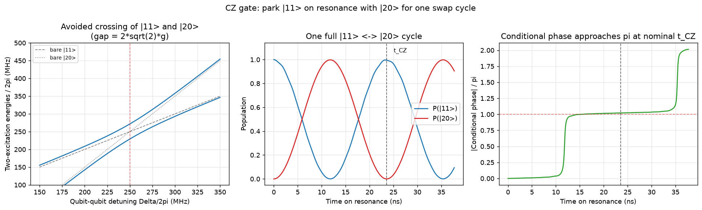

# A CZ gate from the |11> <-> |20> avoided crossing

Theory: [chapter](../../tutorial/08-two-qubit-gates.md)

## What you simulate

Two coupled three-level transmons. In the frame rotating at qubit 2's
frequency,

    H = Delta*n1 + (alpha1/2)*n1*(n1-1) + (alpha2/2)*n2*(n2-1)
        + g*(a*bdag + adag*b)

with Delta = omega1 - omega2 the detuning, alpha_i < 0 the anharmonicities,
and g the exchange coupling. The coupling conserves total excitation number,
so {|20>, |11>, |02>} form a closed two-excitation block.

The flux-tuned CZ gate in three steps:

1. The energies E11 = Delta and E20 = 2*Delta + alpha1 cross at
   Delta = -alpha1. There the states hybridize with an avoided-crossing gap
   2*sqrt(2)*g (the sqrt(2) is the |1> -> |2> matrix-element enhancement).
2. Sitting exactly on resonance for one full population cycle,
   t_CZ = pi/(sqrt(2)*g), sends |11> -> |20> -> |11>.
3. In the isolated two-state approximation, the round trip imprints a phase of pi on |11>: a controlled-Z, up to
   single-qubit phases that virtual-Z rotations absorb for free.

The conditional phase is computed frame-independently as
phi_c = phi_11 - phi_10 - phi_01 + phi_00 with phi_ij = arg <ij|psi_ij(t)>.

## Run it

Run these commands from the **repository root**, using the environment from the [shared setup](../README.md).

    python -m pip install -r hands-on/requirements.txt
    python hands-on/06-cz-gate/cz_gate.py

## The code explained

Tensor-product operators build the two-transmon Hamiltonian; `hamiltonian(D)`
returns it for any detuning. For the avoided-crossing panel the Hamiltonian
is projected onto the 3x3 two-excitation block and diagonalized as Delta is
swept from 150 to 350 MHz; the minimum numerical gap is compared against
2*sqrt(2)*g.

For the gate itself the system sits at Delta = -alpha1 and all four
computational states |00>, |01>, |10>, |11> are evolved with sesolve. The
|11> trace gives the population swap to |20> and back; the four phase traces
combine into the conditional phase. The full 9x9 propagator is also projected into the computational basis to report mean leakage and a Haar-averaged overlap with CZ after local phase correction. For projected propagator K and ideal target U, this overlap is (Tr(K†K) + |Tr(U†K)|²)/20. It counts leakage as failure and does not renormalize leaked states.

## Expected output

    coupling g/2pi            =   15.0 MHz
    resonance at Delta/2pi    =  250.0 MHz (= -alpha1)
    avoided-crossing gap: numerical  42.39 MHz at Delta/2pi = 251.0 MHz
                          theory     42.43 MHz (2*sqrt(2)*g)
    gate time t_CZ            =  23.57 ns  (pi / (sqrt(2)*g))
    at t_CZ:  P11 back to     = 0.9949
              residual P20    = 4.20e-06
              conditional phase = 3.2065 rad (target pi = 3.1416)
              mean computational leakage = 0.001264
              average CZ overlap after local Z correction = 0.997870

Left: the two-excitation energies vs detuning, with the bare |11> and |20>
lines crossing and the coupled branches avoiding each other by 2*sqrt(2)*g.
Middle: on resonance, the population leaves |11>, fully visits |20>, and
returns after t_CZ = 23.6 ns. Right: the conditional phase approaches pi near the nominal t_CZ. During substantial leakage, return-amplitude phases do not define a computational gate.

Why not exactly pi and exactly P11 = 1? Because the idealized two-level
picture ignores the spectators: |11> is also pushed by |02> (500 MHz away),
and |01> weakly mixes with |10> (250 MHz apart). These shift the phase by a
few percent, the same physics behind residual ZZ crosstalk. A real
calibration absorbs this by fine-tuning the interaction time and detuning.

## Try this

1. Double the coupling g. The gate gets twice as fast, but the leftover
   deviation of phi_c from pi grows: stronger coupling means stronger
   spectator shifts. This speed-vs-purity tension is why tunable couplers
   (Chapter 08) are popular.
2. Detune slightly off resonance (Delta = -alpha1 + 2*pi*5.0). The swap is no
   longer complete: P20 does not return to zero at t_CZ, i.e. leakage.
3. Track phi_c over several cycles (extend tlist to 5*t_cz): test whether odd
   multiples of t_CZ remain close to CZ. They are exact CZ points only in the isolated two-state approximation; spectator errors accumulate in this model.
