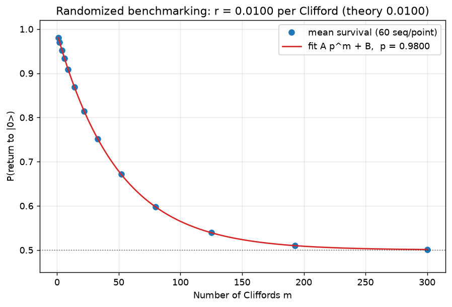

# Single-qubit randomized benchmarking

Theory: [chapter](../../tutorial/11-benchmarking.md)

## What you simulate

Randomized benchmarking (RB): the workhorse protocol for quoting an average
gate error that does not get confused by state-preparation and measurement
(SPAM) errors.

Each experiment applies m random Clifford gates, then the one recovery
Clifford that undoes the whole sequence, then asks for the probability of
being back in |0> (the survival). Averaged over random sequences, the
survival decays as

    F(m) = A * p**m + B

because random Cliffords "twirl" whatever noise the gates have into an
effective depolarizing channel. SPAM errors only rescale A and shift B; the
decay constant p belongs to the gates alone. The average error per Clifford
for a single qubit is

    r = (1 - p) / 2.

The noise in this lab is an explicit depolarizing channel of strength
lambda = 0.02 after every Clifford, which shrinks the Bloch vector by
(1 - lambda). Theory therefore predicts exactly p = 1 - lambda = 0.98 and
r = lambda/2 = 0.01, and the fit recovers both.

## Run it

    pip install qutip matplotlib numpy scipy
    python rb.py

(Only numpy, scipy, and matplotlib are actually used here; gates are plain
2x2 matrices.)

## The code explained

The 24-element single-qubit Clifford group is generated by closing {H, S}
under multiplication. Two unitaries are "the same gate" if they differ only
by a global phase, which for 2x2 unitaries is exactly the condition
|Tr(U^dag V)| = 2; that test powers both the group closure and the recovery
lookup.

`rb_sequence_survival(m)` starts from the density matrix |0><0|, applies m
random Cliffords each followed by `depolarize(rho, lambda)`, finds the
recovery Clifford as the group element matching the inverse of the
accumulated unitary, applies it (also noisily), and returns rho[0,0].
Sequence lengths are log-spaced from 1 to 300 with 60 random sequences each,
and scipy's curve_fit extracts (A, p, B).

## Expected output

    noise: depolarizing lambda = 0.02 after every Clifford
    Clifford group size        = 24
    fit:  F(m) = A p^m + B  ->  A = 0.490, p = 0.98000, B = 0.500
    decay constant p : fit 0.98000   vs theory 0.98000
    error/Clifford r : fit 0.01000   vs theory 0.01000

The survival decays exponentially from ~0.99 toward 0.5 (the fully
depolarized value), and the fit lands on the injected error exactly.

A subtlety worth noticing: with pure depolarizing noise every random
sequence gives the *same* survival, so the points have no scatter. Real
devices (and coherent errors, see below) do produce sequence-to-sequence
scatter, which is why real RB averages over many sequences.

## Try this

1. Add SPAM error: start from rho = 0.95*|0><0| + 0.05*|1><1| and/or corrupt
   the final measurement. A and B change; the fitted p (and hence r) does
   not. That robustness is the whole point of RB.
2. Add a coherent error: follow every Clifford with a small fixed rotation
   Rx(0.05) instead of (or on top of) the depolarizing channel. The decay
   stays exponential on average, but individual sequences now scatter around
   it, and the extracted r reflects the average infidelity of the
   over-rotation.
3. Interleaved RB: estimate the error of one specific gate G by inserting it
   after every random Clifford and comparing the new decay p_int with the
   reference p: r_G ~ (1 - p_int/p)/2.
