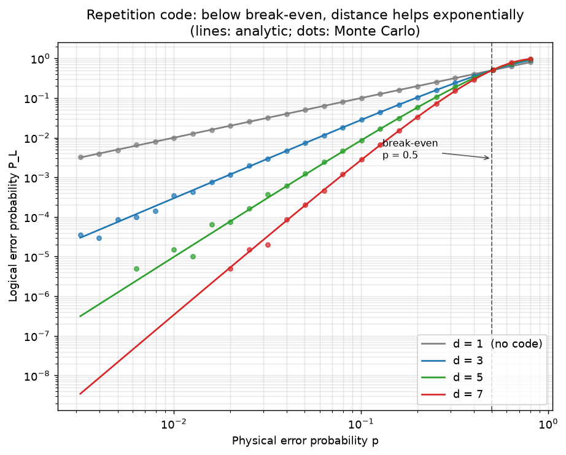

# The bit-flip repetition code

Theory: [chapter](../../tutorial/12-error-correction.md)

## What you simulate

The simplest error-correcting code, distilled to its statistical core: store
one logical bit in d physical qubits (|0_L> = |00...0>, |1_L> = |11...1>),
flip each physical qubit independently with probability p, and decode by
majority vote. Decoding fails only when more than half the qubits flip:

    P_L(d, p) = sum_{k > d/2} C(d, k) * p^k * (1-p)^(d-k)

which for d = 3 is the classic P_L = 3p^2 - 2p^3.

A Monte Carlo simulation (200,000 shots per point) is compared against this
analytic formula for d = 1, 3, 5, 7 across physical error rates from 0.3%
to 80%. Two lessons appear:

* Below break-even (p < 1/2), distance helps exponentially: each +2 of d
  buys another power of p in the logical error rate.
* Above break-even, redundancy actively hurts: the majority is more likely
  wrong than any single qubit. Correction only pays once the hardware is
  good enough, which is the origin of the threshold idea.

## Run it

    pip install qutip matplotlib numpy scipy
    python repetition.py

(Only numpy and matplotlib are actually used; the "quantum" part of the
story, stabilizers, syndromes, phase flips, lives in Chapter 12.)

## The code explained

`logical_error_analytic(d, p)` evaluates the binomial majority-vote sum with
exact combinatorics. `logical_error_montecarlo(d, p, shots)` draws a
(shots x d) array of uniform randoms, thresholds it at p to decide which
bits flipped, and counts the rows where flips form a majority, one line of
vectorized numpy per experiment.

The p = 1% table uses 2 million shots because a d = 7 logical error at that
rate happens roughly 3 times in 10 million tries; seeing (almost) nothing IS
the measurement.

## Expected output

    Logical error rate at p = 1% (analytic | Monte Carlo):
      d = 1:   1.000e-02  |  9.986e-03
      d = 3:   2.980e-04  |  2.940e-04
      d = 5:   9.851e-06  |  9.000e-06
      d = 7:   3.417e-07  | no events in 2e6 shots

On the log-log plot the Monte Carlo dots sit on the analytic curves, the
slopes steepen with distance (slope (d+1)/2), and every curve crosses the
uncoded d = 1 line at the break-even point p = 0.5.

Keep the caveats in mind: this toy model has one round of errors, perfect
syndrome measurement, and bit flips only. A phase flip on any single qubit
flips the logical phase of the quantum version, which is why real codes
(the surface code) must protect both quadratures at once — Chapter 12 picks
up exactly there.

## Try this

1. Change the decoder: instead of majority vote, always trust qubit 0 and
   ignore the rest. The logical error rate collapses back to p for every d.
   The redundancy is only as good as the decoding.
2. Add measurement noise: flip each qubit's *reported* value with
   probability q before the vote (without changing the true state). See how
   the curves lift and the effective threshold drops, a first taste of why
   real codes need repeated syndrome rounds.
3. Estimate the shot noise: rerun with a different seed and watch the
   scatter of the Monte Carlo points around the analytic line, largest
   where P_L * shots is a small count.
