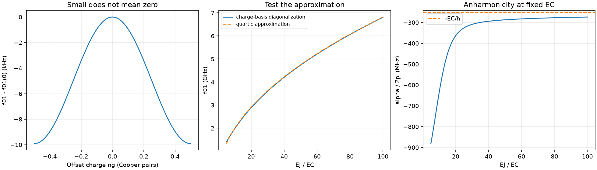

# Charge-basis transmon spectroscopy

Pairs with tutorial chapter(s) 03–04; see the [learning path](../../tutorial/learning-path.md) and [notation](../../tutorial/00-notation.md).

## Predict, then run

Construct the tridiagonal charge Hamiltonian, diagonalize it, and compare its transitions with the quartic approximation.

From the **repository root**, after the [shared setup](../README.md):

```bash
python hands-on/09-transmon-spectrum/transmon.py
python hands-on/run_labs.py 09 --check
```

The first command opens a plot. The second runs without a display and fails if a numerical checkpoint is violated. Both save the figure beside the script.

## Expected result

At EC/h = 250 MHz and EJ/EC = 50, expect f01 = 4.73548 GHz, alpha/2pi = -287.31 MHz and charge dispersion about 9.908 kHz. The leading estimates 4.75 GHz and -250 MHz are approximations, not exact answers.



## Experiment

Change EJ/EC from 50 to 20 and 80 at fixed EC. Compare absolute anharmonicity, relative anharmonicity, and charge dispersion. Increase the cutoff from 20 to 30: physical conclusions should not change.

Record your prediction, changed parameter, numerical result, and physical explanation. Edit one parameter at a time. The automated checks target the documented defaults; restore them before running the full verification suite.

## Model and numerical limits

The basis contains charge states -cutoff through +cutoff. The script checks all plotted offset charges against a larger basis. This is an isolated, static single-mode transmon; it has no drive or loss.
