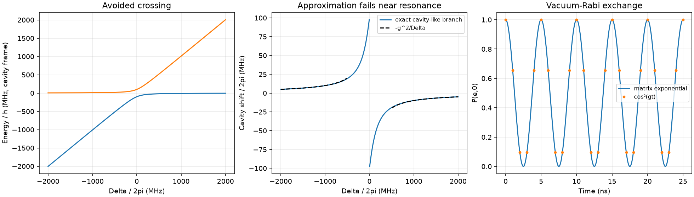

# From vacuum-Rabi exchange to the dispersive limit

Pairs with tutorial chapter(s) 05; see the [learning path](../../tutorial/learning-path.md) and [notation](../../tutorial/00-notation.md).

## Predict, then run

Diagonalize the exact two-state single-excitation block and evolve an excitation with a matrix exponential.

From the **repository root**, after the [shared setup](../README.md):

```bash
python hands-on/10-jaynes-cummings/jaynes_cummings.py
python hands-on/run_labs.py 10 --check
```

The first command opens a plot. The second runs without a display and fails if a numerical checkpoint is violated. Both save the figure beside the script.

## Expected result

For g/2pi = 100 MHz, the resonant splitting is 200 MHz and the full excitation swap takes 2.5 ns. At |Delta| >= 10g, the cavity-shift approximation differs by less than 1%.



## Experiment

Double g and predict the splitting and swap time before running. Reduce |Delta|/g and identify where the perturbative cavity shift becomes unreliable.

Record your prediction, changed parameter, numerical result, and physical explanation. Edit one parameter at a time. The automated checks target the documented defaults; restore them before running the full verification suite.

## Model and numerical limits

This is a two-level emitter in the rotating-wave approximation. It demonstrates -g^2/Delta for the ground-state cavity shift, not the multilevel transmon chi. The cavity-like branch changes identity at resonance; its branch-selected plot has a jump there.
