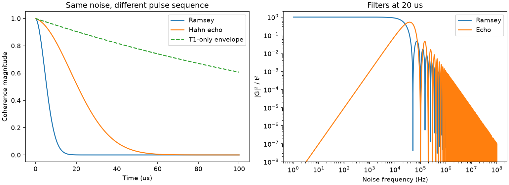

# Ramsey versus Hahn echo from a noise spectrum

Pairs with tutorial chapter(s) 09; see the [learning path](../../tutorial/learning-path.md) and [notation](../../tutorial/00-notation.md).

## Predict, then run

Integrate one explicitly defined one-sided frequency-noise PSD against Ramsey and echo filter functions, then include independent T1 relaxation.

From the **repository root**, after the [shared setup](../README.md):

```bash
python hands-on/11-noise-echo/echo.py
python hands-on/run_labs.py 11 --check
```

The first command opens a plot. The second runs without a display and fails if a numerical checkpoint is violated. Both save the figure beside the script.

## Expected result

The default grid gives approximately 6.75 us Ramsey and 25.50 us echo 1/e times. These are grid crossings of nonexponential envelopes, not fitted Markovian rates.



## Experiment

Raise the infrared cutoff from 1 Hz to 100 Hz: Ramsey should improve more than echo. Replace the PSD with a constant and use a sufficiently wide frequency interval: ideal echo should no longer substantially improve white-noise dephasing.

Record your prediction, changed parameter, numerical result, and physical explanation. Edit one parameter at a time. The automated checks target the documented defaults; restore them before running the full verification suite.

## Model and numerical limits

Frequency is in Hz, time in seconds, and S_f has units Hz^2/Hz. The cutoffs are part of the model. The script checks integration convergence and exact DC rejection. Pulses are instantaneous and perfect; the noise is classical, stationary and Gaussian.
