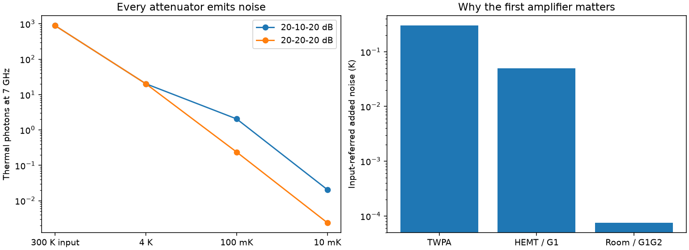

# Thermal photons and amplifier noise

Pairs with tutorial chapter(s) 10; see the [learning path](../../tutorial/learning-path.md) and [notation](../../tutorial/00-notation.md).

## Predict, then run

Propagate thermal occupation through each attenuator, including its emission, and refer amplifier-added noise back through preceding gains.

From the **repository root**, after the [shared setup](../README.md):

```bash
python hands-on/12-microwave-chain/chain.py
python hands-on/run_labs.py 12 --check
```

The first command opens a plot. The second runs without a display and fails if a numerical checkpoint is violated. Both save the figure beside the script.

## Expected result

At 7 GHz, the 20–10–20 dB chain gives n = 0.02055; the 20–20–20 dB chain gives n = 0.002379. The amplifier budget is 0.350075 K of added noise.



## Experiment

Move the middle attenuator from 100 mK to 4 K without changing total attenuation. Does the same total dB give the same noise? Then lower first-stage amplifier gain from 20 dB to 10 dB and recompute the budget.

Record your prediction, changed parameter, numerical result, and physical explanation. Edit one parameter at a time. The automated checks target the documented defaults; restore them before running the full verification suite.

## Model and numerical limits

Attenuators are matched and perfectly thermalized. This omits cable loss, amplifier saturation, pump leakage, and actual stage heat loads. Vacuum-normalized efficiency and phase-preserving SQL-normalized efficiency differ by two; both are printed explicitly.
