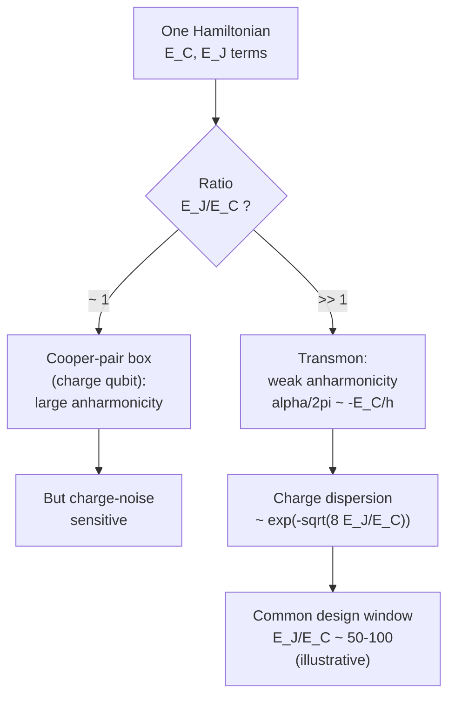
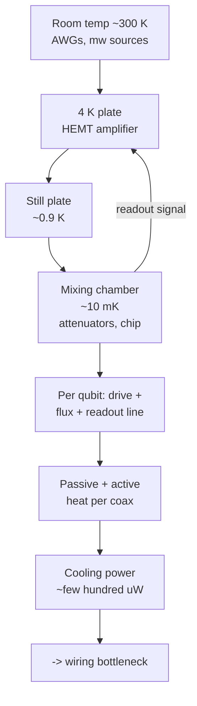

# 01 · Introduction: Why Superconducting Qubits

A qubit is just a quantum two-level system: something with two distinguishable states, $|0\rangle$ and $|1\rangle$, that you can put into superpositions and entangle with its neighbors. Nature gives us plenty of two-level systems for free, the spin of an electron, the polarization of a photon, two energy levels of a trapped ion. So why would anyone build a qubit out of a *circuit*, a lithographically patterned aluminum device on a millimeter-to-centimeter-scale chip cooled to a few millikelvin?

The short answer: because we get to design it. This chapter sets up the rest of the tutorial by explaining what makes superconducting circuits a compelling qubit platform, what makes them genuinely hard, and how to navigate the chapters that follow. We'll keep one question in the back of our minds the whole time: *which physical system do we pick, and what do we trade away to get it?*

## The rubric: DiVincenzo's five criteria

Before comparing platforms it helps to know what we're grading them against. In 2000, David DiVincenzo wrote down five requirements that any viable qubit technology must meet. They are the implicit backbone of this whole chapter, so let's name them:

1. **A scalable system of well-characterized qubits**: you can make many of them and you know each one's parameters.
2. **Initialization** to a known fiducial state (typically $|00\dots0\rangle$).
3. **Long decoherence** relative to the gate time, so you can run many operations before the quantum information leaks away.
4. **A universal gate set**: arbitrary single-qubit rotations plus at least one entangling two-qubit gate.
5. **Qubit-specific readout**: you can measure each qubit individually.

Every "strength" and every "hard problem" below maps onto one of these. Keep the list handy.

## The landscape of platforms

Roughly, the main contenders are trapped ions, neutral atoms, photonics, semiconductor spin qubits, and superconducting circuits. The deep trade-off across all of them is **coherence versus controllability**. Systems that nature hands you (atoms, ions) are pristine and identical, long coherence, but you control them with lasers and optics, which makes gates slow and the apparatus hard to multiply. Systems you build (circuits) are fast and easy to wire together but carry the scars of fabrication: lithographic disorder and coupling to a sea of microscopic loss.

| Platform | Qubit encoding | Gate time | $T_2$ | Key strength | Key challenge |
|---|---|---|---|---|---|
| Trapped ions | Internal/hyperfine states | $\sim$1-100 µs | $\sim$seconds | Pristine, all-to-all coupling | Slow, laser/optics scaling |
| Neutral atoms | Ground hyperfine/clock states; transient Rydberg excitation for gates | $\sim$0.1-1 µs | $\sim$seconds for storage | Reconfigurable arrays | Rydberg lifetime/gate fidelity, atom loss |
| Photonics | Polarization/path (flying) | $\sim$ns | transmission-limited | Natural for networking | Weak interactions, probabilistic gates |
| Spin qubits (Si) | Electron/nuclear spin | $\sim$ns-µs | µs-ms | CMOS-compatible, tiny | Individual control, uniformity |
| Superconducting | Transmon (charge/flux) | $\sim$10-50 ns | $\sim$100 µs | Engineerable, fast, lithographic | Coherence, wiring/heat |

*All numbers illustrative, order-of-magnitude, 2020s-era.*

Superconducting qubits sit in a distinctive spot: not the most coherent, but uniquely **engineerable and fast**. They are *artificial atoms*, macroscopic electrical circuits whose collective degrees of freedom (charge on a capacitor, flux through a loop) are quantized when you cool them below the superconducting transition. You don't find them in a periodic table, you draw them in a CAD tool and pattern them with the same lithography that makes classical chips.

> **Intuition aside: two different temperatures.** Aluminum superconducts already at $T_c \approx 1.2$ K, so why bother with a dilution fridge at $\sim$10 mK? Because of criteria 2 and 3. The qubit transition is typically $\omega_q/2\pi \sim 5$ GHz, and we need its environment quiet enough that it sits in its ground state: $k_B T \ll \hbar\omega_q$. The thermal photon occupation of a 5 GHz mode is $\bar n = 1/(e^{\hbar\omega_q/k_BT}-1)$, which is $\sim 10^{-11}$ at 10 mK but a sizeable $\sim 0.1$ already at 100 mK. Superconductivity is necessary; *cold* is what initializes the qubit and keeps it from being thermally scrambled.

## Why nonlinearity is mandatory

Start with the simplest superconducting circuit: an inductor and a capacitor, an $LC$ oscillator. Quantum-mechanically it's a harmonic oscillator with **equally spaced** levels. That equal spacing is fatal. A microwave pulse tuned to the $0\to1$ transition is *exactly* resonant with $1\to2$, $2\to3$, and so on, drive the qubit and you immediately leak population up the ladder. You cannot isolate a clean two-level subspace.

```
  LC oscillator (harmonic)            Transmon (anharmonic)
  ───────────────── |3⟩               ───────────────── |3⟩
        ↕ ħω                                ↕ ħ(ω₀₁ + 2α)
  ───────────────── |2⟩               ───────────────── |2⟩
        ↕ ħω                                ↕ ħ(ω₀₁ + α)   (smaller, α<0)
  ───────────────── |1⟩               ───────────────── |1⟩
        ↕ ħω                                ↕ ħω₀₁
  ───────────────── |0⟩               ───────────────── |0⟩

  drive at ω₀₁ ALSO drives 1→2        drive at ω₀₁ is off-resonant for
  ✗ cannot isolate a qubit            1→2 by |α| ⇒ clean two-level qubit
```

The fix is to make the inductor **nonlinear**, so the levels are no longer evenly spaced. The Josephson junction is the standard strongly nonlinear, nearly non-dissipative element in superconducting qubit circuits; dissipative nonlinearities such as resistors would add loss. We quantify the unevenness with the **anharmonicity**

$$\alpha = \omega_{12} - \omega_{01},$$

the difference between the second and first transition frequencies. Make $|\alpha|$ large enough that a pulse on $0\to1$ is comfortably off-resonant for $1\to2$, and you've recovered a usable qubit.

## The one Hamiltonian behind everything

A Josephson junction shunted by a capacitor is described by a single Hamiltonian:

$$H = 4E_C(\hat n - n_g)^2 - E_J\cos\hat\varphi.$$

Let's earn each term. The capacitor stores charge $Q = -2en$, where $n$ is the number of excess Cooper pairs (each of charge $2e$). Its electrostatic energy is $Q^2/2C = 4E_C n^2$ with the **charging energy** $E_C = e^2/2C$. A stray offset charge $n_g$ from the environment shifts this to $4E_C(\hat n - n_g)^2$. The second term is the **Josephson energy**: a tunnel junction stores energy $-E_J\cos\hat\varphi$ in the gauge-invariant phase difference $\hat\varphi$, with $E_J = I_c\Phi_0/2\pi$ ($I_c$ the critical current, $\Phi_0 = h/2e$ the flux quantum). Promoting $\hat n$ and $\hat\varphi$ to conjugate operators, $[\hat\varphi,\hat n]=i$, quantizes the circuit. **Everything else in this chapter is a limit of this one equation.**

The picture to hold in your head is a particle in a cosine (washboard) well:

```
 U(φ) = -E_J cos φ
   \                                   /
    \      ___ |2⟩  (levels bend       /
     \    /   \    closer near the    /
      \  /─ |1⟩\   flatter edges)    /
       \/── |0⟩ \___________________/
        ·····  ← dashed parabola = (E_J/2)φ²  (the LC approximation)
```

Near the bottom the cosine looks like a parabola $(E_J/2)\varphi^2$, that's the harmonic $LC$ oscillator, giving the level spacing. But the cosine *flattens* near the well edges (the $-\varphi^4$ correction), bending the higher levels closer together. That bending **is** the anharmonicity.

## Two energy scales, two regimes

The ratio $E_J/E_C$ decides what kind of qubit you have.



Let's derive the transmon limit ($E_J/E_C\gg 1$) step by step.

1. Set $n_g\to 0$ (we'll justify this) and expand the cosine for small phase fluctuations: $\cos\varphi \approx 1 - \varphi^2/2 + \varphi^4/24$.
2. The quadratic part $4E_C\hat n^2 + \tfrac{E_J}{2}\hat\varphi^2$ is a harmonic oscillator with plasma frequency $\hbar\omega_p = \sqrt{8E_JE_C}$.
3. Introduce ladder operators; the quartic term becomes a Duffing perturbation $-\tfrac{E_C}{12}(b+b^\dagger)^4$.
4. First-order perturbation theory on each level gives the transition frequencies, and hence

$$\boxed{\;\omega_{01} \approx \frac{\sqrt{8E_JE_C}-E_C}{\hbar}, \qquad \alpha \equiv \omega_{12}-\omega_{01} \approx -\frac{E_C}{\hbar}.\;}$$

So $E_C/\hbar$ sets the angular anharmonicity, and the geometric mean of $E_J$ and $E_C$ sets the frequency. *You choose the atom* with two numbers.

### Why push $E_J/E_C$ large? The trade-off that created the transmon

Here is the conceptual heart of the chapter, and the thing the swing analogy alone can't tell you. In the charge basis the Hamiltonian with offset charge maps onto **Mathieu's equation**, and the eigenenergies $E_m(n_g)$ wobble as $n_g$ drifts (charge noise). The peak-to-peak wobble, the **charge dispersion** $\epsilon_m = E_m(n_g{=}\tfrac12) - E_m(n_g{=}0)$, has the asymptotic form (Koch *et al.* 2007)

$$\frac{\epsilon_m}{E_C} \sim (-1)^m\,\frac{2^{4m+5}}{m!}\sqrt{\frac{2}{\pi}}\left(\frac{E_J}{2E_C}\right)^{\frac{m}{2}+\frac34}e^{-\sqrt{8E_J/E_C}}.$$

The punchline is the exponential $e^{-\sqrt{8E_J/E_C}}$. As you raise $E_J/E_C$:

- charge-noise sensitivity falls **exponentially** in $\sqrt{8E_J/E_C}$, while
- relative anharmonicity falls only as a **weak power law**, $\alpha/\omega_q \sim -(8E_J/E_C)^{-1/2}$, while the absolute $\alpha\approx -E_C/\hbar$ is mainly set by $E_C$.

That asymmetry is the *entire justification* for the transmon: you pay a small, polynomial price in anharmonicity to buy exponential immunity to charge noise. (This also retroactively justifies dropping $n_g$ above, deep in the transmon regime the qubit's dependence on it is exponentially suppressed, though not zero.) A common design window lives around $E_J/E_C \sim 50$-$100$.

> **Worked example: designing a transmon (all numbers illustrative).**
> **Goal:** $\omega_q/2\pi = 5.0$ GHz with $\alpha/2\pi = -300$ MHz.
> 1. **$E_C$ from $\alpha$.** Since $\alpha/2\pi \approx -E_C/h$, we need $E_C/h = 300$ MHz.
> 2. **The capacitor.** $E_C = e^2/2C \Rightarrow C = e^2/2E_C = (1.602\times10^{-19})^2 / (2\cdot 6.626\times10^{-34}\cdot 3.0\times10^{8}) \approx 65$ fF, a realistic shunt capacitance.
> 3. **$E_J$ from $\omega_q$.** Invert $\sqrt{8E_JE_C} = h(5.0+0.30)$ GHz $\Rightarrow E_J = (5.30)^2/(8\cdot0.30)\,h$ GHz $\approx h\cdot 11.7$ GHz.
> 4. **Check the regime.** $E_J/E_C = 11.7/0.30 \approx 39 \gg 1$, the perturbative formulas are self-consistent.
> 5. **Relative anharmonicity.** $-300/5000 = -6\%$, matching $-(8\cdot39)^{-1/2}\approx-5.7\%$.
> 6. **Charge-noise check.** The exponential alone is $e^{-\sqrt{8\cdot39}}\approx2\times10^{-8}$, but Koch's prefactor matters. The same asymptotic formula gives $\epsilon_0/E_C\sim5\times10^{-6}$ and $\epsilon_1/E_C\sim-3.5\times10^{-4}$, so the $0\to1$ charge dispersion is of order $10^5$ Hz for $E_C/h=300$ MHz: small next to a 5 GHz qubit, but not the bare exponential by itself.
> 7. **The junction.** $E_J = I_c\Phi_0/2\pi \Rightarrow I_c = 2\pi(h\cdot11.7\times10^9)/(2.07\times10^{-15}) \approx 23$ nA, a typical Al/AlOₓ junction.
>
> **Takeaway:** two target numbers (frequency, anharmonicity) fix two circuit elements ($C\approx65$ fF, $I_c\approx23$ nA), and the design lands in the transmon regime with strongly reduced, though not literally exponent-only, charge dispersion.

## Reading the qubit: circuit QED

You measure a transmon without touching it directly. Couple it to a microwave resonator (coupling strength $g$). In the **dispersive limit**, the resonator is far detuned from both the $0\to1$ and nearby $1\to2$ transitions, e.g. $|g/\Delta|\ll1$ and $|g/(\Delta+\alpha)|\ll1$ with $\Delta = \omega_{01}-\omega_r$. A Schrieffer-Wolff transformation of the Jaynes-Cummings Hamiltonian removes the direct photon exchange and leaves a state-dependent cavity pull. Here $g,\Delta,\alpha,\chi,\kappa$ are angular-frequency quantities. For a *two-level* system this would be $\chi_0 = g^2/\Delta$, but a transmon has a $|2\rangle$ state nearby, and including it gives the correct multilevel shift:

$$\chi \approx \frac{g^2\,\alpha}{\Delta(\Delta+\alpha)}.$$

The two dressed resonator frequencies are separated by $2|\chi|$; after absorbing the common Lamb shift into $\omega_r$, this is often written as $\omega_r\pm\chi$. You send a probe tone through a cavity of linewidth $\kappa$ and read which way it shifted. In the dispersive approximation the leading interaction is a cross-Kerr term proportional to $a^\dagger a\,\sigma_z$, which commutes with $\sigma_z$; that is why the measurement is approximately **QND** (quantum non-demolition) and can be repeated, so long as Purcell decay, leakage, and measurement-induced transitions remain small. Good readout wants $\chi \sim \kappa/2$. But coupling too hard opens a **Purcell** channel: the qubit relaxes through the resonator at rate $\sim\kappa(g/\Delta)^2$. Purcell filters and large $\Delta$ tame it. (This satisfies criterion 5, qubit-specific readout.)

## What makes them hard

Being macroscopic is a double-edged sword. The same size that lets us engineer the circuit couples it to microscopic loss. The coherence we actually care about is the **coherence budget**:

$$\frac{1}{T_2} = \frac{1}{2T_1} + \frac{1}{T_\phi}.$$

Here $T_1$ is energy relaxation ($|1\rangle\to|0\rangle$), $T_\phi$ is *pure* dephasing (random frequency jitter, no energy lost), and $T_2$ is the total transverse coherence gates actually see. Energy decay alone dephases coherence at half the population rate, hence the $1/2T_1$; pure dephasing adds independently. Two consequences: $T_2$ can **never** exceed $2T_1$, and the Ramsey $T_2^*$ is usually shorter still, because it includes slow shot-to-shot drift that a Hahn echo refocuses.

| Loss channel | Mainly affects | Physical origin | Typical mitigation |
|---|---|---|---|
| Dielectric TLS defects | $T_1$ | Two-level systems in oxides/interfaces | Better materials, larger gaps, surface treatment |
| Quasiparticles | $T_1$ | Broken Cooper pairs from stray radiation | Shielding, gap engineering, QP traps |
| Purcell decay | $T_1$ | Qubit relaxes through readout resonator | Purcell filters, large $\Delta$ |
| Flux noise | $T_\phi$/$T_2$ | $1/f$ magnetic noise in SQUID loops | Sweet-spot bias, fixed-frequency design |
| Photon shot noise | $T_\phi$ | Thermal photons in readout cavity | Better thermalization/attenuation |

Beyond coherence, **scaling is engineering physics**, not a solved consequence of lithography. Each qubit needs microwave control connectivity; many architectures also need flux-bias connectivity, and readout resonators are commonly multiplexed onto shared feedlines running from room temperature to $\sim$10 mK. Every coax carries both a passive heat leak and active heat from attenuating drive power. Cooling power at the mixing chamber is only $\sim$hundreds of microwatts (illustrative), so wiring is a genuine bottleneck. Add **frequency crowding** (collisions between similar-frequency qubits) and **crosstalk**, and you see why "more qubits" is hard.



### How superconducting circuits score on the rubric

| DiVincenzo criterion | How SC circuits address it | Residual challenge |
|---|---|---|
| 1. Scalable, well-characterized qubits | Lithographic transmons on a wafer | Fab disorder, frequency targeting |
| 2. Initialization | Passive cooling ($k_BT\ll\hbar\omega_q$) or active reset | Residual thermal/QP population |
| 3. Decoherence vs gate time | $T_1,T_2\sim100$ µs vs $\sim20$ ns gates ⇒ $10^3$-$10^4$ ops | Maintaining threshold-level fidelity, leakage control, and calibration stability at scale |
| 4. Universal gates | Microwave single-qubit + tunable-coupler/cross-resonance two-qubit | Crosstalk, leakage to $|2\rangle$ |
| 5. Qubit-specific readout | Dispersive cQED, multiplexed | Purcell decay, readout crosstalk |

## Common pitfalls

- **"A transmon is a perfect two-level system."** It's a weakly anharmonic *multilevel* oscillator; $|2\rangle$ is only $\sim$5-6% away, so leakage is real and pulses must be shaped (e.g. DRAG).
- **"Bigger anharmonicity is always better."** Larger $|\alpha|$ means faster gates but exponentially worse charge sensitivity. The transmon deliberately trades anharmonicity for charge-noise immunity.
- **"$T_2 = 2T_1$ always."** Only when $T_\phi\to\infty$. Real noise makes $T_\phi$ finite, so $T_2 < 2T_1$, and $T_2^* \le T_2$.
- **"You read the qubit by absorbing its photon."** Dispersive readout is QND, you measure the cavity pull $\pm\chi$, not the qubit. That's the whole point of cQED.
- **"The dispersive shift is just $g^2/\Delta$."** For a transmon the higher levels matter: $\chi = g^2\alpha/[\Delta(\Delta+\alpha)]$.
- **"Scaling is solved because it's lithographic."** Frequency targeting, heat load, and crosstalk remain open problems.

## Key takeaways

- Superconducting qubits are *engineerable artificial atoms*: you set $\omega_q$, $\alpha$, $g$ by circuit design, not by nature.
- One Hamiltonian, $H = 4E_C(\hat n-n_g)^2 - E_J\cos\hat\varphi$, generates everything; the ratio $E_J/E_C$ chooses between Cooper-pair box and transmon.
- The transmon won because charge dispersion dies *exponentially* in $\sqrt{8E_J/E_C}$ while anharmonicity only weakens as a power law: $\omega_{01}\approx(\sqrt{8E_JE_C}-E_C)/\hbar$, $\alpha\approx-E_C/\hbar$.
- Readout is dispersive cQED: $\chi = g^2\alpha/[\Delta(\Delta+\alpha)]$, an approximately QND dressed-cavity pull with separation $2|\chi|$ against linewidth $\kappa$, traded against Purcell decay.
- Coherence obeys $1/T_2 = 1/2T_1 + 1/T_\phi$, fought against TLS defects, quasiparticles, flux and photon noise.
- The millikelvin fridge enforces $k_BT\ll\hbar\omega_q$ (initialization), a *different* requirement from superconducting $T_c$.
- Hard problems map to the DiVincenzo rubric: coherence, crosstalk/frequency collisions, and cryogenic wiring/heat load.

## Go deeper

- DiVincenzo, *The Physical Implementation of Quantum Computation*, [arXiv:quant-ph/0002077](https://arxiv.org/abs/quant-ph/0002077). The five criteria.
- Krantz et al., *A Quantum Engineer's Guide to Superconducting Qubits*, [arXiv:1904.06560](https://arxiv.org/abs/1904.06560). The single best on-ramp; we lean on its notation.
- Koch et al., *Charge-insensitive qubit design derived from the Cooper pair box* (the transmon paper), [arXiv:cond-mat/0703002](https://arxiv.org/abs/cond-mat/0703002).
- Blais, Grimsmo, Girvin, Wallraff, *Circuit Quantum Electrodynamics*, [arXiv:2005.12667](https://arxiv.org/abs/2005.12667).

---

← [Project README](../README.md) · [Tutorial index](./README.md)
