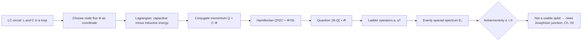

# 02 · The Quantum LC Oscillator

Before we build a qubit, we need to understand the simplest quantum circuit: the humble LC oscillator. It's the "hydrogen atom" of superconducting hardware, simple enough to solve exactly, yet it teaches us the language (flux, charge, ladder operators, zero-point fluctuations, impedance) we'll use everywhere else. The punchline, which we'll arrive at by the end, is that this perfect oscillator is *almost* a qubit, but a fatal flaw forces us to add the Josephson junction in the next chapter.

Here's the whole arc of this chapter at a glance:



## From circuit to Lagrangian

Picture an inductor $L$ and a capacitor $C$ wired in a loop. Classically, charge sloshes back and forth between them, with energy trading between the capacitor's electric field and the inductor's magnetic field, exactly like a mass on a spring trades kinetic and potential energy.

To quantize a circuit the way we quantize mechanics, we need a *coordinate* and its *conjugate momentum*, and the cleanest route is to write a Lagrangian first. The natural coordinate is the **node flux**

$$\Phi(t) = \int_{-\infty}^{t} V(t')\,dt',$$

the time integral of the voltage at the node, so that $V = \dot\Phi$ (this is just Faraday's law for the node). Two short steps build the Lagrangian:

1. **Capacitive ("kinetic") energy.** The charge on the capacitor is $Q = CV = C\dot\Phi$, so its stored energy is $\tfrac{Q^2}{2C} = \tfrac{1}{2}C\dot\Phi^2$. This is quadratic in the *velocity* $\dot\Phi$, it behaves like kinetic energy.
2. **Inductive ("potential") energy.** The energy stored in the inductor is $\tfrac{\Phi^2}{2L}$. This is quadratic in the *coordinate* $\Phi$ itself, it behaves like potential energy.

Subtracting potential from kinetic ($\mathcal{L}=T-U$) gives the circuit Lagrangian:

$$\mathcal{L} = \tfrac{1}{2}C\dot{\Phi}^2 - \frac{\Phi^2}{2L}.$$

Line this up against the mechanical Lagrangian $\mathcal{L} = \tfrac12 m\dot x^2 - \tfrac12 m\omega^2 x^2$ and the dictionary writes itself: $\Phi \leftrightarrow x$, $C \leftrightarrow m$, $1/L \leftrightarrow m\omega^2$.

> **Intuition aside.** Why call $\Phi$ the "position"? Because it's the variable whose *time-derivative* (the velocity $\dot\Phi = V$) carries the inertial energy. The capacitor resists changes in voltage just as a mass resists changes in velocity. That is the entire reason flux, not charge, is the coordinate.

## Charge is the conjugate momentum

Now the payoff. In Lagrangian mechanics the momentum conjugate to a coordinate is $p = \partial\mathcal{L}/\partial\dot q$. Apply that here:

$$Q = \frac{\partial \mathcal{L}}{\partial \dot{\Phi}} = C\dot{\Phi}.$$

The canonical momentum conjugate to flux is *exactly the physical charge on the capacitor*, a very satisfying consistency check. This is the precise sense in which "flux and charge are conjugate": they are a coordinate-momentum pair, not just two circuit quantities that happen to be related.

A Legendre transform $H = Q\dot\Phi - \mathcal{L}$, with $\dot\Phi = Q/C$ substituted in, gives the Hamiltonian:

$$H = \frac{Q^2}{2C} + \frac{\Phi^2}{2L}.$$

The first term is capacitive energy (kinetic), the second inductive energy (potential), and the mechanical analogy is now airtight.

| Mechanical oscillator | LC oscillator | Role |
|---|---|---|
| position $x$ | node flux $\Phi$ | coordinate |
| momentum $p$ | charge $Q$ | conjugate momentum |
| mass $m$ | capacitance $C$ | inertia |
| spring const $m\omega^2$ | $1/L$ | restoring stiffness |
| $\omega=\sqrt{k/m}$ | $\omega_q=1/\sqrt{LC}$ | resonance |
| $\tfrac12 m\omega^2 x^2$ | $\Phi^2/2L$ | potential energy |
| $p^2/2m$ | $Q^2/2C$ | kinetic energy |
| $[\hat x,\hat p]=i\hbar$ | $[\hat\Phi,\hat Q]=i\hbar$ | commutator |
| $x_{\rm zpf}=\sqrt{\hbar/2m\omega}$ | $\Phi_{\rm zpf}=\sqrt{\hbar Z/2}$ | zero-point spread |

> **Pitfall: two different "fluxes".** The node flux $\Phi$ here is a *dynamical variable* (the time-integral of a voltage). It is **not** the externally applied magnetic flux threading a loop, even though both carry units of webers. We'll meet the external flux as a control knob in the SQUID/flux-qubit chapters; keep the two mentally separate.

## Quantization: one postulate

The crucial quantum step is to promote $\Phi$ and $Q$ to operators that **do not commute**:

$$[\hat{\Phi}, \hat{Q}] = i\hbar.$$

This is *not* an extra physical assumption about circuits, it is plain canonical quantization applied to a conjugate pair, the very same move as $[\hat x,\hat p]=i\hbar$. Everything quantum from here on (uncertainty, zero-point fluctuations, the discrete ladder) is a mathematical consequence of this one line. Immediately it implies a Heisenberg bound:

$$\Delta\Phi\,\Delta Q \ge \frac{\hbar}{2},$$

so the flux and charge of the circuit cannot both be perfectly sharp.

## The harmonic ladder (with the actual operators)

Because $H$ is quadratic, we diagonalize it with ladder operators. The trick is to rescale $\Phi$ and $Q$ so that both terms in $H$ carry equal weight; the natural scale is the **characteristic (wave) impedance**

$$Z = \sqrt{\frac{L}{C}}.$$

Define the zero-point scales $\Phi_{\rm zpf}=\sqrt{\hbar Z/2}$ and $Q_{\rm zpf}=\sqrt{\hbar/2Z}$, and set

$$\hat{a} = \frac{1}{\sqrt{2\hbar Z}}\,\hat{\Phi} + \frac{i\sqrt{Z}}{\sqrt{2\hbar}}\,\hat{Q}.$$

A one-line check using $[\hat\Phi,\hat Q]=i\hbar$ gives $[\hat a,\hat a^\dagger]=1$. Inverting,

$$\hat\Phi = \Phi_{\rm zpf}(\hat a + \hat a^\dagger), \qquad \hat Q = -i\,Q_{\rm zpf}(\hat a - \hat a^\dagger).$$

Substituting these into $H = Q^2/2C + \Phi^2/2L$ and using $\Phi_{\rm zpf}^2/L = Q_{\rm zpf}^2/C = \tfrac12\hbar\omega_q$ (they're equal precisely because $Z$ balances them), the cross terms reassemble into $\hat a^\dagger\hat a + \tfrac12$ and the Hamiltonian collapses to

$$\hat{H} = \hbar\omega_q\left(\hat{a}^\dagger\hat{a} + \tfrac{1}{2}\right), \qquad \omega_q = \frac{1}{\sqrt{LC}}.$$

The operator $\hat{n} = \hat{a}^\dagger\hat{a}$ counts **excitations**, quanta of microwave energy, genuine *microwave photons* living in the circuit. The eigenstates are number states $|0\rangle, |1\rangle, |2\rangle,\dots$ with energies

$$E_n = \hbar\omega_q\left(n + \tfrac{1}{2}\right).$$

$\hat{a}^\dagger$ climbs the ladder, $\hat{a}$ descends it, and $|0\rangle$ is the ground state with irreducible zero-point energy $\tfrac{1}{2}\hbar\omega_q$.

```
         U(Φ) = Φ²/2L
            \        |        /
             \       |       /     ── E₂ = 5/2·ℏω
              \      |      /
               \     |     /       ── E₁ = 3/2·ℏω
                \    |    /
                 \___|___/         ── E₀ = 1/2·ℏω   ← sits ABOVE the well bottom
                 [±Φ_zpf]            (Q also fluctuates by ±Q_zpf)
```
*The lowest level is not at the bottom of the well: the vacuum is not silent.*

## Zero-point fluctuations: the vacuum is busy

That $\tfrac12\hbar\omega_q$ is not a bookkeeping offset, it encodes real, measurable fluctuations. On the vacuum $|0\rangle$, only the $\hat a\hat a^\dagger$ term survives, so

$$\langle 0|\hat\Phi^2|0\rangle = \Phi_{\rm zpf}^2, \qquad \langle 0|\hat Q^2|0\rangle = Q_{\rm zpf}^2,$$

$$\Phi_{\rm zpf} = \sqrt{\frac{\hbar Z}{2}}, \qquad Q_{\rm zpf} = \sqrt{\frac{\hbar}{2Z}}, \qquad \Phi_{\rm zpf}\,Q_{\rm zpf} = \frac{\hbar}{2}.$$

Their product *saturates* the Heisenberg bound, the LC vacuum is a minimum-uncertainty state. Notice the role of impedance: a **large $Z$** gives big flux fluctuations and small charge fluctuations (flux-like circuits), and a **small $Z$** does the opposite (charge-like circuits). The benchmark is the resistance quantum $R_Q = h/4e^2 \approx 6.45~\text{k}\Omega$. Typical lab resonators have $Z\sim 50\text{–}100~\Omega \ll R_Q$, so their *flux* fluctuations are tiny in units of $\Phi_0/2\pi$ (here $\Phi_{\rm zpf}\sim 0.1\text{–}0.2\,\Phi_0/2\pi$) while their charge fluctuations are comparatively large, such low-impedance circuits sit far on the charge-like side, which is exactly why building a strongly anharmonic qubit takes deliberate engineering.

> **Pitfall.** "Zero-point energy means nothing happens in the ground state." Wrong: $\Phi_{\rm zpf}$ and $Q_{\rm zpf}$ are genuine fluctuations, and they drive real physics (dispersive shifts, vacuum-induced relaxation, Casimir-like effects). The $\tfrac12$ is physically loaded, not ignorable.

## How cold is "cold enough"?

Excitations are real photons, so whether the circuit actually sits in $|0\rangle$ depends on $\hbar\omega_q$ versus the thermal energy $k_B T$. The mean thermal occupation is the Bose factor

$$\bar n = \frac{1}{e^{\hbar\omega_q/k_B T} - 1}.$$

If $\hbar\omega_q \gg k_B T$, then $\bar n \approx 0$ and the mode is frozen in its ground state; if not, thermal photons swamp the quantum behaviour. This is the quantitative reason superconducting circuits live at millikelvin temperatures, see the worked example below.

## A worked example (illustrative numbers)

Take an LC resonator with **illustrative** values $L = 1.59~\text{nH}$ and $C = 637~\text{fF}$, chosen so $Z=\sqrt{L/C}=50~\Omega$.

| Quantity | Illustrative value |
|---|---|
| Resonance $f_q = \omega_q/2\pi$ | $5.0~\text{GHz}$ |
| Characteristic impedance $Z$ | $50~\Omega$ |
| Photon energy $\hbar\omega_q$ | $h\times 5~\text{GHz} \approx 3.3\times10^{-24}~\text{J}$ |
| Zero-point energy $\tfrac12\hbar\omega_q$ | $h\times 2.5~\text{GHz}$ |
| Flux ZPF $\Phi_{\rm zpf}$ | $5.1\times10^{-17}~\text{Wb} \approx 0.16\,(\Phi_0/2\pi)$ |
| Charge ZPF $Q_{\rm zpf}$ | $1.03\times10^{-18}~\text{C} \approx 6.4\,e \approx 3.2\,(2e)$ |
| $\hbar\omega_q/k_B$ | $240~\text{mK}$ |
| $\bar n$ at $15~\text{mK}$ | $\approx 1.1\times10^{-7}$ (ground state) |
| $\bar n$ at $300~\text{mK}$ | $\approx 0.8$ (thermally excited) |

Walking through it: (1) $\omega_q = 1/\sqrt{LC} = 3.14\times10^{10}~\text{rad/s}$, i.e. $f_q = 5.0~\text{GHz}$, squarely in the microwave band. (2) A single excitation costs $\hbar\omega_q \approx 3.3\times10^{-24}~\text{J}$. (3) Check the uncertainty product: $\Phi_{\rm zpf}Q_{\rm zpf} = 5.1\times10^{-17}\times1.03\times10^{-18} \approx 5.3\times10^{-35}~\text{J·s} = \hbar/2$ exactly, the vacuum saturates the bound. (4) Since $\hbar\omega_q/k_B = 240~\text{mK}$, a dilution fridge at $15~\text{mK}$ gives $\bar n \approx 10^{-7}$ (essentially $|0\rangle$), whereas at $300~\text{mK}$ the same mode has $\bar n \approx 0.8$ and is useless as a clean quantum system. That is millikelvin operation, justified in one inequality.

## Why a uniform ladder can't be a qubit

A qubit needs **two** addressable levels, a clean $\{|0\rangle,|1\rangle\}$ subspace we can drive with a pulse at $\omega_q$. But in the LC oscillator every gap is identical, $E_{n+1}-E_n = \hbar\omega_q$, independent of $n$. The **anharmonicity**

$$\alpha \equiv (E_2 - E_1) - (E_1 - E_0) = 0$$

vanishes exactly. A pulse resonant with $0\to1$ is *equally* resonant with $1\to2$, $2\to3$, … so population leaks straight up the ladder. No pulse shape can fix this; with $\alpha=0$ there is literally no spectrum that isolates two levels.

```
   Harmonic (α = 0)                 Anharmonic (α < 0)
   ───── |3⟩                        ──── |3⟩
     ↑ ℏω  (leak!)                    ↑ ω₀₁ + 2α  (off-resonant)
   ───── |2⟩                        ──── |2⟩
     ↑ ℏω  (leak!)                    ↑ ω₀₁ + α   (smaller gap)
   ───── |1⟩                        ──── |1⟩
     ↑ ℏω  drive ω_q                  ↑ ω₀₁       drive here
   ───── |0⟩                        ──── |0⟩
   one drive climbs ALL rungs       drive at ω₀₁ misses 1→2
```

To make a qubit we must *bend the ladder* so $0\to1$ and $1\to2$ sit at different frequencies. For scale, a real transmon deliberately introduces **(illustrative)** $\alpha/2\pi \approx -200$ to $-300~\text{MHz}$, a few percent of $\omega_q$, so the $1\to2$ transition is detuned enough to avoid leakage (Chapter 03).

Crucially, the nonlinear element must be (a) **non-dissipative**, a resistor would bend the spectrum but dump energy and destroy coherence, and (b) **functional at millikelvin**. The only circuit element meeting both is the **Josephson junction**, whose nonlinear inductance is the entire subject of the next chapter.

## Key takeaways

- A Lagrangian in the node flux $\Phi$ ($\mathcal{L}=\tfrac12 C\dot\Phi^2 - \Phi^2/2L$) makes charge the conjugate momentum, $Q=C\dot\Phi$, that's *why* flux and charge are conjugate.
- One postulate, $[\hat\Phi,\hat Q]=i\hbar$, delivers uncertainty, the ladder, and zero-point fluctuations; it's just $[\hat x,\hat p]=i\hbar$ in disguise.
- Diagonalizing gives $E_n=\hbar\omega_q(n+\tfrac12)$ with $\omega_q=1/\sqrt{LC}$, built from $\hat a,\hat a^\dagger$ weighted by $Z=\sqrt{L/C}$.
- The vacuum genuinely fluctuates: $\Phi_{\rm zpf}=\sqrt{\hbar Z/2}$, $Q_{\rm zpf}=\sqrt{\hbar/2Z}$, product $\hbar/2$. Impedance vs. $R_Q\approx6.45~\text{k}\Omega$ sets flux-like vs. charge-like.
- Excitations are microwave photons; only $\hbar\omega_q\gg k_B T$ (millikelvin) keeps the mode in $|0\rangle$.
- Uniform spacing means $\alpha=0$: no drive isolates two levels, so a linear oscillator cannot be a qubit. A **non-dissipative** nonlinearity, the Josephson junction, is required.

## Go deeper

- M. H. Devoret, *Quantum Fluctuations in Electrical Circuits*, Les Houches Session LXIII (1997), the canonical foundational reference for node-flux circuit quantization.
- P. Krantz et al., *A Quantum Engineer's Guide to Superconducting Qubits*, Appl. Phys. Rev. 6, 021318 (2019), [arXiv:1904.06560](https://arxiv.org/abs/1904.06560), accessible, thorough onboarding review; Section II mirrors this chapter.
- U. Vool & M. H. Devoret, *Introduction to Quantum Electromagnetic Circuits*, Int. J. Circ. Theor. Appl. 45, 897 (2017), [arXiv:1610.03438](https://arxiv.org/abs/1610.03438), the rigorous Lagrangian-to-Hamiltonian circuit-quantization procedure.
- A. Blais, A. L. Grimsmo, S. M. Girvin, A. Wallraff, *Circuit Quantum Electrodynamics*, Rev. Mod. Phys. 93, 025005 (2021), [arXiv:2005.12667](https://arxiv.org/abs/2005.12667), authoritative modern cQED review; excellent on impedance, ZPF, and microwave-photon language.

---

← Back to [project README](../README.md) · [Tutorial index](./README.md)
