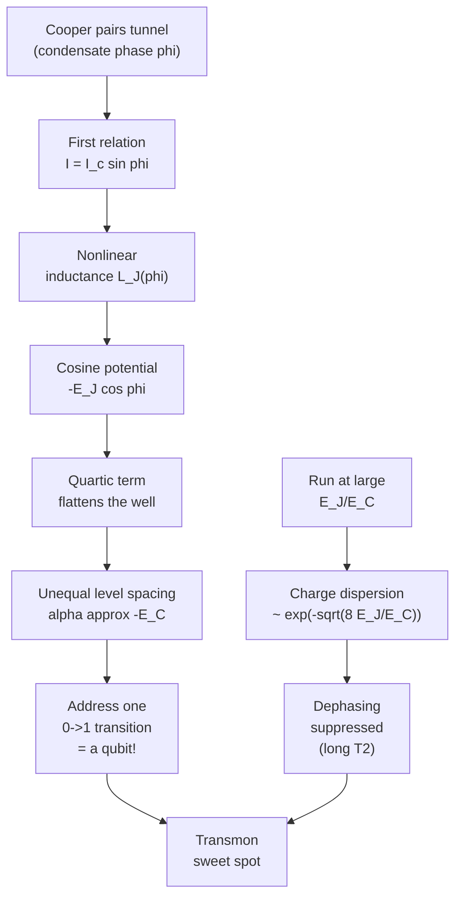

# 03 · The Josephson Junction & Anharmonicity

In the previous chapter we built an LC oscillator out of superconducting circuit elements. It has a beautiful, clean problem: it is *harmonic*. Its energy levels are perfectly evenly spaced, like rungs on a ladder where every step is the same height. That sounds nice, but for a qubit it is fatal. If you send in a microwave pulse tuned to drive the $0 \to 1$ transition, the exact same photon also drives $1 \to 2$, $2 \to 3$, and so on. You cannot isolate a clean two-level system. You need one circuit element that breaks this even spacing, and that element is the Josephson junction.

A junction is almost embarrassingly simple to picture: two superconductors separated by a thin (~1 nm) insulating barrier. Classically nothing should flow. But the superconducting condensate on each side is described by a *single macroscopic wavefunction* $\psi = \sqrt{n_s}\,e^{i\theta}$ with a well-defined phase $\theta$. Only the **gauge-invariant phase difference** $\varphi = \theta_L - \theta_R$ across the barrier matters, and through it Cooper pairs *tunnel* coherently across the gap. The junction is the one circuit element that is simultaneously **nonlinear** and **non-dissipative**, and you cannot build a good qubit without both.

Here is the causal story the rest of the chapter tells, end to end:



## The two Josephson relations

Let $\varphi$ be the gauge-invariant phase difference across the junction. The entire device is governed by two relations:

$$ I = I_c \sin\varphi \qquad\text{(DC / first relation)} $$
$$ \frac{d\varphi}{dt} = \frac{2e}{\hbar}\,V \qquad\text{(AC / second relation)} $$

**Where the first relation comes from.** Each superconductor carries a condensate with phase $\theta_{L,R}$. Coupling the two through the barrier (Feynman's two-mode tunnelling model) makes the supercurrent depend *only* on the phase difference, and the simplest such periodic, odd function is $\sin\varphi$. The amplitude is the **critical current** $I_c$, set by the barrier transparency and the gap. Plain meaning: push a phase across the junction and a dissipationless current flows *with no voltage*, until you try to exceed $I_c$.

**Where the second relation comes from.** Each condensate phase evolves as $\dot\theta = -E/\hbar$, where $E$ is the energy of a charge carrier on that side. A voltage $V$ biases the two sides by an energy $2eV$, note the $2e$, because the carriers are Cooper **pairs**, not single electrons. So the *difference* winds at $\dot\varphi = 2eV/\hbar$. Integrated, a DC voltage produces an AC supercurrent at the Josephson frequency $f = 2eV/h$, with the universal slope $2e/h \approx 483.6\ \text{MHz}/\mu\text{V}$. That factor of $2e$ is the experimental fingerprint of Cooper pairing.

**The nonlinear inductance.** Differentiate the first relation and substitute the second:

$$ \frac{dI}{dt} = I_c\cos\varphi\,\dot\varphi = I_c\cos\varphi\cdot\frac{2e}{\hbar}V. $$

An inductor obeys $V = L\,dI/dt$, so $L = V/(dI/dt)$, giving

$$ L_J(\varphi) = \frac{\hbar}{2e\,I_c\cos\varphi} = \frac{\Phi_0}{2\pi I_c\cos\varphi}, \qquad \Phi_0 = \frac{h}{2e}. $$

A linear inductor has constant $L$; here $L_J$ stiffens and softens with $\varphi$, *diverges* and turns *negative* at $\varphi = \pi/2$. That phase-dependence is exactly the ingredient the bare LC circuit was missing.

> **Pitfall.** $L_J$ is only a literal lumped inductor in the small-oscillation linearisation around an operating point. Near $\varphi=\pi/2$ it blows up, don't read it as a real component at all phases.

## The cosine potential

Integrate the energy delivered to the junction, $U = \int I\,V\,dt$. Using $I = I_c\sin\varphi$ and $V = (\hbar/2e)\dot\varphi$ gives $I\,V\,dt = I_c\sin\varphi\,(\hbar/2e)\,d\varphi$, and integrating over $\varphi$:

$$ U(\varphi) = -E_J \cos\varphi, \qquad E_J = \frac{\hbar I_c}{2e} = \frac{I_c\Phi_0}{2\pi}. $$

$E_J$ is the **Josephson energy**, the depth of the potential well. Taylor-expanding,

$$ -E_J\cos\varphi \approx -E_J + \tfrac{1}{2}E_J\varphi^2 - \tfrac{1}{24}E_J\varphi^4 + \dots $$

The $\varphi^2$ term reproduces a harmonic oscillator (matching $\tfrac12 L_{J0}^{-1}\Phi^2$ identifies the linear inductance). The $\varphi^4$ term is the crucial correction: it is **negative**, so the cosine well is *flatter* than a parabola away from the bottom. A flatter well means the energy rungs get closer together as you climb, the ladder is no longer evenly spaced.

```
 U(φ)
   │      .                              .
   │       \           parabola         /     ← harmonic approx (steeper)
   │        \  (½E_Jφ²)               /
   │   ──────\───────────────────── E₂   ⎫ ħω₁₂  (smaller)
   │     ─────\─────────────────── E₁    ⎬ ─────
   │       ────\─────────────── E₀       ⎭ ħω₀₁  (larger)
   │            \....         ..../        gaps shrink as you climb
   │             `-._ -E_Jcosφ _.-'        = anharmonicity
   │                  `-._____.-'  ← min at φ=0, depth E_J
   └──────────────┴───────┴──────────── φ
                 -π/2     0    +π/2
```

The cosine (solid) hugs the parabola (the steeper arms) only at the bottom; the levels $E_0, E_1, E_2$ live in the flatter cosine, so $\hbar\omega_{12} < \hbar\omega_{01}$.

> **Intuition aside.** Think of the cosine as a pendulum. Small swings are nearly harmonic and isochronous; but a real pendulum slows for large swings, its period grows with amplitude. That amplitude-dependent frequency *is* anharmonicity. Tilt the cosine by adding a bias current and you get the **tilted washboard**: the bob can roll over barriers (phase slips) once $I \to I_c$. A qubit lives in the lowest swings of this superconducting pendulum.

```
   pivot ●                tilt with bias current I →  /\  /\  /\
         |\                                          /  \/  \/  \
         | \  angle = phase φ                       running "washboard":
         |  \                                       phase slips when I→I_c
         |   ● bob   gravity well = -E_J cos φ
```

## The Hamiltonian in the charge basis

Pair the cosine potential with the electrostatic (charging) energy of the junction capacitance. The charge on the island is $Q = 2e(\hat n - n_g)$, so its electrostatic energy $Q^2/2C$ gives the full Hamiltonian:

$$ H = 4E_C\,(\hat n - n_g)^2 - E_J\cos\hat\varphi, \qquad E_C = \frac{e^2}{2C}, \qquad [\hat\varphi,\hat n] = i. $$

Here $\hat n$ counts excess Cooper pairs, $n_g$ is the dimensionless **offset (gate) charge**, and $E_C$ is the **charging energy**, the single-electron scale $e^2/2C$ that sets the cost of moving charge onto the island (one full Cooper pair costs $4E_C$). The $4E_C(\hat n - n_g)^2$ term is the "kinetic" energy; $-E_J\cos\hat\varphi$ is the "potential." Their ratio $E_J/E_C$ governs everything.

The chapter title promised "in the charge basis," so let's make it concrete. Because $\hat\varphi$ and $\hat n$ are conjugate, $\cos\hat\varphi$ is a *shift operator* on Cooper-pair number:

$$ \cos\hat\varphi = \tfrac{1}{2}\sum_n \big(|n\rangle\langle n{+}1| + |n{+}1\rangle\langle n|\big). $$

It hops between adjacent charge states $n \leftrightarrow n\pm 1$, literally one Cooper pair tunnelling. In this basis $H$ is **tridiagonal**: diagonal entries $4E_C(n-n_g)^2$, off-diagonal entries $-E_J/2$. You could type that matrix into NumPy, truncate at $|n|\le 10$, and `eigh` it to get the spectrum, that is exactly how the figures below are produced.

## $E_J/E_C$: the master control knob

Everything about the device follows from one ratio. It interpolates a whole continuum of qubits:

| Regime | $E_J/E_C$ | Eigenstate character | Charge dispersion | Anharmonicity | Trade-off |
|---|---|---|---|---|---|
| Cooper-pair box / charge qubit | $\lesssim 1$ | charge (number) states | large (strong $n_g$ sensitivity) | large | very charge-noise sensitive |
| Intermediate | $\sim 1$-$10$ | mixed | moderate | moderate | partially charge-protected, larger anharmonicity |
| Transmon | $\gg 1$ ($\sim 20$-$100$) | phase-localized | exponentially suppressed | weak (power-law) | charge-insensitive, modest anharmonicity |

with dispersion $\sim e^{-\sqrt{8E_J/E_C}}$ and relative anharmonicity $\alpha_r \sim -(8E_J/E_C)^{-1/2}$. The transmon is just *one limit* of this family, not the only option.

Contrast the two oscillators a newcomer might confuse:

| Property | Linear LC oscillator | Josephson (transmon) |
|---|---|---|
| Potential shape | $\tfrac12 L^{-1}\Phi^2$ parabola | $-E_J\cos\varphi$ cosine |
| Inductance | constant $L$ | $L_J(\varphi)=\Phi_0/(2\pi I_c\cos\varphi)$ |
| Level spacing | equal ($\hbar\omega$) | unequal (shrinks with $m$) |
| Usable as a qubit? | No (cannot address one transition) | Yes |
| Key parameter | $\omega = 1/\sqrt{LC}$ | ratio $E_J/E_C$ |
| Dissipation | resistive losses | non-dissipative (ideal) |

## Energy levels and anharmonicity

In the transmon regime $\varphi$ is localized near $0$, so expand the cosine to quartic order and treat the $\varphi^4$ term in first-order perturbation theory using harmonic-oscillator matrix elements. The result (Koch *et al.* 2007):

$$ E_m \simeq -E_J + \sqrt{8E_J E_C}\,\big(m+\tfrac12\big) - \frac{E_C}{12}\big(6m^2 + 6m + 3\big). $$

The first two terms are a harmonic ladder at the **plasma frequency** $\omega_p = \sqrt{8E_J E_C}/\hbar$; the $m^2$ term bends the ladder. Subtracting levels:

$$ \hbar\omega_q = E_1 - E_0 \simeq \sqrt{8E_J E_C} - E_C, \qquad \alpha \equiv \omega_{12}-\omega_{01} \simeq -\frac{E_C}{\hbar}, \qquad \alpha_r \equiv \frac{\alpha}{\omega_{01}} \simeq -\Big(\frac{8E_J}{E_C}\Big)^{-1/2}. $$

So the **absolute anharmonicity** is $\approx -E_C$ (a few hundred MHz), and the **relative anharmonicity** shrinks only as a *weak power law* of $E_J/E_C$. Why does this finally give a qubit? The $0\to1$ and $1\to2$ transitions now sit at *different* frequencies, detuned by $\alpha$. A pulse resonant with $\omega_{01}$ is off-resonant from $\omega_{12}$, so it leaves higher levels alone, provided its bandwidth $\sim 1/\tau$ stays below $|\alpha|$. That is a hard gate-speed limit: too-fast pulses leak population into level $2$. Pulse-shaping (e.g. **DRAG**) is the practical fix.

> **Pitfall.** A transmon is *not* a true two-level system, it is a weakly anharmonic *multi-level* oscillator. Levels $2, 3, \dots$ are always there, which is exactly why $|\alpha|$ and DRAG matter. And the nonlinearity comes **entirely** from the cosine; $E_C$ only sets the oscillator scale and the *size* of $\alpha$, the charging term itself is not nonlinear.

## Charge dispersion: the whole point of the transmon

Each level's energy depends on the gate charge $n_g$. The peak-to-peak band width as $n_g$ sweeps $0\to1$ is the **charge dispersion** $\epsilon_m$, and it is suppressed *exponentially* (Koch *et al.* 2007):

$$ \epsilon_m \simeq (-1)^m\,E_C\,\frac{2^{4m+5}}{m!}\sqrt{\frac{2}{\pi}}\Big(\frac{E_J}{2E_C}\Big)^{\frac{m}{2}+\frac34} e^{-\sqrt{8E_J/E_C}}. $$

The physics: making the band depend on $n_g$ requires the phase to *tunnel* between adjacent cosine wells ($\varphi\to\varphi+2\pi$). A WKB/instanton estimate of that tunnelling action gives the $e^{-\sqrt{8E_J/E_C}}$ factor (the exact problem maps onto **Mathieu's equation**, which supplies the algebraic prefactor). Flat bands mean $df_q/dn_g \approx 0$: stray $1/f$ charge noise barely shifts the qubit frequency, so dephasing is suppressed and $T_2$ is long. *This is the transmon's defining payoff*, and it costs only a weak power-law penalty in anharmonicity.

```
 E_m(n_g)   small E_J/E_C                   large E_J/E_C (transmon)
   │   __        __        __          │
   │  /  \      /  \      /  \  m=2     │  ────────────────────  m=2
   │ /    \    /    \    /    \         │
   │ \    /\  /    /\  /                │  ────────────────────  m=1
   │  \__/  \/    /  \/      m=1        │
   │   /\    /\    /\                   │  ────────────────────  m=0
   │  /  \  /  \  /  \       m=0        │   ε_m shrinks ~ e^(-√(8E_J/E_C))
   └──┴────┴────┴──── n_g               └────────────────────── n_g
      0   0.5    1                          0        0.5        1
   strongly curved bands              nearly flat ⇒ df_q/dn_g ≈ 0
   (big ε_m, charge-sensitive)        ⇒ insensitive to charge noise ⇒ long T₂
```

> **Pitfall.** "Charge-insensitive" does *not* mean $n_g$ vanishes from $H$, it still appears. The point is the *resulting bands* are exponentially flat. Likewise "non-dissipative" is an ideal-element statement; real junctions still suffer quasiparticle, dielectric, and radiative losses.

## A fully worked transmon (illustrative numbers)

Pick two energy scales (round teaching values, *illustrative*, not any real device): $E_C/h = 250\ \text{MHz}$ and $E_J/E_C = 50$, so $E_J/h = 12.5\ \text{GHz}$. All energies are quoted as frequencies by dividing by $h$.

**Step 1: back out the hardware.**
- Capacitance: $C = e^2/(2E_C) = e^2/(2h\cdot 250\,\text{MHz}) \approx 78\ \text{fF}$ (a large pad, how you *reach* big $E_J/E_C$).
- Critical current: $I_c = 2eE_J/\hbar = 2e\,(h\cdot 12.5\,\text{GHz})/\hbar \approx 25\ \text{nA}$.
- Zero-phase inductance: $L_{J0} = \hbar/(2eI_c) \approx 13\ \text{nH}$.

**Step 2: qubit frequency.** $\omega_q/2\pi \approx \sqrt{8E_JE_C}/h - E_C/h = \sqrt{8\cdot 12.5\cdot 0.25} - 0.25 = \sqrt{25} - 0.25 = 5.000 - 0.250 = 4.75\ \text{GHz}$ (plasma frequency $\omega_p/2\pi = 5.00\ \text{GHz}$).

**Step 3: anharmonicity.** Absolute: $\alpha/2\pi \approx -E_C/h = -250\ \text{MHz}$, so $\omega_{12}/2\pi \approx 4.50\ \text{GHz}$, the $1\to2$ transition sits $250\ \text{MHz}$ *below* the $0\to1$. Relative: $\alpha_r \approx -(8\cdot 50)^{-1/2} = -1/\sqrt{400} = -0.05$, i.e. $-5\%$.

**Step 4: charge dispersion (the payoff).** Exponent $\sqrt{8\cdot 50} = 20$, so $e^{-20}\approx 2.06\times10^{-9}$. The ground level barely moves: $\epsilon_0/h \approx (250\,\text{MHz})\cdot 32\cdot 0.798\cdot 25^{0.75}\cdot 2.06\times10^{-9} \approx 150\ \text{Hz}$. But the quantity you actually *measure* is the $0\to1$ transition, and its dispersion is set by the **upper** level: $\epsilon_m$ grows fast with $m$ (the $2^{4m+5}$ prefactor), so evaluating the formula at $m=1$ gives $\epsilon_1/h \approx 10\ \text{kHz}$, about $70\times$ larger than $\epsilon_0$. Because $\epsilon_0$ and $\epsilon_1$ alternate in sign (the $(-1)^m$), the $0\to1$ frequency wiggles peak-to-peak by $\approx |\epsilon_0|+|\epsilon_1|\approx 10\ \text{kHz}$ across a full $n_g$ period, about one part in $5\times10^5$ of $4.75\ \text{GHz}$. *That* is why the transmon barely feels charge noise. (Diagonalizing the Mathieu problem directly confirms the $\sim 10\ \text{kHz}$ transition swing.)

**Step 5: gate-speed sanity check.** With $|\alpha|/2\pi = 250\ \text{MHz}$, a plain resonant pulse must keep its spectral width $\sim 1/\tau$ well under $250\ \text{MHz}$, so $\tau\gtrsim$ a few ns; DRAG relaxes this.

**Takeaways (all illustrative):** $\omega_q/2\pi\approx 4.75\ \text{GHz}$, $\alpha/2\pi\approx -250\ \text{MHz}$, $0\to1$ charge dispersion $\approx 10\ \text{kHz}$ (level-0 dispersion $\epsilon_0\approx 150\ \text{Hz}$), $C\approx 78\ \text{fF}$, $I_c\approx 25\ \text{nA}$, $L_{J0}\approx 13\ \text{nH}$.

## Common pitfalls

- **It's $2e$, not $e$.** Both Josephson relations and $\Phi_0 = h/2e$ carry the Cooper-pair charge. The factor-of-two error is everywhere.
- **Bigger $E_J/E_C$ is not strictly better.** It suppresses charge dispersion *exponentially* but preserves anharmonicity only *as a power law*; too little $|\alpha|$ means leakage. The transmon is a deliberate compromise.
- **Two anharmonicities.** $\alpha$ (absolute, $\approx -E_C$, in Hz) sets the $1\!\to\!2$ detuning; $\alpha_r$ (relative, $\approx -5\%$, dimensionless) measures fractional unevenness.
- **The cosine is flatter, not steeper.** The *negative* quartic term lowers upper levels and shrinks spacings, that is what "negative anharmonicity" means.

## Key takeaways

- The Josephson junction is the unique **nonlinear, non-dissipative** circuit element; without it you only get an unusable harmonic oscillator.
- Two relations: $I = I_c\sin\varphi$ and $\dot\varphi = 2eV/\hbar$, giving the phase-dependent inductance $L_J(\varphi) = \Phi_0/(2\pi I_c\cos\varphi)$.
- The junction energy is the **cosine potential** $-E_J\cos\varphi$; its quartic term flattens the well and unevenly spaces the ladder.
- $H = 4E_C(\hat n - n_g)^2 - E_J\cos\hat\varphi$ is **tridiagonal in the charge basis** and governed by $E_J/E_C$, a continuum from charge qubit to transmon.
- Anharmonicity $\alpha\approx -E_C/\hbar$ lets a selective pulse address one $0$-$1$ transition (gate-speed limited by $|\alpha|$); **charge dispersion $\sim e^{-\sqrt{8E_J/E_C}}$** is the exponential charge-noise immunity that defines the transmon.

## Go deeper

- Koch *et al.*, "Charge-insensitive qubit design derived from the Cooper pair box," Phys. Rev. A **76**, 042319 (2007), the foundational transmon paper and source of the $E_m$, $\omega_q$, $\alpha_r$, and charge-dispersion formulas above. [arXiv:cond-mat/0703002](https://arxiv.org/abs/cond-mat/0703002).
- Krantz *et al.*, "A Quantum Engineer's Guide to Superconducting Qubits," Appl. Phys. Rev. **6**, 021318 (2019), the standard modern review. [arXiv:1904.06560](https://arxiv.org/abs/1904.06560).
- Blais *et al.*, "Circuit Quantum Electrodynamics," Rev. Mod. Phys. **93**, 025005 (2021), authoritative derivations of the charge-basis Hamiltonian and charge dispersion. [arXiv:2005.12667](https://arxiv.org/abs/2005.12667).

---

← Back to [project README](../README.md) · [Tutorial index](./README.md)
