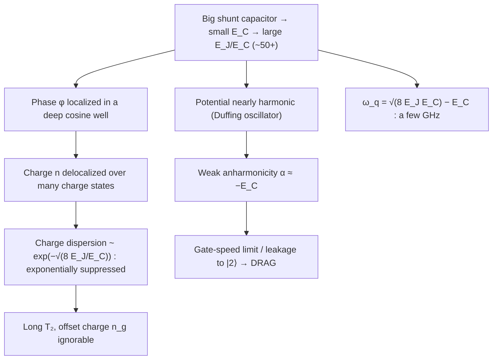

# 04 · The Transmon Qubit

In the previous chapter we met the Josephson junction and used it to build the charge qubit, the Cooper-pair box, a tiny superconducting island whose state is set by how many Cooper pairs have tunnelled across the junction. It made a beautiful two-level system, but it had a fatal flaw, it was painfully sensitive to stray electric charge. A single fluctuating charge near the island would smear out the qubit frequency and kill coherence in microseconds. The transmon is the fix, and it turned out to be such a good fix that it became the workhorse of nearly every superconducting quantum processor built today.

The whole trick is one design choice: **make the Josephson energy $E_J$ much larger than the charging energy $E_C$.** Everything good (and the one thing we give up) follows from that single inequality. Here is the logical skeleton of the entire chapter, keep it in mind as we fill in each branch:



## The circuit and its energy scales

> **The single most important point:** the transmon is *not* a new circuit. It is the **same** Josephson-junction-plus-capacitor as the Cooper-pair box, with the **same** Hamiltonian. We only change one number, the ratio $E_J/E_C$, by adding a large shunt capacitor that lowers $E_C$.

$$H = 4 E_C\,(\hat{n} - n_g)^2 - E_J \cos\hat{\varphi}$$

Here $\hat{n}$ counts excess Cooper pairs on the island, $\hat{\varphi}$ is the superconducting phase difference across the junction (conjugate to $\hat{n}$, with $[\hat\varphi,\hat n]=i$), and $n_g$ is the offset charge, the gremlin we want to defeat.

Where does the factor of $4$ come from? Start from the circuit. The electrostatic energy of an island holding charge $Q$ with gate-induced offset $Q_g$ is $(Q-Q_g)^2/2C$. Charge moves in units of Cooper pairs, so write $Q = 2e\,\hat n$ and $Q_g = 2e\,n_g$. Then

$$\frac{(2e)^2}{2C}(\hat n - n_g)^2 = \frac{2e^2}{C}(\hat n - n_g)^2 = 4E_C\,(\hat n - n_g)^2,
\qquad E_C \equiv \frac{e^2}{2C}.$$

The convention $E_C = e^2/2C$ is the charging energy *per single electron*, and the $(2e)^2$ from pairing produces the factor $4$. The junction contributes its Josephson potential $-E_J\cos\hat\varphi$. Promote $\hat n,\hat\varphi$ to conjugate operators and you have the Hamiltonian above.

Charge qubits live around $E_J/E_C \sim 1$; transmons deliberately push it to $E_J/E_C \gtrsim 50$.

## Why charge noise dies exponentially

Think of the $-E_J\cos\hat{\varphi}$ term as a pendulum. When $E_J/E_C$ is large the "pendulum" is heavy and sits deep in its cosine well, barely swinging. The phase $\varphi$ is well-localized. Quantitatively, the ground-state phase spread in the harmonic well (derived below) is $\langle\varphi^2\rangle^{1/2} = (2E_C/E_J)^{1/4}$, which shrinks as the ratio grows. By the uncertainty relation $[\hat\varphi,\hat n]=i$, a tightly-localized $\varphi$ forces the conjugate charge $\hat n$ to spread over **many** charge eigenstates ($\langle n^2\rangle^{1/2} = \tfrac12(E_J/2E_C)^{1/4}$). A charge wavefunction smeared across dozens of $|n\rangle$ states simply cannot tell where the offset charge $n_g$ sits, shifting $n_g$ by a fraction of a Cooper pair barely overlaps with anything.

The rigorous statement is a **Bloch-band** argument: $n_g$ enters exactly like a quasimomentum, and the qubit's residual $n_g$-dependence (the *charge dispersion* $\epsilon_m$, the peak-to-peak swing of $E_m$ as $n_g$ runs over one period) is the tunnelling bandwidth between adjacent cosine wells. A WKB / Mathieu analysis of that inter-well tunnelling gives

$$\epsilon_m \;\simeq\; (-1)^m\,E_C\,\frac{2^{4m+5}}{m!}\sqrt{\frac{2}{\pi}}\left(\frac{E_J}{2E_C}\right)^{\frac{m}{2}+\frac34}\,
e^{-\sqrt{8 E_J/E_C}}.$$

The decisive feature is the factor $e^{-\sqrt{8E_J/E_C}}$: charge sensitivity is suppressed **exponentially** in $\sqrt{E_J/E_C}$. Double the ratio and the charge sensitivity doesn't halve, it plummets by orders of magnitude. The $(-1)^m$ and the growing prefactor show higher levels disperse more, which is why we always use the lowest, most protected levels. This single exponential is what buys the transmon its long coherence and lets us forget $n_g$.

> **Intuition aside.** It's like tuning a heavy bell versus a light one. A featherweight bell rings at a pitch that changes with every breeze (every stray charge). A massive cathedral bell rings at essentially the same note no matter what the air does. We traded a nimble, twitchy qubit for a heavy, steady one, and steadiness is what coherence needs.

> **Misconception check.** $n_g$ does **not** disappear from the Hamiltonian. Its *effect* on the frequency is exponentially suppressed. The qubit still has an $n_g$ in it; you just can't measure the resulting frequency wobble.

## The spectrum: one expansion, all the results

Deep in the well the potential is nearly parabolic, so the transmon is a **weakly anharmonic (Duffing) oscillator**: a harmonic ladder with a small quartic softening. Let's derive its whole spectrum and read everything off one line.

**Step 1: drop $n_g$.** We just showed its effect is exponentially small, so set $n_g=0$.

**Step 2: expand the cosine.** Near the bottom of the well,
$$-E_J\cos\hat\varphi = -E_J\left(1 - \tfrac{\hat\varphi^2}{2} + \tfrac{\hat\varphi^4}{24} - \cdots\right)
= -E_J + \tfrac{E_J}{2}\hat\varphi^2 - \tfrac{E_J}{24}\hat\varphi^4 + \cdots$$

**Step 3: identify the harmonic oscillator.** The piece $4E_C\hat n^2 + \tfrac{E_J}{2}\hat\varphi^2$ is a harmonic oscillator: $\hat n$ plays the role of momentum (with "mass" $\propto 1/8E_C$) and $\hat\varphi$ the coordinate (with "spring constant" $E_J$). Its frequency, the **plasma frequency**, is
$$\hbar\omega_p = \sqrt{8 E_J E_C}.$$

**Step 4: introduce ladder operators.** Writing $\hat\varphi = (2E_C/E_J)^{1/4}(a+a^\dagger)$ and $\hat n = \tfrac{i}{2}(E_J/2E_C)^{1/4}(a^\dagger-a)$ diagonalizes the harmonic part as $\hbar\omega_p(a^\dagger a + \tfrac12)$.

**Step 5: treat the quartic term as a perturbation.** Here is the magic cancellation: $\hat\varphi^4 \sim (2E_C/E_J)(a+a^\dagger)^4$, so the prefactor $-E_J/24$ times $(2E_C/E_J)$ leaves a coefficient of order **$E_C$**, the $E_J$ cancels. First-order perturbation theory keeps the diagonal part of $(a+a^\dagger)^4$, which on level $m$ equals $6m^2+6m+3$.

**Step 6: collect.** Putting it together (Koch *et al.* 2007):

$$\boxed{\;E_m \simeq -E_J + \sqrt{8 E_C E_J}\,\big(m+\tfrac12\big) - \frac{E_C}{12}\big(6m^2 + 6m + 3\big)\;}$$

The three terms are exactly the three pieces of physics: $-E_J$ is the **well depth**, $\sqrt{8E_CE_J}(m+\tfrac12)$ is the **harmonic ladder**, and the quartic term makes the spacing **shrink with $m$**, the levels crowd together near the top, just as in a real pendulum.

Now read off the observables:

- **Qubit frequency.** $\hbar\omega_{01} = E_1-E_0 = \sqrt{8E_JE_C}\,[(1+\tfrac12)-(0+\tfrac12)] - \tfrac{E_C}{12}[(6{+}6{+}3)-(0{+}0{+}3)]$
$= \sqrt{8E_JE_C} - \tfrac{E_C}{12}(12) = \sqrt{8E_JE_C} - E_C.$
- **Absolute anharmonicity.** $E_{12}=E_2-E_1=\sqrt{8E_JE_C}-2E_C$, and $E_{01}=\sqrt{8E_JE_C}-E_C$, so
$$\alpha \equiv E_{12}-E_{01} \simeq -E_C.$$
- **Relative anharmonicity.** $\displaystyle \alpha_r \equiv \frac{\alpha}{\omega_{01}} \simeq \frac{-E_C}{\sqrt{8E_JE_C}} = -\sqrt{\frac{E_C}{8E_J}} = -\left(\frac{8E_J}{E_C}\right)^{-1/2}.$

Here is the energy ladder, with the crucial detail that $E_{12}$ is *smaller* than $E_{01}$ by exactly $E_C$:

```
 energy
   │
   │   ┌──────────────  |3⟩
   │   │   spacing ≈ √(8E_J E_C) − 3E_C   (smallest)
   │   ├──────────────  |2⟩
   │   │   E_12 = √(8E_J E_C) − 2E_C
   │   ├──────────────  |1⟩      ── α = E_12 − E_01 = −E_C
   │   │   E_01 = √(8E_J E_C) − E_C
   │   └──────────────  |0⟩
   │
   │        \                              /
   │         \      dashed parabola       /   ← harmonic / Duffing approx
   │          \____________________ _____/
   │            true −E_J cos φ well  (depth −E_J)
   └────────────────────────────────────────►  φ
```

**The central trade-off.** Distinguish the two anharmonicities carefully:

- **Absolute** $\alpha\approx -E_C$ is *roughly constant*, it sets a fixed, ns-scale gate-speed limit.
- **Relative** $\alpha_r = -(8E_J/E_C)^{-1/2}$ is the quantity that *slowly shrinks* as we push the ratio up.

And $\alpha_r$ falls only as a **power law**, while charge dispersion falls **exponentially**. Exponential beats power law, so there is a wide window where the qubit is essentially charge-insensitive yet still usefully anharmonic:

| $E_J/E_C$ | $\sqrt{8E_J/E_C}$ | charge dispersion $\sim e^{-\sqrt{8E_J/E_C}}$ (normalized) | $\alpha_r = -(8E_J/E_C)^{-1/2}$ |
|---:|---:|---:|---:|
| 1   | 2.8  | $\sim 6\times10^{-2}$  | $-0.35$ |
| 10  | 8.9  | $\sim 1\times10^{-4}$  | $-0.11$ |
| 20  | 12.6 | $\sim 3\times10^{-6}$  | $-0.079$ |
| 50  | 20.0 | $\sim 2\times10^{-9}$  | $-0.050$ |
| 100 | 28.3 | $\sim 5\times10^{-13}$ | $-0.035$ |

*All values illustrative.* As $E_J/E_C$ goes $1\to100$, charge dispersion drops by **eleven orders of magnitude** while $\alpha_r$ only shrinks by a factor of $\sim10$. **Exponential beats power law → a wide usable window.**

> **Misconception check.** Bigger $E_J/E_C$ is *not* always better. By $E_J/E_C\sim 50$-$100$ the charge dispersion is already utterly negligible; pushing higher buys essentially no extra charge protection but keeps eroding anharmonicity and slowing your gates. There is an optimum window, not a monotonic "more is better."

## A worked example (illustrative numbers)

Pick generic teaching values: $E_C/h = 0.25$ GHz and $E_J/h = 15$ GHz, so $E_J/E_C = 60$, comfortably in the transmon regime. *(All numbers illustrative, not from any specific device.)*

**1 · Qubit frequency.** $\sqrt{8E_JE_C}/h = \sqrt{8\times15\times0.25}\ \text{GHz} = \sqrt{30}\approx 5.48$ GHz. Then $\omega_q/2\pi = 5.48 - 0.25 = \mathbf{5.23\ GHz}$, squarely in the microwave band.

**2 · Anharmonicity.** Absolute: $\alpha/h = -E_C/h = \mathbf{-250\ MHz}$. Relative: $\alpha_r = -(8\times60)^{-1/2} = -(480)^{-1/2} \approx \mathbf{-4.6\%}$. Cross-check: $\alpha/\omega_q = -250/5230 = -4.8\%$, consistent to leading order.

**3 · Gate-speed intuition.** A square pulse of duration $\tau$ has spectral width $\sim 1/\tau$. To avoid driving $|1\rangle\to|2\rangle$ (detuned by $|\alpha|=250$ MHz) we need $1/\tau \ll 250$ MHz, i.e. $\tau \gg 4$ ns. That is exactly why few-ns single-qubit gates need pulse shaping (e.g. **DRAG**, covered later) to suppress leakage into $|2\rangle$.

**4 · Charge dispersion.** Exponent $-\sqrt{8\times60} = -\sqrt{480}\approx -21.9$, so $e^{-21.9}\approx 3\times10^{-10}$. Even with the algebraic prefactor (tens-to-hundreds for the lowest level), $\epsilon_0$ lands in the sub-kHz range, negligible next to a 5 GHz qubit.

**The quantitative heart of the chapter.** At $E_J/E_C=60$, $\alpha_r\approx-4.6\%$ (healthy) while dispersion $\sim10^{-10}$. Double the ratio to 120: $\alpha_r$ only improves to $\sim-3.2\%$ (power law), but the exponent becomes $-\sqrt{960}\approx-31$, so dispersion $\sim e^{-31}\sim 3\times10^{-14}$, **four more orders of magnitude** for a tiny anharmonicity cost. That asymmetry *is* the transmon.

## Making it tunable: the SQUID transmon

A fixed junction gives a fixed $\omega_q$. Replace the single junction with two in a loop, a **dc SQUID**, and the pair behaves like one junction whose *effective* Josephson energy depends on the flux $\Phi$ threading the loop.

Two junctions in parallel give $-E_{J1}\cos\varphi_1 - E_{J2}\cos\varphi_2$ subject to the fluxoid constraint $\varphi_1-\varphi_2 = 2\pi\Phi/\Phi_0$. Combining the cosines into a single cosine of an average phase yields an amplitude $E_{J,\Sigma}\sqrt{\cos^2(\pi\Phi/\Phi_0)+d^2\sin^2(\pi\Phi/\Phi_0)}$, which rearranges to

$$E_{J,\mathrm{eff}}(\Phi) = E_{J,\Sigma}\,\big|\cos(\pi\Phi/\Phi_0)\big|\,\sqrt{1 + d^2\tan^2(\pi\Phi/\Phi_0)},
\qquad d=\frac{E_{J2}-E_{J1}}{E_{J1}+E_{J2}},$$

with $\Phi_0=h/2e$, $E_{J,\Sigma}=E_{J1}+E_{J2}$, and **asymmetry** $d$. For $d=0$ this reduces to the symmetric $E_{J,\Sigma}|\cos(\pi\Phi/\Phi_0)|$. Substitute $E_{J,\mathrm{eff}}(\Phi)$ into $\omega_q(\Phi)=\sqrt{8E_{J,\mathrm{eff}}(\Phi)E_C}-E_C$ and flux now tunes the frequency in real time, how we bring qubits in and out of resonance for two-qubit gates.

**Why asymmetry on purpose?** Real junctions are never perfectly matched, so $d\neq0$ always. But designers often *deliberately* make $d$ large: a nonzero $d$ raises the minimum of $E_{J,\mathrm{eff}}$ (it no longer reaches zero), shrinking the tuning range but flattening the curve, which reduces flux-noise sensitivity over the operating band.

**Sweet spots.** Since $\omega_q\propto\sqrt{E_{J,\mathrm{eff}}}$, the slope $\partial\omega_q/\partial\Phi$ vanishes wherever $\partial E_{J,\mathrm{eff}}/\partial\Phi=0$. For the symmetric case $|\cos(\pi\Phi/\Phi_0)|$ has zero slope at $\Phi=0$ and $\Phi=\Phi_0/2$:

$$\left.\frac{\partial\omega_q}{\partial\Phi}\right|_{\Phi=0}=0.$$

At a sweet spot, expanding gives $\delta\omega_q \sim \tfrac12(\partial^2\omega_q/\partial\Phi^2)\,\delta\Phi^2$, only **second order** in flux noise, so dephasing is strongly suppressed and $T_2$ is maximized. This is the flux-domain analogue of the transmon's charge insensitivity.

```
 ω_q                       Φ₀/2          Φ₀/2
   │       ●●●●●          (symmetric        (symmetric
   │     ●●     ●●         dips to 0)        dips to 0)
   │    ●         ●                ●●●          ●●●
   │   ●  SWEET    ●              ●   ●        ●   ●   ← asymmetric d>0:
   │  ●   SPOT      ●            ●     ●      ●     ●     min never reaches 0,
   │ ●  dω/dΦ=0,     ●          ●       ●    ●       ●    flatter / less tuning
   │●   best T₂       ●●      ●●         ●●●●         
   │  steep flanks =    ●●●●●●
   │  high flux-noise sensitivity
   └────┼────────┼────────┼────────┼────────► Φ/Φ₀
      −1.0     −0.5      0.0      0.5      1.0
```

> **Misconception check.** A sweet spot removes only the *first-order* flux sensitivity (slope $=0$); the *curvature* still couples second-order flux noise. That is why tunable transmons generally trail fixed-frequency ones in $T_2$, and why a symmetric SQUID tunes $E_{J,\mathrm{eff}}$ to zero at $\Phi_0/2$ but an asymmetric one never does.

## Common pitfalls

- **"It's a different circuit from the CPB."** No, same circuit, same Hamiltonian; only $E_J/E_C$ changes.
- **"Maximize $E_J/E_C$."** No, there's an optimum window (~50-100); beyond it you only lose anharmonicity and gate speed.
- **"$\alpha<0$ is a defect."** No, it just means upper levels are more closely spaced; the sign matters for choosing DRAG parameters.
- **"$n_g$ vanishes."** No, only its *effect* on the frequency is exponentially suppressed.
- **"These formulas are exact."** No, $\omega_q=\sqrt{8E_JE_C}-E_C$ and $\alpha=-E_C$ are leading-order teaching approximations; for design you diagonalize the full Hamiltonian (Mathieu functions / numerics).

## Key takeaways

- The transmon is a Cooper-pair box run at large $E_J/E_C$ ($\gtrsim50$), achieved with a big shunt capacitor, same circuit, one ratio changed.
- One perturbative line, $E_m\simeq -E_J+\sqrt{8E_CE_J}(m+\tfrac12)-\tfrac{E_C}{12}(6m^2+6m+3)$, yields $\omega_q$, $\alpha$, and the level crowding.
- Charge dispersion is suppressed **exponentially** as $e^{-\sqrt{8E_J/E_C}}$; anharmonicity falls only as a **power law** $\alpha_r=-(8E_J/E_C)^{-1/2}$, exponential beats power law, opening a wide usable window.
- **Absolute** $\alpha\approx-E_C$ (fixed, sets the ns gate-speed limit) differs from **relative** $\alpha_r$ (slowly shrinks). Finite $\alpha$ ⇒ leakage to $|2\rangle$ ⇒ DRAG.
- A SQUID makes $E_{J,\mathrm{eff}}(\Phi)$ flux-tunable; junction asymmetry $d$ trades tuning range for flux-noise robustness; operate at a sweet spot where $\partial\omega_q/\partial\Phi=0$ for best $T_2$.

## Go deeper

- J. Koch *et al.*, "Charge-insensitive qubit design derived from the Cooper pair box," Phys. Rev. A **76**, 042319 (2007), the original transmon paper and source of every formula here, [arXiv:cond-mat/0703002](https://arxiv.org/abs/cond-mat/0703002).
- P. Krantz *et al.*, "A Quantum Engineer's Guide to Superconducting Qubits," Appl. Phys. Rev. **6**, 021318 (2019), readable engineering review; best for the Duffing picture, flux tunability, and asymmetric SQUIDs, [arXiv:1904.06560](https://arxiv.org/abs/1904.06560).
- A. Blais, A. L. Grimsmo, S. M. Girvin, A. Wallraff, "Circuit Quantum Electrodynamics," Rev. Mod. Phys. **93**, 025005 (2021), authoritative modern review with rigorous derivations of the charge/flux Hamiltonians and the harmonic-plus-quartic expansion, [arXiv:2005.12667](https://arxiv.org/abs/2005.12667).

---

[← Back to repo README](../README.md) · [Tutorial index](./README.md)
