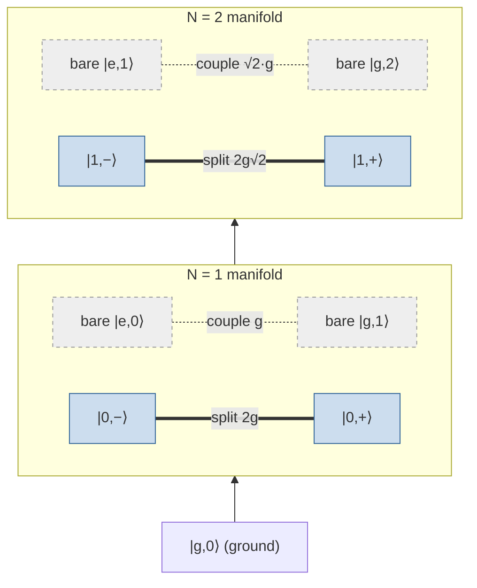
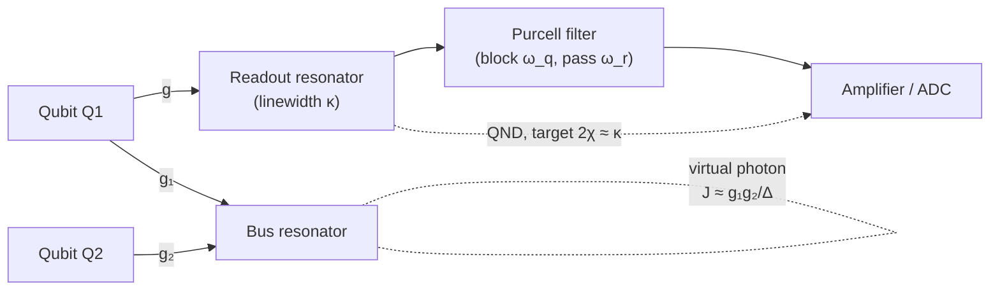

# 05 · Circuit QED: Qubits + Resonators

A qubit sitting alone is useless, you need to talk to it (read out its state) and connect it to other qubits (entangle them). Circuit quantum electrodynamics (circuit QED) is how we do both, using a single, beautifully reusable trick: couple the qubit to a microwave **resonator** (an on-chip LC circuit, see Chapter 02). The resonator becomes your microphone for readout and your wire for coupling. The remarkable thing is that *one* coupling rate $g$ underlies **both** jobs. This chapter builds the physics from the dipole coupling up, derives the two regimes, resonant and dispersive, step by step, and ends with a fully worked numerical example.

> **Conventions (stated once).** We write the qubit term as $\frac{\hbar\omega_q}{2}\hat\sigma_z$ (not $\hbar\omega_q\hat\sigma_z$), define the detuning $\Delta = \omega_q - \omega_r$, and take the anharmonicity $\alpha = \omega_{ef}-\omega_{ge} < 0$. With these choices $\chi = g^2/\Delta$ for a two-level system. Sign and factor-of-2 conventions differ across textbooks, mixing them is the #1 source of spurious errors, so we keep these fixed throughout.

## From dipole coupling to Jaynes-Cummings

A superconducting qubit has an electric dipole; the resonator stores a microwave field whose **zero-point voltage fluctuations** are nonzero even in vacuum. Capacitively coupling them gives a dipole interaction proportional to (qubit dipole) $\times$ (resonator voltage). In operator form the *full* coupling is

$$H_\text{int} = \hbar g\,(\hat a + \hat a^\dagger)(\hat\sigma_+ + \hat\sigma_-).$$

Expand the product into four terms and ask what each does to the **total excitation number** $N = \hat a^\dagger\hat a + |e\rangle\langle e|$:

| Term | Process | Effect on $N$ | Rotation in interaction picture |
|------|---------|---------------|-------------------------------|
| $\hat a^\dagger\hat\sigma_-$ | qubit decays, photon created | conserves $N$ | slow, $\sim e^{-i\Delta t}$ |
| $\hat a\,\hat\sigma_+$ | photon absorbed, qubit excited | conserves $N$ | slow, $\sim e^{+i\Delta t}$ |
| $\hat a^\dagger\hat\sigma_+$ | photon **and** excitation created | $N\to N+2$ | fast, $\sim e^{+i(\omega_q+\omega_r)t}$ |
| $\hat a\,\hat\sigma_-$ | photon **and** excitation destroyed | $N\to N-2$ | fast, $\sim e^{-i(\omega_q+\omega_r)t}$ |

The last two are the **counter-rotating** terms. In the interaction picture they oscillate at $\omega_q+\omega_r$ (tens of GHz), so over any relevant timescale they average to zero. Dropping them is the **rotating-wave approximation (RWA)**, valid when

$$g \ll \omega_q,\ \omega_r.$$

What survives is the **Jaynes-Cummings (JC) Hamiltonian**:

$$H_\text{JC} = \hbar\omega_r\,\hat a^\dagger\hat a + \frac{\hbar\omega_q}{2}\hat\sigma_z + \hbar g\left(\hat a^\dagger\hat\sigma_- + \hat a\,\hat\sigma_+\right).$$

> **Intuition aside.** The RWA is just energy bookkeeping: creating a photon *and* exciting the qubit costs $\hbar(\omega_q+\omega_r)$ out of nowhere, so it can only happen virtually, for a fleeting time $\sim 1/(\omega_q+\omega_r)$. The slow terms instead *trade* one quantum for another, that exchange is real and is the whole story below.

When $g/\omega_r$ approaches $\sim 0.1$ (**ultrastrong coupling**), the counter-rotating terms are no longer negligible (they produce a Bloch-Siegert shift) and JC breaks down. Standard transmon designs sit far from this, so JC is an excellent model.

## The Jaynes-Cummings ladder and dressed states

Because $H_\text{JC}$ conserves $N$, it block-diagonalizes into $2\times2$ blocks spanning $\{|g,n+1\rangle,\,|e,n\rangle\}$. Within a block the off-diagonal coupling is $\hbar g\sqrt{n+1}$, the $\sqrt{n+1}$ comes straight from $\hat a^\dagger|n\rangle=\sqrt{n+1}\,|n+1\rangle$. Diagonalizing the $2\times2$ matrix gives the **exact eigenenergies**

$$E_{\pm,n} = \hbar\omega_r\!\left(n+\tfrac12\right) \pm \frac{\hbar}{2}\sqrt{\Delta^2 + 4g^2(n+1)}.$$

At resonance ($\Delta=0$) the bare states $|e,n\rangle$ and $|g,n+1\rangle$ are degenerate; the coupling lifts the degeneracy and the eigenstates become the maximally-entangled **dressed states** (polaritons)

$$|n,\pm\rangle = \frac{|e,n\rangle \pm |g,n+1\rangle}{\sqrt2}, \qquad \text{split by } 2g\sqrt{n+1}.$$

The $n=0$ rung splits by $2g$, the **vacuum-Rabi splitting**. Higher rungs split by $2g\sqrt2,\,2g\sqrt3,\dots$: the ladder is **anharmonic in photon number**. That $\sqrt{n}$ nonlinearity is exactly what distinguishes a true two-level emitter from a linear oscillator (which would give an evenly-spaced ladder).



## Resonant regime: vacuum-Rabi oscillations

Set $\Delta=0$ and put one excitation in the single-excitation manifold $\{|e,0\rangle,|g,1\rangle\}$. The block is just $\hbar g\,\hat\sigma_x$ in this basis (equal diagonals, off-diagonal $\hbar g$), formally a spin in a transverse field. Starting from $|e,0\rangle$, the population Rabi-flops:

$$P_e(t) = \cos^2(g t), \qquad T_\text{swap} = \frac{\pi}{2g}.$$

A quarter period fully converts the qubit excitation into a single photon. This is a **vacuum-Rabi oscillation**, the *time-domain* face of the same physics whose *frequency-domain* face is the $2g$ vacuum-Rabi splitting (an avoided crossing in spectroscopy). Same $g$, two different measurements; mind the factor-of-2 convention (some texts call $2g$ "the Rabi frequency").

Fast state transfer is great, but on resonance the qubit is half-photon, so it leaks out the resonator port at the cavity rate, bad for storing or reading a state. For readout we go the other way.

## Dispersive regime: Schrieffer-Wolff and $\chi$

Now detune far: $\lambda \equiv g/|\Delta| \ll 1$. There is no resonant photon to swap (energy conservation forbids it), but the coupling survives as a **second-order shift**. The clean way to see it is a **Schrieffer-Wolff (SW) transformation**, a unitary $U=e^{S}$ that cancels the off-diagonal JC coupling to first order, block-diagonalizing the qubit and resonator so they no longer exchange *real* energy.

Choose the anti-Hermitian generator

$$S = \frac{g}{\Delta}\left(\hat a^\dagger\hat\sigma_- - \hat a\,\hat\sigma_+\right),$$

picked so that $[H_0, S]$ exactly cancels the coupling $V=\hbar g(\hat a^\dagger\hat\sigma_- + \hat a\hat\sigma_+)$. Then

$$H' = e^{-S}H e^{S} = H_0 + \underbrace{(V + [H_0,S])}_{=\,0\ \text{by design}} + \tfrac12[V,S] + \mathcal O(g^3).$$

The first-order coupling is gone; the leading survivor $\tfrac12[V,S]$ is $\mathcal O(g^2/\Delta)$. Collecting it (it has the structure $\chi(2\hat a^\dagger\hat a+1)\hat\sigma_z$) gives the **dispersive Hamiltonian**

$$H_\text{disp} \approx \hbar\!\left(\omega_r + \chi\,\hat\sigma_z\right)\hat a^\dagger\hat a + \frac{\hbar}{2}\!\left(\omega_q + \chi\right)\hat\sigma_z, \qquad \chi = \frac{g^2}{\Delta}.$$

Three physical effects fall out:

1. **Qubit-state-dependent cavity pull.** From the $\chi\hat\sigma_z\hat a^\dagger\hat a$ term (with $\hat\sigma_z|e\rangle=+|e\rangle$), the resonator sits at $\omega_r+\chi$ for $|e\rangle$ and $\omega_r-\chi$ for $|g\rangle$. Probe near $\omega_r$, read the reflected phase, learn the state.
2. **Lamb shift.** The qubit frequency is statically renormalized by $\chi$ (the $+\chi$ in the $\hat\sigma_z$ term), vacuum fluctuations dressing the qubit.
3. **AC-Stark / photon-number shift.** Rewriting the first term, the qubit frequency shifts by $2\chi\,\langle\hat a^\dagger\hat a\rangle$, each measurement photon pushes $\omega_q$ by $2\chi$. This is the seed of measurement-induced dephasing, so you don't want infinitely many photons.

Crucially $H_\text{disp}$ commutes with $\hat\sigma_z$: measuring the cavity does **not** flip the qubit. The readout is **quantum non-demolition (QND)**, repeatable and projective. SNR grows with photon number and integration time.

> **Intuition aside.** Think of the resonator as a tuning fork and the qubit as a tiny weight you clip on. You never let them ring together, the weight just barely shifts the fork's pitch. Listen to the pitch and you know whether the weight is "on" ($|e\rangle$) or "off" ($|g\rangle$), without ever stopping the fork.

```text
 cavity-probe
 freq (y)        dispersive            resonant            dispersive
                  wing                  center                wing
  ω_r+χ  ──────────────  ·  ·                       
  ω_r     · · · · · · · ╲     avoided        ╱ · · · · · · ·   (bare cavity)
                          ╲   crossing      ╱
                           ╲   gap = 2g    ╱
  ω_r−χ                     ╲· · · · · · ·╱ ────────────────
        ───────────────────────┼──────────────────────────►  ω_q (or flux)
                              ω_q = ω_r
   far-detuned: cavity at ω_r ± χ      |      on resonance: 2g split
```

### Why a transmon needs anharmonicity: the realistic $\chi$

The two-level $\chi=g^2/\Delta$ is **wrong for a transmon**. A transmon is a weakly anharmonic ladder $|g\rangle,|e\rangle,|f\rangle,\dots$, and the $|e\rangle\!\to\!|f\rangle$ transition also couples to the cavity (with matrix element $g_{ef}\approx\sqrt2\,g$). Summing the second-order SW contributions:

- the $|g\rangle\!-\!|e\rangle$ transition pulls the cavity by $+g^2/\Delta$,
- the $|e\rangle\!-\!|f\rangle$ transition pulls it the **opposite** way by $-g_{ef}^2/(\Delta+\alpha)\approx -2g^2/(\Delta+\alpha)$.

Combining the matrix elements, the half-difference of cavity frequencies between $|g\rangle$ and $|e\rangle$ factors neatly into

$$\boxed{\ \chi = \frac{g^2}{\Delta}\cdot\frac{\alpha}{\Delta+\alpha}\ }, \qquad \alpha<0.$$

Two limiting checks make the physics vivid:

- $\alpha\to-\infty$ (a true two-level atom): the factor $\to1$ and $\chi\to g^2/\Delta$. ✓
- $\alpha\to0$ (a perfectly **harmonic** multilevel mode): the factor $\to0$, so $\chi\to0$. The two contributions **cancel exactly**, a linear oscillator coupled to a cavity gives *no* dispersive shift and **cannot be read out dispersively**. Anharmonicity is what makes readout possible. *This is the single most important correction to the naive formula.*

## Resonators as readout, and as buses



**Readout linewidth and the $2\chi\approx\kappa$ optimum.** The cavity linewidth $\kappa$ sets both how fast information leaves the cavity and its bandwidth. The two qubit-dependent peaks are separated by $2\chi$ and each is $\sim\kappa$ wide. Maximal distinguishability lives near $2\chi\approx\kappa$, a **matching** condition, *not* "make $\chi$ huge." Too large $2\chi/\kappa$ wastes contrast and worsens measurement-induced mixing; too small and the peaks overlap inside one linewidth. The enabling separation of timescales is **strong coupling**, $g\gg\kappa,\gamma$.

**The quantum bus.** Couple *two* qubits to one shared mode and SW-eliminate the cavity for each. Virtual photon exchange couples $|e,g\rangle\leftrightarrow|g,e\rangle$ with effective strength

$$J \approx \frac{g_1 g_2}{2}\left(\frac{1}{\Delta_1}+\frac{1}{\Delta_2}\right).$$

Because the cavity is only virtually populated, $J$ persists with the resonator in its **ground state**, a true "quantum wire," not a storage element. This $J$ generates iSWAP / $\sqrt{\text{iSWAP}}$-type entangling dynamics and remote entanglement.

**Purcell decay.** Dispersive dressing leaves the qubit with a photonic admixture of amplitude $g/\Delta$, hence population fraction $(g/\Delta)^2$ that decays at the cavity rate:

$$\Gamma_\text{Purcell} = \kappa\left(\frac{g}{\Delta}\right)^2.$$

A **Purcell filter** is a band element that suppresses the environmental density of states at $\omega_q$ while passing $\omega_r$, protecting $T_1$ *without* killing readout. (It does not remove the dispersive shift; conflating the two leads to thinking you must trade readout speed for $T_1$.)

## Worked example (illustrative numbers)

All values chosen for teaching, not from any device.

| Symbol | Meaning | Illustrative value |
|--------|---------|--------------------|
| $\omega_r/2\pi$ | resonator freq | $7.0$ GHz |
| $\omega_q/2\pi$ | qubit freq | $5.0$ GHz |
| $\Delta/2\pi$ | detuning $\omega_q-\omega_r$ | $-2.0$ GHz |
| $g/2\pi$ | coupling | $100$ MHz |
| $\alpha/2\pi$ | anharmonicity | $-300$ MHz |
| $\kappa/2\pi$ | cavity linewidth | $5$ MHz |
| $\chi_\text{2-level}/2\pi$ | naive shift | **$-5.0$ MHz** (computed) |
| $\chi_\text{transmon}/2\pi$ | realistic shift | **$-0.65$ MHz** (computed) |
| $\Gamma_\text{Purcell}$ | Purcell rate | **$2\pi\times12.5$ kHz** (computed) |
| $T_\text{swap}$ | resonant swap | **$2.5$ ns** (computed) |

**Step 1: dispersive check.** $g/|\Delta| = 100/2000 = 0.05 \ll 1$. Safely dispersive; the SW series in $0.05$ converges fast.

**Step 2: two-level shift.** $\chi_\text{2lvl}/2\pi = g^2/\Delta = (0.1)^2/(-2.0) = -0.005$ GHz $= -5.0$ MHz. Naively the two cavity peaks differ by $2|\chi|=10$ MHz.

**Step 3: transmon correction.** Factor $\alpha/(\Delta+\alpha) = -0.3/(-2.3) = 0.130$. So $\chi_\text{transmon}/2\pi = -5.0\times0.130 = -0.65$ MHz, about **8× smaller** than the two-level estimate. (Had $\alpha/2\pi=-2.0$ GHz, the factor would be $0.5$ and $\chi=-2.5$ MHz, the result is *very* sensitive to $\alpha/\Delta$.)

**Step 4: readout matching.** $2|\chi_\text{transmon}|/2\pi = 1.3$ MHz vs $\kappa/2\pi=5$ MHz. Here $2\chi<\kappa$: the peaks sit inside one linewidth and are only marginally resolvable, a $\kappa$-limited corner. Fixes: raise $g$, reduce $|\Delta|$, or reduce $\kappa$ toward $2\chi\approx\kappa$. (Trusting the two-level $\chi=5$ MHz you'd wrongly conclude $2\chi=10\text{ MHz}\gg\kappa$, comfortable readout, which is *false*. This is why the multilevel formula matters.)

**Step 5: Purcell decay.** $\Gamma_\text{Purcell} = \kappa(g/\Delta)^2 = (2\pi\times5\text{ MHz})(0.05)^2 = 2\pi\times12.5$ kHz. As a $T_1$ ceiling, $T_1^\text{Purcell}=1/\Gamma_\text{Purcell}\approx12.7\ \mu$s, short enough to matter, which is exactly why a Purcell filter is added to push it toward the millisecond scale.

**Step 6: resonant contrast.** If instead $\omega_q=\omega_r$ ($\Delta=0$), a full swap takes $T_\text{swap}=\pi/(2g)=\pi/(2\cdot2\pi\cdot100\text{ MHz})=2.5$ ns, fast, but now the qubit decays at $\kappa$.

**Takeaway:** the *same* $g=100$ MHz gives a $\sim2.5$ ns swap on resonance but only a sub-MHz dispersive pull at $2$ GHz detuning, and the transmon factor cuts that pull $\sim8×$.

## Resonant vs dispersive at a glance

| Property | Resonant ($\Delta\approx0$) | Dispersive ($|\Delta|\gg g$) |
|----------|------------------------------|------------------------------|
| Condition | $\Delta\approx0$ | $g/|\Delta|\ll1$ |
| Dominant effect | excitation **swap** | frequency **pull** |
| Key quantity | $2g$ split; $T_\text{swap}=\pi/2g$ | $\chi=g^2/\Delta\cdot\frac{\alpha}{\Delta+\alpha}$ |
| Eigenstates | maximally-entangled dressed states | nearly product |
| Real photon exchange | yes | no, virtual only |
| Use case | fast state transfer | QND readout & bus |
| Main drawback | qubit decays via cavity loss | Purcell decay; weaker effect |

## Common pitfalls

- **"$\chi=g^2/\Delta$ for transmons."** No, that's the two-level result. Use $\chi=(g^2/\Delta)\,\alpha/(\Delta+\alpha)$; the factor can shrink $\chi$ several-fold (8× above).
- **"A linear resonator could be read out dispersively too."** No, for a harmonic mode the $|g\rangle\!-\!|e\rangle$ and $|e\rangle\!-\!|f\rangle$ contributions cancel and $\chi=0$. Anharmonicity is essential.
- **"The RWA is always fine."** Only for $g\ll\omega_q,\omega_r$. Near $g/\omega_r\sim0.1$ (ultrastrong) counter-rotating terms matter.
- **"In the dispersive regime the cavity exchanges energy / stores the bus photon."** Real exchange is suppressed; shifts are virtual. The bus resonator stays in its ground state.
- **"Bigger $\chi$ is always better."** The target is $2\chi\approx\kappa$, a matching condition, not "maximize."
- **"Vacuum-Rabi splitting = vacuum-Rabi oscillation number."** Same physics, different measurements (frequency-domain $2g$ vs time-domain rate $g$); watch the factor-of-2.
- **"A Purcell filter kills readout too."** It blocks $\omega_q$ while passing $\omega_r$, it protects $T_1$ and keeps readout.

## Key takeaways

- A qubit + resonator is the **Jaynes-Cummings model**; the RWA (valid for $g\ll\omega_q,\omega_r$) drops the counter-rotating $\hat a^\dagger\hat\sigma_+,\hat a\hat\sigma_-$ terms.
- The JC ladder is **anharmonic**: doublets split by $2g\sqrt{n+1}$; the $n=0$ rung is the $2g$ vacuum-Rabi splitting.
- **Resonant** ($\Delta\approx0$): excitations swap at rate $g$ ($T_\text{swap}=\pi/2g$); fast but lossy.
- **Dispersive** ($|\Delta|\gg g$): Schrieffer-Wolff gives $\chi$; the cavity pulls by $\pm\chi$, plus Lamb and AC-Stark shifts, enabling QND readout.
- For transmons, $\chi=(g^2/\Delta)\,\alpha/(\Delta+\alpha)$, anharmonicity makes readout possible.
- One $g$ does double duty: readout (target $2\chi\approx\kappa$) and a virtual-photon **bus** $J\approx\tfrac{g_1g_2}{2}(1/\Delta_1+1/\Delta_2)$. Tame $\Gamma_\text{Purcell}=\kappa(g/\Delta)^2$ with a Purcell filter.

## Go deeper

- A. Blais, R.-S. Huang, A. Wallraff, S. M. Girvin, R. J. Schoelkopf, *Cavity quantum electrodynamics for superconducting electrical circuits*, Phys. Rev. A 69, 062320 (2004), [arXiv:cond-mat/0402216](https://arxiv.org/abs/cond-mat/0402216), the founding circuit-QED proposal; introduces dispersive readout and the state-dependent cavity pull.
- A. Blais, A. L. Grimsmo, S. M. Girvin, A. Wallraff, *Circuit Quantum Electrodynamics*, Rev. Mod. Phys. 93, 025005 (2021), [arXiv:2005.12667](https://arxiv.org/abs/2005.12667), comprehensive modern review; authoritative on JC, dressed states, the SW dispersive derivation, QND readout, and the bus.
- J. Koch et al., *Charge-insensitive qubit design derived from the Cooper pair box*, Phys. Rev. A 76, 042319 (2007), [arXiv:cond-mat/0703002](https://arxiv.org/abs/cond-mat/0703002), the transmon paper; source of $\chi=(g^2/\Delta)\,\alpha/(\Delta+\alpha)$ and the harmonic-cancellation argument.
- P. Krantz et al., *A Quantum Engineer's Guide to Superconducting Qubits*, Appl. Phys. Rev. 6, 021318 (2019), [arXiv:1904.06560](https://arxiv.org/abs/1904.06560), practical design rules for $\chi$, $\kappa$, the $\chi\!\sim\!\kappa$ optimum, and Purcell filtering.

---

← Back to [project README](../README.md) · [Tutorial index](./README.md)
