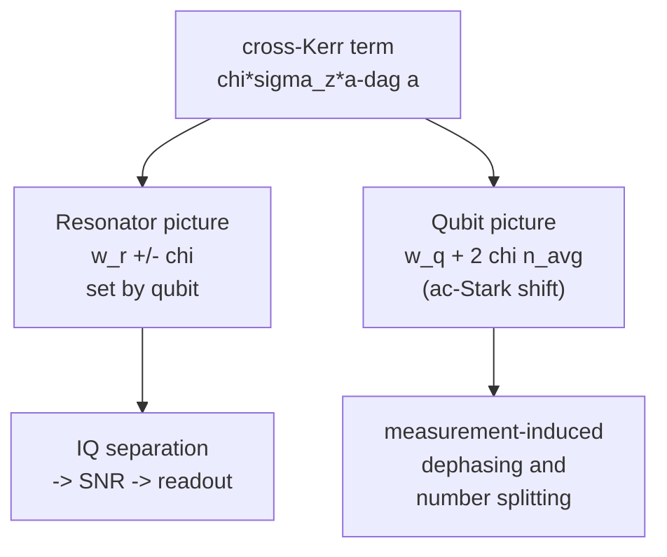
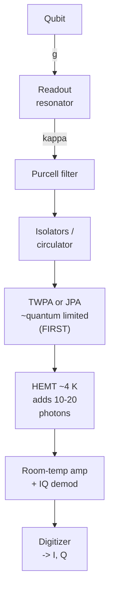

# 06 · Dispersive Readout

We've built a qubit (Chapters 03-04) and coupled it to a resonator (Chapter 05). Now we want to *ask* the qubit whether it's in $|0\rangle$ or $|1\rangle$, without disturbing it any more than quantum mechanics forces us to. The trick is beautiful: don't measure the qubit at all. Measure the resonator, and let the qubit's state leave a fingerprint on it.

This chapter builds that idea quantitatively. We start from Jaynes-Cummings, derive the dispersive shift step by step, see where it breaks, and then turn $\chi$ into a signal-to-noise ratio, a fidelity, and a back-action rate. By the end you'll be able to follow a single number, $\chi$, all the way to "what fidelity do I get, and why."

## 1. From Jaynes-Cummings to the dispersive shift

Recall the Jaynes-Cummings (JC) Hamiltonian for a qubit coupled to a single resonator mode:

$$
H/\hbar = \omega_r\, a^\dagger a + \tfrac{1}{2}\omega_q\,\sigma_z + g\left(a^\dagger \sigma_- + a\,\sigma_+\right).
$$

Three pieces: a harmonic resonator ($a^\dagger a$), a two-level qubit ($\sigma_z$), and a coupling that swaps **one photon for one qubit excitation**. That coupling conserves total excitation number, it's the rotating-wave term you keep when $g \ll \omega_q,\omega_r$.

We use the readout (quantum-information) convention $\sigma_z = |0\rangle\langle0| - |1\rangle\langle1|$, so $\sigma_z = +1$ on $|0\rangle$ and $-1$ on $|1\rangle$; with this sign the qubit term places the *occupied* $|1\rangle$ at the lower diagonal entry, which is purely a bookkeeping choice and does not affect any readout result below.

Define the detuning $\Delta = \omega_q - \omega_r$. In the **dispersive regime** $|\Delta| \gg g$, the coupling can't conserve energy if it tries to actually move an excitation: emitting a photon would cost/release $\sim\Delta$ of energy it doesn't have. So real population transfer is forbidden, but the qubit and resonator still feel each other through *virtual* exchange. Our job is to fold that virtual coupling into an effective, diagonal Hamiltonian.

> **Intuition.** Two pendulums with very different natural frequencies, joined by a weak spring, never trade energy. But the spring still slightly stiffens each one, shifting its frequency by an amount that depends on the *other* pendulum's state. That frequency pull is $\chi$.

### Schrieffer-Wolff: eliminating the coupling

We remove the coupling perturbatively with a small unitary rotation $U = e^{S}$, choosing the anti-Hermitian generator

$$
S = \frac{g}{\Delta}\left(a^\dagger \sigma_- - a\,\sigma_+\right).
$$

**Step 1.** Transform: $H' = U H U^\dagger = H + [S,H] + \tfrac{1}{2}[S,[S,H]] + \dots$ (Baker-Campbell-Hausdorff).

**Step 2.** $S$ is chosen so that $[S,\,H_0]$ exactly cancels the original $g$-term to first order, where $H_0$ is the uncoupled part. This is the whole point of the rotation: kill the off-diagonal coupling.

**Step 3.** The first surviving correction is the second-order term $\tfrac{1}{2}[S, g(a^\dagger\sigma_- + a\sigma_+)]$. Evaluating the commutators (using $[a,a^\dagger]=1$ and $[\sigma_+,\sigma_-]=\sigma_z$) gives

$$
\frac{g^2}{\Delta}\left(a^\dagger a + \tfrac{1}{2}\right)\sigma_z .
$$

**Step 4.** Collecting terms, define $\chi \equiv g^2/\Delta$:

$$
\boxed{\,H_{\mathrm{disp}}/\hbar \approx \left(\omega_r + \chi\,\sigma_z\right) a^\dagger a + \tfrac{1}{2}\!\left(\omega_q + \chi\right)\sigma_z\,}
$$

Two things fell out at once. The $\chi\,\sigma_z\,a^\dagger a$ term is a **cross-Kerr** coupling, and the leftover $\tfrac12\chi\sigma_z$ is a Lamb shift of the qubit. The expansion parameter was $g/\Delta$, keep it small.

## 2. One term, two pictures

That single cross-Kerr term $\chi\,\sigma_z\,a^\dagger a$ is symmetric, you can group the operators two ways, and each grouping is a physical "picture."



- **Resonator picture**: group as $(\chi\sigma_z)\,a^\dagger a$: the resonator frequency is $\omega_r + \chi$ if the qubit is in $|0\rangle$ (where $\sigma_z=+1$) and $\omega_r - \chi$ if in $|1\rangle$. The two frequencies are split by $2\chi$. **This is what we read.**
- **Qubit picture**: group as $\chi(a^\dagger a)\,\sigma_z$: the qubit frequency shifts by $2\chi\,\bar n$ where $\bar n$ is the photon number. This is the **ac-Stark shift**, and its photon-number dependence causes the back-action we meet in §5.

Both are the *same physics*. Read the resonator, learn the qubit; but the same term means probing the resonator inevitably disturbs the qubit's phase.

## 3. The transmon correction: why the third level matters

The two-level result $\chi = g^2/\Delta$ is wrong for a transmon, because a transmon is a *weakly anharmonic oscillator*, not a true two-level system. Its $|1\rangle\!\to\!|2\rangle$ transition (detuning $\Delta + \alpha$, coupling enhanced by $\sqrt2$) **also pulls the cavity**, and in the opposite sense when the qubit sits in $|1\rangle$. The cavity pull is the difference $\chi_{01} - \chi_{12}/2$ of the two manifolds. Collecting them:

$$
\boxed{\;\chi = \frac{g^2}{\Delta}\,\frac{\alpha}{\Delta + \alpha}, \qquad \alpha < 0\;}
$$

Because $\alpha<0$, the factor $\alpha/(\Delta+\alpha)$ is less than one: **the third level partially cancels the dispersive shift.** Using the bare two-level formula overestimates $\chi$, a common and costly mistake when designing a chip. A typical illustrative value is $\chi/2\pi \sim 0.5\text{–}1$ MHz.

## 4. Where it breaks: the critical photon number

The dispersive expansion isn't free, it assumed $g/\Delta \ll 1$. But the *effective* coupling of a coherent field with $\bar n$ photons grows as $\sqrt{n+1}\,g$. Demanding the expansion stays valid, $\sqrt{\bar n}\,g/\Delta \lesssim \tfrac12$, defines the **critical photon number**:

$$
\boxed{\;n_{\mathrm{crit}} = \frac{\Delta^2}{4g^2}\;}
$$

Push more than $\sim n_{\mathrm{crit}}$ photons into the resonator and the perturbation theory collapses: the qubit hybridizes with the cavity, gets driven into higher transmon levels, and you get **measurement-induced state transitions (MIST)** and leakage to $|2\rangle$. This is why "more photons" is *not* always better, there's a hard ceiling, and you operate a comfortable factor below it ($\bar n \sim$ a few, when $n_{\mathrm{crit}}\sim 100$).

## 5. Reading it out in the IQ plane

We probe the resonator with a microwave tone near $\omega_r$ and measure the reflected/transmitted signal. The qubit state shifts the resonance, changing **both the amplitude and the phase** of the returned tone, near $\omega_r$ the *phase* shift usually dominates, which is why we homodyne along an optimal quadrature. We demodulate into two quadratures $I$ and $Q$; each single-shot lands as a point, and the two qubit states form two Gaussian clouds.

```
        Q
        ^                  decision threshold
        |        .          (perpendicular bisector)
        |     ( |0> )  :
        |    (  ###  ) :   ( |1> )
        |     ( ### )  :  (  ###  )
        |        '     :   ( ### )
        |              :      '
        +--------------------------------> I
         <-- separation = |α0 − α1| -->
         (grows with χ, n̄, integration T)

   blob WIDTH  = noise σ  (vacuum 1/2 + amplifier n_add, ÷ efficiency η)
   overlapping tails (shaded) = assignment error ≈ ½ erfc(SNR/2)
```

The two coherent states $\alpha_0,\alpha_1$ are the steady states of a damped, driven oscillator at the two pulled frequencies. Their **separation is the signal**; amplifier and vacuum noise set the **blob width**. Everything good comes from pushing the blobs apart and keeping them narrow.

### Signal-to-noise ratio

Each escaping photon carries which-state information, so the integrated signal is $\propto \sqrt{\kappa}\,(\alpha_0-\alpha_1)$ over time $T$. The noise per quadrature is vacuum ($\tfrac12$) plus amplifier added noise $n_{\mathrm{add}}$, divided by efficiency $\eta$. Forming (signal)$^2$/(noise):

$$
\mathrm{SNR}^2 = \frac{2\,\eta\,\kappa\,T\,|\alpha_0-\alpha_1|^2}{1 + 2 n_{\mathrm{add}}}
\;\sim\; \eta\,\frac{16\chi^2}{\kappa}\,\bar n\,T \quad(\text{near } 2\chi = \kappa).
$$

SNR rewards larger $\chi$, more photons $\bar n$, longer $T$, higher efficiency $\eta$, and lower $n_{\mathrm{add}}$. The separation overlap then sets the **fidelity**:

$$
F = 1 - P(0|1) - P(1|0), \qquad
\varepsilon_{\mathrm{overlap}} \approx \tfrac12\,\mathrm{erfc}\!\left(\frac{\mathrm{SNR}}{2}\right).
$$

Doubling SNR suppresses the overlap error *exponentially*. But there's a catch that SNR can't fix: during the readout, the qubit can decay via $T_1$, contributing an error $\sim T_{\mathrm{meas}}/(2T_1)$ that *grows* with $T$. So integrating forever is counterproductive, there's an optimal $T_{\mathrm{meas}}$.

## 6. Back-action: measurement-induced dephasing

Here is the conceptual heart, and it's the *qubit picture* of §2 coming back to bite us. The moment the two pointer states $\alpha_0,\alpha_1$ become distinguishable in the cavity, a qubit *superposition* loses phase coherence. The qubit's off-diagonal coherence is multiplied by the overlap $\langle\alpha_1|\alpha_0\rangle$, whose magnitude decays as $\exp(-|\alpha_0-\alpha_1|^2/2)$. The dephasing rate is

$$
\Gamma_\phi^{\mathrm{meas}} = \kappa\,\frac{|\alpha_0-\alpha_1|^2}{2}
\;\xrightarrow{\,2\chi\ll\kappa\,}\;
\boxed{\;\frac{8\chi^2}{\kappa}\,\bar n\;}
$$

This is **unavoidable**: in an ideal ($\eta=1$) measurement, the rate at which you learn about $\sigma_z$ *equals* the rate at which $\sigma_x,\sigma_y$ dephase. That is the rigorous statement behind "measure the resonator, learn the qubit." QND does *not* mean "no back-action", it means the measured observable $\sigma_z$ is preserved while its conjugates are scrambled.

## 7. Purcell decay and the Purcell filter

By hybridizing with the lossy resonator, the qubit inherits a photonic admixture of amplitude $g/\Delta$, which decays at the cavity rate $\kappa$:

$$
\Gamma_{\mathrm{Purcell}} = \kappa\left(\frac{g}{\Delta}\right)^2, \qquad T_1^{\mathrm{Purcell}} = 1/\Gamma_{\mathrm{Purcell}}.
$$

Note the same $g/\Delta$ that sets $\chi$ also sets this decay, so faster readout (bigger $\kappa$) directly threatens $T_1$. The fix is a **Purcell filter**: a frequency-selective impedance that presents *low* impedance (high $\kappa$, fast photon escape) at $\omega_r$ but *high* impedance (suppressed emission) at $\omega_q$. It multiplies $\Gamma_{\mathrm{Purcell}}$ by the filter's out-of-band rejection $|H(\omega_q)|^2 \ll 1$, decoupling readout speed from $T_1$. It's not just "more bandwidth", it's a band-stop at the qubit frequency.

## 8. The amplifier chain and the quantum limit

The returned signal is of order *one photon*. A semiconductor HEMT (the workhorse cryogenic amp at ~4 K) adds 10-20 noise photons, it would bury a single-photon signal. **Caves' theorem** says any phase-insensitive linear amplifier must add at least half a photon:

$$
n_{\mathrm{add}} \ge \tfrac12, \qquad T_{\mathrm{added}} \ge \frac{hf}{2k_B}\;(\approx 0.14\text{ K at 6 GHz}).
$$

Why does the *first* amplifier matter most? The **Friis formula** for noise referred to input:

$$
T_N^{\mathrm{sys}} = T_{N,1} + \frac{T_{N,2}}{G_1} + \dots
$$

A quantum-limited first stage with gain $G_1 \sim 100$ divides the HEMT's contribution by 100, making it negligible. So we place a JPA or TWPA *first*, it sets the system noise near the quantum limit. Order matters more than individual quality.



| Amplifier | Type | Gain | Bandwidth | Added noise* | Saturation | Role |
|---|---|---|---|---|---|---|
| JPA | Resonant Josephson | ~20 dB | ~tens of MHz | ~0.5-1 photon (near SQL) | low | narrowband first stage |
| TWPA | Traveling-wave | ~20 dB | ~GHz | ~1-2 photons | higher | broadband multiplexed first stage |
| HEMT | Semiconductor | ~40 dB | multi-GHz | ~10-20 photons (few K) | high | second stage at 4 K |

\*All numbers illustrative.

## 9. Why $2\chi \approx \kappa$, and the trade space

Maximize integrated SNR per unit time at fixed photon number. The phase separation of the two coherent states is largest when the two Lorentzian responses (width $\kappa$, split by $2\chi$) are *just resolved*, too narrow a $\kappa$ imprints lots of phase but leaks slowly; too broad a $\kappa$ is fast but smears the phase contrast and worsens Purcell. The optimum lands near $2\chi = \kappa$.

```
 amplitude/phase
     |        |1>: ω_r − χ       |0>: ω_r + χ
     |          _                  _
     |        /   \              /   \
     |       /     \            /     \      each peak width ≈ κ
     |      /       \    |     /       \
     |____/_________\___|___/_________\____ → probe freq
                       ω_r (drive)
        <----- 2χ ----->   peaks just resolved when 2χ ≈ κ
```

| Knob | Increase helps | Increase hurts |
|---|---|---|
| $\chi$ | more signal / SNR | more measurement dephasing; smaller $n_{\mathrm{crit}}$ margin |
| $\bar n$ photons | more SNR | approaches $n_{\mathrm{crit}}$, MIST/leakage, more dephasing |
| $\kappa$ | faster info out; less Purcell-$T_1$ cost (fast escape) | less phase contrast; worse Purcell at $\omega_q$ (without filter) |
| $T$ (integration) | more SNR (overlap error ↓) | more $T_1$ decay during readout; lower QND repeatability |

Bottom line: aim for $2\chi \approx \kappa$, keep $\bar n \ll n_{\mathrm{crit}}$, and add a Purcell filter. (The exact optimum shifts with $\eta$, target fidelity, and your Purcell/$T_1$ budget, $2\chi=\kappa$ is a sweet spot, not a law.)

## 10. Worked example (all numbers illustrative)

**Given:** $g/2\pi = 100$ MHz, $\omega_q/2\pi = 5.0$ GHz, $\omega_r/2\pi = 7.0$ GHz, $\alpha/2\pi = -300$ MHz, $\kappa/2\pi = 2$ MHz, $n_{\mathrm{add}} = 0.5$, $\eta = 0.5$, $T = 500$ ns, $T_1 = 50\,\mu$s.

1. **Detuning:** $\Delta/2\pi = 5.0 - 7.0 = -2000$ MHz.
2. **Critical photons:** $n_{\mathrm{crit}} = \Delta^2/(4g^2) = 2000^2/(4\cdot100^2) = 100$. We'll use $\bar n \sim 5$, safely QND.
3. **Two-level guess:** $g^2/\Delta = 100^2/(-2000) = -5$ MHz.
4. **Transmon $\chi$:** $\chi = (-5)\cdot\dfrac{-300}{-2000-300} = (-5)(0.130) = -0.65$ MHz. So $2|\chi|/2\pi \approx 1.3$ MHz vs $\kappa/2\pi = 2$ MHz → near the $2\chi\approx\kappa$ sweet spot.
5. **Purcell (no filter):** $\Gamma_{\mathrm{Purcell}} = \kappa(g/\Delta)^2 = (2\pi\cdot2\text{ MHz})(0.05)^2 = 2\pi\cdot5$ kHz → $T_1^{\mathrm{Purcell}} \approx 32\,\mu$s. A 20 dB filter pushes this to ~3 ms, no longer a bottleneck.
6. **Measurement dephasing** at $\bar n=5$: $\Gamma_\phi = 8\chi^2\bar n/\kappa \approx 2\pi\cdot8.5$ MHz → coherence gone in ~19 ns. Fine: we've already collapsed to a $\sigma_z$ eigenstate; readout and idle coherence are different regimes.
7. **SNR:** separation $|\alpha_0-\alpha_1|^2 \approx \dfrac{16\chi^2}{\kappa^2+4\chi^2}\bar n = \dfrac{6.81}{5.70}\cdot5 \approx 5.97$ photons. Collected photons $\kappa T = (2\pi\cdot2\text{e}6)(500\text{e-}9)\approx6.28$. Then $\mathrm{SNR}^2 \approx \dfrac{2\cdot0.5\cdot6.28\cdot5.97}{1+1} \approx 18.7$, so $\mathrm{SNR}\approx4.3$.
8. **Fidelity:** overlap error $\approx \tfrac12\,\mathrm{erfc}(2.16) = 0.0011$; both tails → $\approx0.998$. Add $T_1$ error $T_{\mathrm{meas}}/(2T_1)=0.005$. **Net $F \approx 0.99$.**

This already sits around 99%; to push it solidly past 99.x%: raise $\eta$ (better amplifier), modestly raise $\chi$ or $\bar n$ (staying $\ll n_{\mathrm{crit}}=100$), or lengthen $T$ while watching $T_1$, exactly the levers in the §9 table.

## Common pitfalls

- **"Dispersive readout measures the qubit."** No, it measures the *resonator field*. The qubit's $\sigma_z$ is only inferred, which is *why* it's preserved (QND).
- **"More photons are always better."** Beyond $\sim n_{\mathrm{crit}}$ you break the approximation and trigger MIST/leakage, fidelity collapses.
- **"QND means no back-action."** Only $\sigma_z$ is protected; $\sigma_x,\sigma_y$ dephase at exactly the information-gain rate.
- **"$\chi = g^2/\Delta$ for a transmon."** The third level cancels part of it: $\chi = (g^2/\Delta)\,\alpha/(\Delta+\alpha)$.
- **"Just buy a better HEMT."** Friis says the *first* stage sets system noise, a quantum-limited JPA/TWPA in front is what matters.
- **"Any amplifier reaches the quantum limit."** Caves forbids $n_{\mathrm{add}}<\tfrac12$ for phase-insensitive amps; only squeezing beats it, and only for one quadrature.

## Key takeaways

- The cross-Kerr term $\chi\,\sigma_z\,a^\dagger a$ gives two equivalent pictures: resonator pull $\omega_r\pm\chi$ (what we read) and ac-Stark shift $2\chi\bar n$ (the back-action).
- For a transmon, $\chi = \dfrac{g^2}{\Delta}\dfrac{\alpha}{\Delta+\alpha}$, the third level matters.
- The dispersive picture dies above $n_{\mathrm{crit}} = \Delta^2/(4g^2)$; stay well below it.
- $\mathrm{SNR}^2 \sim \eta\,(16\chi^2/\kappa)\,\bar n\,T$ (near $2\chi=\kappa$), and $\varepsilon_{\mathrm{overlap}}\approx\tfrac12\mathrm{erfc}(\mathrm{SNR}/2)$, but $T_1$ decay caps the useful integration time.
- Back-action is unavoidable: $\Gamma_\phi^{\mathrm{meas}} = 8\chi^2\bar n/\kappa$ equals the information-gain rate.
- A **Purcell filter** decouples $\kappa$ from $T_1$; a **JPA/TWPA first** sets system noise near the Caves limit ($n_{\mathrm{add}}\ge\tfrac12$).
- Operate near $2\chi\approx\kappa$, $\bar n\ll n_{\mathrm{crit}}$.

## Go deeper

- Blais, Grimsmo, Girvin, Wallraff, *Circuit quantum electrodynamics*, Rev. Mod. Phys. 93, 025005 (2021), [arXiv:2005.12667](https://arxiv.org/abs/2005.12667). The definitive review; authoritative for the dispersive Hamiltonian, SNR, dephasing, and QND.
- Krantz et al., *A Quantum Engineer's Guide to Superconducting Qubits*, Appl. Phys. Rev. 6, 021318 (2019), [arXiv:1904.06560](https://arxiv.org/abs/1904.06560). Engineering-level treatment of the transmon $\chi$, Purcell filters, and the amplifier chain.
- Gambetta et al., *Qubit-photon interactions in a cavity: measurement-induced dephasing and number splitting*, Phys. Rev. A 74, 042318 (2006), [arXiv:cond-mat/0602322](https://arxiv.org/abs/cond-mat/0602322). The original quantitative back-action / ac-Stark treatment.
- Macklin et al., *A near-quantum-limited Josephson traveling-wave parametric amplifier*, Science 350, 307 (2015), [DOI:10.1126/science.aaa8525](https://doi.org/10.1126/science.aaa8525). The canonical TWPA paper.
- Caves, *Quantum limits on noise in linear amplifiers*, Phys. Rev. D 26, 1817 (1982), [DOI:10.1103/PhysRevD.26.1817](https://doi.org/10.1103/PhysRevD.26.1817). The foundational half-photon proof.

---

← Back to [project README](../README.md) · [Tutorial index](./README.md)
