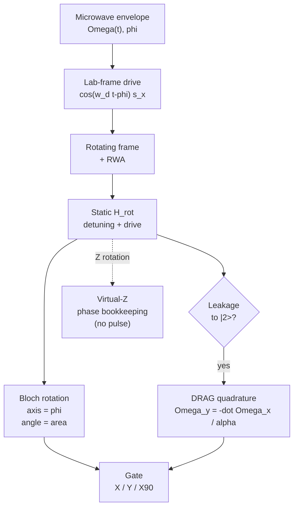
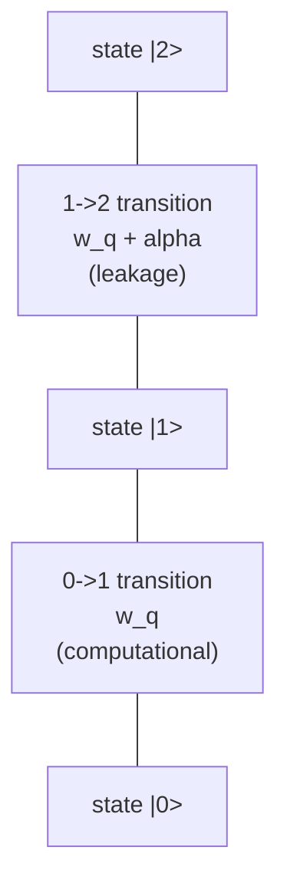

# 07 · Single-Qubit Gates & Control

So far we have a transmon sitting at frequency $\omega_q$ with a weak anharmonicity $\alpha$. It is (almost) a quantum two-level system, but a static qubit is useless, we need to *rotate* its state on demand. This chapter is about how a microwave pulse turns into a gate: how driving produces Rabi oscillations, why we think in a rotating frame on the Bloch sphere, what happens *off* resonance, and the two tricks (DRAG and virtual-Z) plus the calibration loop that make real gates fast and clean.

Here is the whole pipeline at a glance:



## Driving the qubit: the lab-frame Hamiltonian

We address the qubit through a control line that capacitively couples a classical microwave voltage to it. Using the same convention as the labs, $|0\rangle$ is the ground state and $\hat\sigma_z|0\rangle=+|0\rangle$. Dropping an irrelevant constant, the lab-frame Hamiltonian is

$$ H_\text{lab}(t) = -\frac{\omega_q}{2}\,\hat\sigma_z + \Omega(t)\cos(\omega_d t - \phi)\,\hat\sigma_x . $$

The first term is the static energy splitting; the second is a tiny *transverse* oscillating field, with slow envelope $\Omega(t)$, carrier frequency $\omega_d$, and phase $\phi$.

> **Intuition: the swing.** Think of a child on a swing. Pushing at random does nothing; a gentle push delivered once per period, *in phase* with the motion, builds a large swing from a small force. The drive is the push; resonance is matching the swing's natural frequency $\omega_q$. Only a near-resonant drive accumulates coherently, off-resonant pushes alternately add and subtract and average away. This is the physical origin of Rabi oscillations.

## The rotating frame and the RWA, step by step

Free evolution is precession about $z$ at $\omega_q$, dizzyingly fast (GHz). To expose the slow *gate* dynamics, transform into a frame co-rotating with the drive. It's like filming a carousel from a co-rotating camera: the blur freezes. Use

$$ U(t) = \exp\!\Big(-i\,\frac{\omega_d t}{2}\,\hat\sigma_z\Big), \qquad H_\text{rot} = U H_\text{lab} U^\dagger + i\,\dot U\,U^\dagger . $$

Step by step:

1. **Free term.** $U$ commutes with $\hat\sigma_z$, so $U\,(-\tfrac{\omega_q}{2}\hat\sigma_z)\,U^\dagger = -\tfrac{\omega_q}{2}\hat\sigma_z$. The generator term contributes $i\dot U U^\dagger = \tfrac{\omega_d}{2}\hat\sigma_z$. Together they give $\tfrac{\Delta}{2}\hat\sigma_z$ with **detuning** $\Delta = \omega_d - \omega_q$.
2. **Split the cosine.** Define energy raising/lowering operators for this convention as $\hat\sigma_+ = |1\rangle\langle0| = (\hat\sigma_x-i\hat\sigma_y)/2$ and $\hat\sigma_- = |0\rangle\langle1| = (\hat\sigma_x+i\hat\sigma_y)/2$, so $\hat\sigma_x=\hat\sigma_+ + \hat\sigma_-$. Then write $\cos(\omega_d t-\phi)=\tfrac12\big[e^{i(\omega_d t-\phi)}+e^{-i(\omega_d t-\phi)}\big]$.
3. **Conjugate the ladder operators.** $U\hat\sigma_+ U^\dagger = e^{i\omega_d t}\hat\sigma_+$ (and the conjugate for $\hat\sigma_-$). Multiplying the four cross terms, two are *time-independent* (co-rotating: $e^{i\omega_d t}\cdot e^{-i\omega_d t}$) and two oscillate at $\pm 2\omega_d$ (counter-rotating).
4. **RWA.** Because $\Omega \ll \omega_q \approx \omega_d$, the $2\omega_d$ terms average to zero over one drive period and are dropped. (This is an *approximation*, not exact, it leaves small Bloch-Siegert-type shifts that precise calibration absorbs.)

Collecting survivors gives the workhorse equation:

$$ \boxed{\,H_\text{rot} = \frac{\Delta}{2}\,\hat\sigma_z + \frac{\Omega(t)}{2}\big(\cos\phi\,\hat\sigma_x + \sin\phi\,\hat\sigma_y\big)\,}, \qquad \Delta = \omega_d - \omega_q . $$

## Bloch sphere, axis, and angle

A pure state is a point on the **Bloch sphere** ($|0\rangle$ north, $|1\rangle$ south, superpositions on the equator). $H_\text{rot}$ is a *fixed field vector* $\mathbf{b}=(\Omega\cos\phi,\ \Omega\sin\phi,\ \Delta)$, and the state simply rotates about $\mathbf{b}$ at the **generalized Rabi frequency** $\Omega_R=|\mathbf b|=\sqrt{\Omega^2+\Delta^2}$. On resonance the axis lies in the equatorial plane; detuning tilts it up toward the pole.

On resonance ($\Delta=0$) the axis is fixed, so the time-ordered exponential collapses to an ordinary one:

$$ \theta = \int_0^{t_g}\!\Omega(t)\,dt, \qquad U = \exp\!\Big[-i\frac{\theta}{2}\big(\cos\phi\,\hat\sigma_x+\sin\phi\,\hat\sigma_y\big)\Big]. $$

The rotation **angle is the pulse *area*** $\theta$; the **axis is the phase** $\phi$. That separation *is* the entire single-qubit toolkit:

| Knob | Symbol | Controls | Illustrative value | Resulting gate |
|---|---|---|---|---|
| Drive phase | $\phi$ | rotation axis in $xy$-plane | $\phi=0 \to x$; $\pi/2 \to y$ | X vs Y |
| Pulse area | $\theta=\int\Omega\,dt$ | rotation angle | $\theta=\pi$ | X ($\pi$ pulse) |
| | | | $\theta=\pi/2$ | X90 |
| Detuning | $\Delta=\omega_d-\omega_q$ | tilts axis / speeds $\Omega_R$ | $\Delta=0$ ideal | calibration target |
| DRAG coeff | $\beta\!\approx\!-1/\alpha$ | leakage/phase cancel | tuned | clean fast gate |
| Virtual-Z | $\lambda$ | $z$-rotation via phase | any | $Z(\lambda)$ |

```text
        |0⟩ (north)
         |        X90: 90 degree rotation about +x
         |   ___       takes |0> -> equator (-y)
         |  /   \
   ------+--•----→ +y     • leakage arrow escaping toward |2⟩,
        /|   x          curved "DRAG" arrow bending it back
       / |
     +x  |
        |1⟩ (south)
```

## Off resonance: the generalized Rabi formula

The on-resonance result is only the special case. The full population from $|0\rangle$ is

$$ P_1(t) = \frac{\Omega^2}{\Omega_R^2}\,\sin^2\!\Big(\frac{\Omega_R t}{2}\Big), \qquad \Omega_R=\sqrt{\Omega^2+\Delta^2}. $$

Geometrically: rotate the Bloch vector about $\mathbf b$ and project onto $z$, giving $z(t)=1-2\tfrac{\Omega^2}{\Omega_R^2}\sin^2(\Omega_R t/2)$, hence $P_1=(1-z)/2$. Set $\Delta=0$ to recover the textbook $\sin^2(\Omega t/2)$, which reaches 1.

Off resonance two things change: oscillations are **faster** (rate $\Omega_R>\Omega$) and the **contrast** $\Omega^2/\Omega_R^2<1$, the qubit *never* reaches $|1\rangle$. A low-amplitude, fast-oscillating Rabi signal is the textbook fingerprint of a *detuned drive*, not a weak pulse.

```text
P1
1.0 ┤   Δ=0 (on resonance)        full contrast, period 2π/Ω
    │     ___           ___
    │    /   \         /   \      ← t_π = π/Ω marks the π pulse
0.5 ┤   /     \       /     \
    │  /       \     /       \
0.0 ┼─/─────────\___/─────────\__ t
1.0 ┤   Δ=Ω (off resonance)    peak = Ω²/Ω_R² = 1/2, faster
0.5 ┤   /\    /\    /\    /\       period 2π/Ω_R, Ω_R=√2·Ω
0.0 ┼──/  \__/  \__/  \__/  \____ t
```

## The transmon is multilevel: leakage

Now the transmon's weakness bites. It is **not** a true two-level system. With $\alpha<0$ (typically a couple hundred MHz, illustrative), the $|1\rangle\!\to\!|2\rangle$ transition sits *below* the qubit transition:



| Transition | Frequency (illustrative) | Note |
|---|---|---|
| $|0\rangle\!\to\!|1\rangle$ | $\omega_q = 5.0$ GHz | computational |
| $|1\rangle\!\to\!|2\rangle$ | $\omega_q+\alpha = 4.75$ GHz ($\alpha=-250$ MHz) | leakage target |
| Drive bandwidth | $\sim 1/t_g \approx 50$ MHz at $t_g=20$ ns | overlaps $|1\rangle\!\to\!|2\rangle$ when $|\alpha|$ small or $t_g$ short |

A short pulse has broad bandwidth $\sim 1/t_g$; its spectral weight near $\omega_q+\alpha$ drives population out of the computational subspace. Faster gates and smaller $|\alpha|$ leak more, a fundamental speed/leakage trade-off.

## DRAG: suppressing leakage

**DRAG** (Derivative Removal by Adiabatic Gate) drives the in-phase (I) quadrature with the desired envelope $\Omega_x(t)$ and the out-of-phase (Q) quadrature with its scaled derivative. For a transmon, let $\lambda\approx\sqrt2$ denote the relative $|1\rangle\!\leftrightarrow\!|2\rangle$ dipole matrix element:

$$ \Omega_y(t) \simeq -\frac{\dot\Omega_x(t)}{\alpha}, \qquad
\delta_1(t) \simeq \frac{(\lambda^2-4)\Omega_x^2(t)}{4\alpha}\ \ (\text{Motzoi convention: } \delta_1=\omega_{01}-\omega_d). $$

For $\lambda=\sqrt2$, the detuning correction is $\delta_1\simeq-\Omega_x^2/(2\alpha)$; the sign follows the chosen detuning convention.

Sketch of why: in the rotating frame $|2\rangle$ sits at detuning $\alpha$, giving an off-resonant coupling $\propto\Omega_x$. Treat it perturbatively (adiabatic elimination of $|2\rangle$); choosing the orthogonal quadrature so the transition amplitude into $|2\rangle$ integrates to zero, to first order in $1/\alpha$, *requires* the Q drive to be the time-derivative of I. A residual diagonal AC-Stark shift of order $\Omega_x^2/\alpha$ remains and is cancelled by a small dynamic detuning (or equivalent virtual-Z); the sign must follow the chosen detuning convention. Get the **sign** wrong and you *worsen* leakage.

```text
amplitude
 │      I (in-phase): main Gaussian X envelope
 │        ╭───╮
 │       ╱     ╲
 │──────╱───────╲────────── t
 │     ╱         ╲
 │   Q (quadrature) = -İ/α : antisymmetric two lobes,
 │   ╲_╱           ╲_╱       much smaller than I (illustrative)
```

## Virtual-Z gates

What about $z$-rotations? Often you need *no pulse at all*. Since every drive axis is defined relative to $\phi$, applying $Z(\lambda)$ can be compiled into the phase reference of all *subsequent* pulses. With the convention above,

$$ Z(\lambda):\ \phi \to \phi-\lambda \ \text{ for every later pulse.} $$

Commuting a $Z(\lambda)$ through later gates is exactly this subtraction of $\lambda$ from each later pulse phase, so the $Z$ is never physically applied, it is absorbed into the final measurement basis. It is a **relabeling**: zero duration, *exact*, no calibration or coherence cost. (A physical alternative exists, built by conjugating a $Y$-rotation with two $X90$ pulses: $R_z(\lambda)=R_x(\pi/2)\,R_y(\lambda)\,R_x(-\pi/2)$, but why pay for three real pulses?)

Combined with two physical X90 pulses, virtual-Z's synthesize any single-qubit unitary via Euler angles:

$$ U = Z(c)\,X_{90}\,Z(b)\,X_{90}\,Z(a). $$

For example a Hadamard is just a virtual $Z(\pi)$ followed by a Y90, the time of a *single* half-pulse, not three physical pulses.

## Initialization and reset

Every gate sequence assumes you *start* in a known state, almost always $|0\rangle$. Getting there is **initialization**; returning there on demand mid-circuit is **reset**. It is a control problem in its own right, and DiVincenzo's criterion 2 ([Chapter 1](01-introduction.md)) demands it. There are three common approaches, in increasing order of speed and sophistication:

- **Passive (thermal) reset.** Just wait. Left alone, the qubit relaxes to its thermal ground state with time constant $T_1$. Waiting $\sim5\,T_1$ gives a clean $|0\rangle$, but at $T_1\sim100\,\mu$s that is hundreds of microseconds of dead time per shot, and the residual thermal population (a few percent at typical fridge/effective temperatures) sets a floor on the fidelity. Too slow for deep circuits.
- **Measurement-based feedback reset.** Read the qubit dispersively ([Chapter 6](06-readout.md)); if the outcome is $|1\rangle$, apply a $\pi$ pulse to flip it to $|0\rangle$; if $|0\rangle$, do nothing. This **conditional reset** is fast (set by readout plus one gate, $\sim1\,\mu$s) but needs low-latency classical feedback wired into the control electronics. It is the workhorse for QEC ancillas, which must be reset every syndrome round.
- **Driven (unconditional) reset.** Engineer an always-available decay path and *drive* the excited population out of the qubit, with no measurement. The standard trick maps the excitation onto a fast-decaying mode, for example with a microwave sideband or Raman pump that sends $|1,0_c\rangle\to|0,1_c\rangle$ (or routes leaked $|2,0_c\rangle$ toward $|0,1_c\rangle$), after which the readout-resonator photon decays at rate $\kappa$. Done well this reaches the ground state in hundreds of nanoseconds, deterministically.

One subtlety the gate story already hinted at: a transmon can be excited *out* of the computational subspace into $|2\rangle$ and above (leakage, the reason DRAG exists). Ordinary reset to $|0\rangle$ does not necessarily empty those levels, so hardware that runs long algorithms or QEC adds explicit **leakage reset** to pump $|2\rangle$ population back down. We return to why this matters for error correction in [Chapter 12](12-error-correction.md).

## Calibration loop

Ideal formulas are not enough; real drives drift. The standard loop, refined by *error-amplifying* repeated-gate sequences:

| Step | Parameter | Experiment | Symptom if wrong |
|---|---|---|---|
| 1 Frequency | $\omega_d$ (drive $\Delta\!\to\!0$) | Ramsey fringe | reduced Rabi contrast / off-axis rotation |
| 2 Amplitude | $\pi$-pulse area | Rabi / repeated-$\pi$ amplification | over/under-rotation |
| 3 DRAG | $\beta$ | repeated X then Y (error amplification) | leakage + phase error |
| 4 Verify | gate error | randomized benchmarking | high error per gate |

Numbers illustrative. Standard Clifford randomized benchmarking reports the average error per Clifford; a per-native-gate number requires stating the average native gates per Clifford, or using a gate-specific protocol such as interleaved RB. The result is set by coherence ($T_1,T_2$), residual leakage, and calibration drift, which is exactly *why* DRAG and virtual-Z are worth the effort.

## Worked example (illustrative numbers)

Qubit $\omega_q/2\pi = 5.000$ GHz, $\alpha/2\pi = -250$ MHz (so $|1\rangle\!\to\!|2\rangle$ at 4.750 GHz). Goal: an X gate ($\pi$ about $x$).

1. **$\pi$-pulse time.** Pick $\Omega/2\pi=25$ MHz on resonance. For a square envelope $t_\pi=\pi/\Omega = 1/(2\cdot 25\,\text{MHz})=20$ ns. RWA check: $\Omega/\omega_q = 25/5000 = 0.005 \ll 1$, dropping the $2\omega_d$ terms is well justified.
2. **Off-resonance contrast.** Mistune by $|\Delta|/2\pi=25$ MHz, i.e. $|\Delta|=\Omega$. Then $\Omega_R=\sqrt2\,\Omega$, equivalently $\Omega_R/2\pi=\sqrt2\cdot25\,\text{MHz}\approx35.4\,\text{MHz}$, and max population $=\Omega^2/\Omega_R^2 = 1/2$: the qubit only reaches halfway, and the resonant $\pi$ pulse badly under-rotates. That is the cue to re-tune $\omega_d$.
3. **Axis from phase.** Keep the 20 ns $\pi$ pulse but set $\phi=\pi/2$ → a Y gate, same amplitude and duration.
4. **Hadamard.** Virtual $Z(\pi)$ (zero ns) then Y90, one 10 ns half-pulse total.
5. **Leakage & DRAG.** Speed up: $t_g=10$ ns -> $\Omega/2\pi=50$ MHz, bandwidth $\sim 100$ MHz, an appreciable fraction of $|\alpha|=250$ MHz. Leakage scales as $(\Omega/\alpha)^2 \approx (50/250)^2 = 0.04$, a few percent, far too large. DRAG adds $\Omega_y=-\dot\Omega_x/\alpha$ (antisymmetric two-lobed) plus a small frame correction with scale $|\Omega^2/(2\alpha)|/2\pi = (50)^2/(2\cdot250) = 5$ MHz, suppressing leakage and its phase error by orders of magnitude, a clean 10 ns X gate. (Exact suppression is a calibration result; the point is the *scaling*.)

## Common pitfalls

- A $\pi$ pulse does **not** always reach $|1\rangle$: off resonance the max is $\Omega^2/\Omega_R^2<1$. Reduced contrast means *detuned*, not *weak*.
- Don't confuse $\Omega$ (bare Rabi, the on-resonance rotation rate) with $\Omega_R=\sqrt{\Omega^2+\Delta^2}$.
- For a resonant two-level drive with fixed phase under the RWA, the ideal rotation angle depends only on pulse **area**, not shape. Shape matters for *leakage/bandwidth*, and detuning, DRAG quadrature, Stark shifts, or time-dependent axes break the simple area rule.
- The RWA is **not** exact, it drops $2\omega_d$ terms and leaves Bloch-Siegert shifts for calibration to absorb.
- Don't conflate detuning $\Delta$ (qubit-vs-drive, sets axis) with anharmonicity $\alpha$ ($|1\rangle\!\to\!|2\rangle$ spacing, sets leakage). With $\alpha<0$, $|2\rangle$ is *below* $2\omega_q$.
- Virtual-Z gates are exact and free, but only act on *subsequent* pulses and the final measurement basis.

## Key takeaways

- A near-resonant microwave pulse drives **Rabi oscillations**; the full law is $P_1=\tfrac{\Omega^2}{\Omega_R^2}\sin^2(\Omega_R t/2)$, reducing to $\sin^2(\Omega t/2)$ on resonance.
- In the **rotating frame** under the RWA, $H_\text{rot}=\tfrac{\Delta}{2}\hat\sigma_z+\tfrac{\Omega}{2}(\cos\phi\,\hat\sigma_x+\sin\phi\,\hat\sigma_y)$ with $\Delta=\omega_d-\omega_q$: drive **phase** picks the axis, pulse **area** picks the angle.
- The transmon is **multilevel**; the nearby $|2\rangle$ at $\omega_q+\alpha$ causes **leakage**, worse for fast gates and small $|\alpha|$.
- **DRAG** adds a derivative quadrature ($\propto-\dot\Omega/\alpha$) plus a small detuning correction to cancel leakage and phase error.
- **Virtual-Z** gates are exact, zero-duration phase relabelings; two X90 + virtual-Z's generate the full gate set.
- A **calibration loop** (Ramsey → Rabi → DRAG → RB) turns ideal formulas into real gates.

## Go deeper

- F. Motzoi, J. M. Gambetta, P. Rebentrost, F. K. Wilhelm, *Simple Pulses for Elimination of Leakage in Weakly Nonlinear Qubits* (original DRAG), Phys. Rev. Lett. **103**, 110501 (2009), [arXiv:0901.0534](https://arxiv.org/abs/0901.0534).
- D. C. McKay, C. J. Wood, S. Sheldon, J. M. Chow, J. M. Gambetta, *Efficient Z-Gates for Quantum Computing*, Phys. Rev. A **96**, 022330 (2017), [arXiv:1612.00858](https://arxiv.org/abs/1612.00858) (virtual-Z).
- P. Krantz, M. Kjaergaard, F. Yan, T. P. Orlando, S. Gustavsson, W. D. Oliver, *A Quantum Engineer's Guide to Superconducting Qubits*, Appl. Phys. Rev. **6**, 021318 (2019), [arXiv:1904.06560](https://arxiv.org/abs/1904.06560) (control, rotating frame, DRAG, virtual-Z, calibration).
- A. Blais, A. L. Grimsmo, S. M. Girvin, A. Wallraff, *Circuit Quantum Electrodynamics*, Rev. Mod. Phys. **93**, 025005 (2021), [arXiv:2005.12667](https://arxiv.org/abs/2005.12667) (first-principles driven-qubit Hamiltonian, rotating frame, RWA, multilevel transmon).

---

← Back to [project README](../README.md) · [Tutorial index](./README.md)
