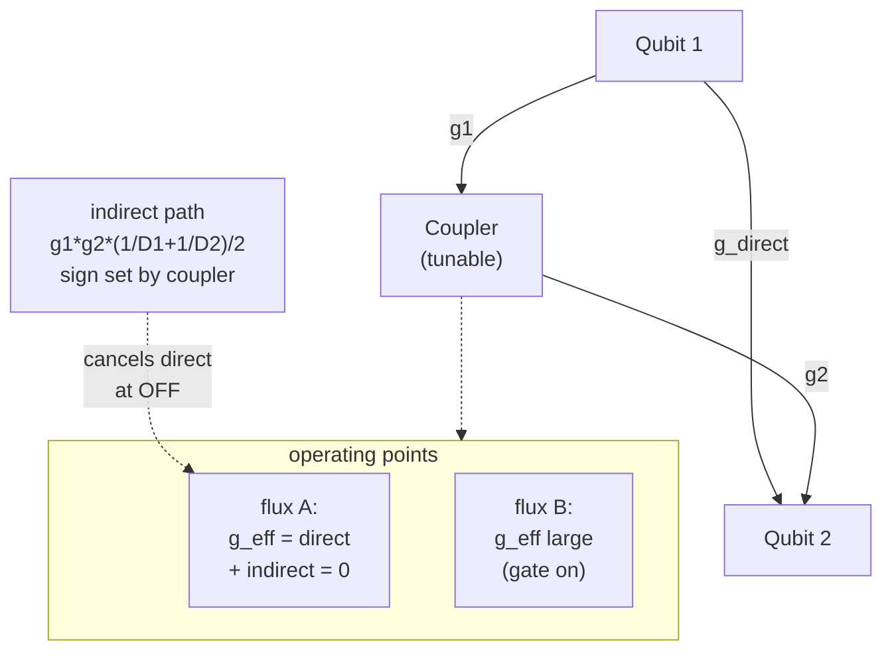

# 08 · Two-Qubit Gates

Single-qubit gates are "easy": drive one qubit with a shaped microwave pulse and you can rotate it anywhere on the Bloch sphere. But a quantum computer needs qubits to *talk* to each other. To create entanglement you need a gate whose action on one qubit depends on the state of another, and that requires a physical interaction between them. Engineering that interaction, turning it on cleanly, and turning it *off* again, is where most of the hard work in superconducting hardware lives. This chapter is about how we get two transmons to interact on purpose.

A theme that runs through everything below: **the same coupling $g$ that lets you build a gate also produces an always-on error.** The same exchange Hamiltonian that gives idle $ZZ$ also creates the avoided crossings used for CZ, but the idle shift and the pulsed gate phase are not the same measured quantity. Different two-qubit gates are mostly different answers to one question, *which* resonance do I bring into play, and *when*?

## Coupling: where $g$ comes from

The simplest way to couple two transmons is to wire them together with a capacitor $C_g$. The shared capacitance produces an electrostatic energy proportional to the *product* of the two charges, $H_c \propto C_g\,V_1 V_2 \propto \hat n_1 \hat n_2$, a charge-charge interaction. Let us turn that into the familiar exchange term, one step at a time.

1. **Start from the charge coupling.** Each transmon is an anharmonic LC mode. Its charge operator in raising/lowering form is $\hat n_i \propto i(a_i^\dagger - a_i)$, with a zero-point amplitude $\propto \sqrt{\omega_i}$. So $\hat n_1 \hat n_2 \propto -(a_1^\dagger - a_1)(a_2^\dagger - a_2)$.
2. **Expand the product.** This gives four terms: $a_1^\dagger a_2$ and $a_1 a_2^\dagger$ (excitation-conserving), plus $a_1^\dagger a_2^\dagger$ and $a_1 a_2$ (excitation non-conserving).
3. **Rotating-wave approximation.** For near-resonant qubits the non-conserving terms oscillate at $\omega_1+\omega_2$ and average to zero, leaving the number-conserving $a_1^\dagger a_2 + a_1 a_2^\dagger$.
4. **Project onto two levels.** Replace $a_i \to \sigma_-^{(i)}$, $a_i^\dagger \to \sigma_+^{(i)}$:

$$H_\text{int} = g\left(\sigma_+^{(1)}\sigma_-^{(2)} + \sigma_-^{(1)}\sigma_+^{(2)}\right), \qquad g \approx \tfrac{1}{2}\,\frac{C_g}{\sqrt{C_1 C_2}}\sqrt{\omega_1 \omega_2}.$$

This is the **exchange** (or "flip-flop") interaction: qubit 1 hands an excitation to qubit 2 and vice versa. The boxed formula matters because it says $g$ is **not a free parameter**, it is set by geometry ($C_g$ relative to the qubit capacitances) and by the frequencies. This is the same Jaynes-Cummings physics as the qubit-resonator $g$ from earlier chapters; here the "cavity" is just a second qubit.

> **Intuition.** Two pendulums on a shared springy beam swap their swinging, that is exchange coupling. The stiffer the shared spring ($C_g$), the faster they trade energy.

The catch: direct capacitive coupling is *always on*. You engineer gates around an interaction you cannot switch off, typically by parking qubits at different frequencies (detuning them) so exchange is suppressed, then acting only when you want a gate.

## Two regimes: resonant vs. dispersive

Let $\Delta = \omega_1 - \omega_2$ be the qubit-qubit detuning. The exchange term behaves completely differently depending on $\Delta$ versus $g$:

- **Resonant ($|\Delta| \lesssim g$):** energy is exchanged on resonance, the singly-excited states $|01\rangle$ and $|10\rangle$ swap. This is the iSWAP regime (it lives near $\Delta \approx 0$). The CZ gate uses a *different* resonance, the $|11\rangle$-$|02\rangle$ avoided crossing at $\Delta \approx \alpha_2$ (set by the anharmonicity, $|\alpha| \gg g$), covered below, so do not conflate it with this $\Delta \approx 0$ point.
- **Dispersive ($|\Delta| \gg g$):** direct energy exchange is suppressed; coupling acts only at second order through *virtual* excitations. What survives is a static **residual $ZZ$ shift**, a conditional phase that accrues even while you do nothing.

## Residual $ZZ$, the gate resource *and* the dominant idle error

The residual $ZZ$ is the conditional frequency shift on $|11\rangle$: how much qubit 1's frequency moves depending on whether qubit 2 is excited.

$$\zeta_{ZZ} = (E_{11}-E_{10}) - (E_{01}-E_{00}) \approx \frac{2g^2(\alpha_1+\alpha_2)}{(\Delta-\alpha_2)(\Delta+\alpha_1)}.$$

Derivation in words:

1. **Define the conditional part.** $\zeta$ is the energy of $|11\rangle$ *beyond* the sum of the single-excitation energies, the part not explained by single-qubit physics.
2. **Second-order repulsion.** $|11\rangle$ couples to $|02\rangle$ and $|20\rangle$ with matrix element $\sqrt 2\,g$ each (the $\sqrt 2$ is the bosonic $\langle 2|a^\dagger|1\rangle$ enhancement).
3. **Energy denominators.** With $\Delta=\omega_1-\omega_2$, the denominators are $E_{11}-E_{02}=\Delta-\alpha_2$ and $E_{11}-E_{20}=-(\Delta+\alpha_1)$. Thus
   $$\delta E_{11}= \frac{2g^2}{\Delta-\alpha_2}-\frac{2g^2}{\Delta+\alpha_1}.$$
   The single-excitation shifts cancel from $\zeta$, leaving the signed conditional shift.
4. **Combine.** The two signed contributions give the compact form with $(\alpha_1+\alpha_2)$ on top.
5. **The crucial limit.** As $\alpha \to \infty$ (ideal two-level systems), $\zeta \to 0$. **$ZZ$ is a transmon effect**, it exists precisely *because* transmons are weakly anharmonic. Anharmonicity is essential, not incidental.

The same exchange Hamiltonian that gives idle $ZZ$ also creates the avoided crossings used for CZ, but the idle shift and the pulsed gate phase are not the same measured quantity.

## The CZ gate via the $|11\rangle$-$|02\rangle$ avoided crossing

Tune the qubits so $|11\rangle$ and $|02\rangle$ become nearly degenerate. The $\{|11\rangle,|02\rangle\}$ block, coupled by $\sqrt 2\,g$, diagonalizes into an **avoided crossing** with minimum gap

$$\Delta_\text{gap} = 2\sqrt 2\, g \quad\text{at resonance.}$$

(Note the $2\sqrt 2$, not $2g$: the $\sqrt 2$ is the $1\to 2$ bosonic matrix element, easy to drop.)

```
 E                          |11⟩ (diabatic, rising)
 │        ╲                 ╱
 │         ╲      ___      ╱   ← upper branch (solid)
 │          ╲    /   \    ╱
 │           ╲  / gap  \  /        gap = 2√2 g
 │            ╲/ 2√2 g  \/
 │            /\        /\
 │           /  \  ___ /  ╲   ← lower branch (solid)
 │          ╱    ‾‾‾‾    ╲
 │     |02⟩ (diabatic, falling)
 │
 │ ───────────────────────────  |10⟩  (flat reference, unaffected)
 │ ───────────────────────────  |01⟩  (flat reference, unaffected)
 │ ───────────────────────────  |00⟩  (flat reference, unaffected)
 └─────────────────────────────────────► control flux / detuning
   trajectory: park → approach crossing → return
   conditional phase from |11> branch  =  -integral zeta dt  =  pi mod 2pi
```

Now bring the qubits adiabatically toward the crossing and back. Along the path the $|11\rangle$ branch is shifted by a signed conditional angular frequency $\zeta_{ZZ}(t)$ while $|00\rangle,|01\rangle,|10\rangle$ are not. The accumulated **conditional phase** includes the Schrodinger phase sign, and the gate condition is

$$\phi_\text{cond} = -\int \zeta_{ZZ}(t)\,dt \pmod{2\pi}, \qquad \phi_\text{cond}=\pi \ \text{for CZ}.$$

It is essential to define the gate phase as the *conditional* phase, not a vague "extra phase." Only the part of $|11\rangle$'s phase **not** explained by single-qubit phases counts:

$$\phi_{11} = \phi_\text{actual} - \phi_{01} - \phi_{10} + \phi_{00} = \pi \;\Rightarrow\; |11\rangle \to -|11\rangle,$$

with the other three computational states untouched. That conditional sign flip *is* a controlled-Z, $\text{CZ}=\mathrm{diag}(1,1,1,-1)$.

**The central tradeoff.** Going fast risks Landau-Zener leakage into $|02\rangle$. For $H/\hbar=(\epsilon/2)\sigma_z+V\sigma_x$, with $\epsilon$ and $V$ in angular-frequency units,
$$ P_\text{LZ} \approx \exp\!\left[-\frac{\pi \Delta_\text{gap}^2}{2|\dot\epsilon|}\right], \qquad \Delta_\text{gap}=2|V|. $$
Faster gates need larger $g$, but larger $g$ also raises leakage risk. The fix is not raw speed but a **shaped trajectory** (the "fast-adiabatic"/Martinis-style pulse, DRAG-like derivative shaping). Two ways to run CZ in practice: (a) adiabatic flux tuning into the crossing, and (b) diabatic/resonant and modern tunable-coupler "net-zero" approaches.

### Worked example, adiabatic CZ (all numbers illustrative)

Two flux-tunable transmons, $g/2\pi = 12$ MHz, $\alpha/2\pi = -300$ MHz each, $T_1=T_2=80\,\mu$s.

| Step | Quantity | Estimate |
|---|---|---|
| 1, avoided-crossing gap | $\Delta_\text{gap}/2\pi = 2\sqrt 2\,g/2\pi$ | $2(1.414)(12) \approx 34$ MHz |
| 2, conditional shift at dwell | $\zeta/2\pi \approx (\sqrt 2 g)^2/\delta$, $\delta/2\pi=50$ MHz | $(16.97)^2/50 \approx 5.8$ MHz |
| 3, gate time for $\pi$ phase | $t_\text{gate}\approx 1/(2\,\zeta_\text{Hz})$ | $1/(2\cdot 5.8\times10^6) \approx 86$ ns |
| 4, leakage (Landau-Zener) | $P_\text{LZ}\sim \exp[-\pi \Delta_\text{gap}^2/(2|\dot\epsilon|)]$ | $<10^{-3}$ *only if shaped* |
| 5, decoherence floor | $\varepsilon_\text{dec}\sim \frac{t_\text{gate}}{2}(1/T_1+1/T_2)$ | $86\text{e-}9\cdot 25000/2 \approx 1.1\times10^{-3}$ |

**Takeaway:** the *same* $g$ sets the gap (1), the conditional shift that powers the gate (2), the gate time (3), and the leakage risk (4); and coherence (5) puts a hard $\sim10^{-3}$ floor under all of it. That is why two-qubit gates dominate the error budget and sit near the surface-code threshold.

## Tunable couplers, making $g$ switchable

Insert a third element (a tunable transmon/SQUID) between the qubits. Now there are **two coupling paths**, direct, and indirect via a virtual coupler excitation, that *interfere*:

$$g_\text{eff} = g_\text{direct} + \frac{g_1 g_2}{2}\!\left(\frac{1}{\Delta_1} + \frac{1}{\Delta_2}\right).$$

The indirect term's *sign* is set by the coupler frequency, where $\Delta_i=\omega_i-\omega_c$ are signed qubit-coupler detunings in this convention, so flux-tuning the coupler can make the two paths cancel.



Crucially, $g_\text{eff}=0$ and $\zeta_{ZZ}=0$ occur at generally *different but engineerable* flux points. The real design problem is making **both** small at the operating point, a high on/off ratio with low idle crosstalk. (A common misconception: the coupler does *not* null $g_\text{eff}$ everywhere, and the $ZZ$ null is nearby but not identical.)

## Cross-resonance: all-microwave entanglement

Tunable approaches need flux lines. The **cross-resonance (CR)** gate avoids them: keep two *fixed-frequency* qubits statically coupled (strength $J$), and drive the **control** qubit at the **target's** frequency. The static coupling transmits a weak resonant tone to the target whose sign depends on the control's state, a $ZX$ interaction:

$$H_\text{CR} \approx \underbrace{\Omega_d\,\frac{J\alpha_c}{\Delta(\Delta+\alpha_c)}}_{\mu_{ZX}}\frac{ZX}{2} \;+\; \nu\, IX \;+\;\text{(IY, ZI, ZZ terms)}.$$

Derivation sketch: drive the control off-resonantly; it barely moves, but the dispersive coupling makes the target see a control-state-dependent X drive. Schrieffer-Wolff expansion in $J/\Delta$ and $\Omega_d/\Delta$ gives the leading $ZX$ rate up to sign and frame conventions, where $\alpha_c$ is the driven control qubit's anharmonicity. The perturbative formula fails near the collision $\Delta+\alpha_c\approx0$.

The raw gate is **not** a clean $ZX$, calibration must remove spurious terms:

| Term | Origin | Useful? | How handled |
|---|---|---|---|
| $ZX$ | conditioned drive via coupling $J$ | **yes** (entangling) | keep, calibrate to $\pi/2$ |
| $IX$ | classical crosstalk / direct bleed | no | cancel with target tone or echo |
| $ZI/IZ$ | Stark shifts | no | frame change / calibration |
| $ZZ$ | higher levels | no | echo / tunable detuning |

**Echoed-CR**: insert a control $\pi$-pulse and flip the drive phase halfway. The echo cancels selected single-qubit and drive-odd terms by combining control pi pulses with drive phase reversal; the desired ZX term is retained after choosing the calibrated frame. Because the rate is $\propto J\Omega_d/\Delta$ with all factors small, CR is intrinsically **slower** (hundreds of ns). And the $\alpha_c/(\alpha_c+\Delta)$ structure means certain frequency combinations kill or blow up the rate, the **frequency-collision** problem that makes fixed-frequency CR processors demand careful frequency targeting.

## The iSWAP family

Instead of routing through $|02\rangle$, bring $|01\rangle$ and $|10\rangle$ onto resonance ($\Delta=0$). Now the exchange acts within the degenerate single-excitation subspace, where $H_\text{int}=g\,\sigma_x$ (with $|01\rangle,|10\rangle$ as the basis), a Rabi-like rotation:

$$U_\text{exch}(t)=\exp\!\big[-i g t\,(\sigma_+^{(1)}\sigma_-^{(2)}+\text{h.c.})\big],\quad |01\rangle \to \cos(gt)\,|01\rangle - i\sin(gt)\,|10\rangle.$$

The only knob is dwell time $\theta = gt$:

```
 pop │  |01⟩ = cos²gt        |10⟩ = sin²gt
 1.0 │●╲              ╱‾‾╲              ╱
     │  ╲           ╱      ╲          ╱
 0.5 │   ╲╳        ╱        ╲╳       ╱
     │   ╱  ╲    ╱   |   ╲   ╱  ╲   ╱
 0.0 │  ╱     ‾‾‾    |    ‾‾‾     ‾‾
     └──────────────┼───────────────► t
              gt=π/4 │   gt=π/2
            √iSWAP    iSWAP
        (max entangling)  (full swap, -i phase)
```

- $gt=\pi/2$: full swap, the `-i` version of iSWAP for the positive-$g$ Hamiltonian above: $|01\rangle\to -i|10\rangle,\;|10\rangle\to -i|01\rangle$. The sign convention for $g$ and single-qubit phases determines whether this is written as iSWAP or iSWAP$^\dagger$.
- $gt=\pi/4$: $\sqrt{\text{iSWAP}}$, maximally entangling, a common native gate on tunable-coupler chips.

This is the **same** $g$ as the CZ avoided crossing. iSWAP and CZ are two corners of one physics, iSWAP uses the $|01\rangle$-$|10\rangle$ resonance, CZ uses $|11\rangle$-$|02\rangle$, and the **fSim** (fermionic-simulation) family continuously interpolates swap angle $\theta$ and conditional phase $\phi$ on tunable-coupler hardware.

## Why entangling gates are the hard part

Frame the two-qubit error as a sum of channels, $\varepsilon_\text{2Q}\approx \varepsilon_\text{coh}+\varepsilon_\text{leak}+\varepsilon_\text{dec}$, with the decoherence floor scaling as

$$\varepsilon_\text{dec}\sim \frac{t_\text{gate}}{2}\left(\frac{1}{T_1}+\frac{1}{T_2}\right).$$

The leading prefactor (here $1/2$) is an order-unity number that depends on the fidelity convention (process vs average) and on the number of qubits involved; we keep it explicit and fixed so the same expression reproduces the worked estimate above and the table below.

| Error channel | Scaling | Illustrative size | Mitigation |
|---|---|---|---|
| Decoherence | $\frac{t_\text{gate}}{2}(1/T_1+1/T_2)$ | $\sim 1\text{ to }3\times10^{-3}$ | shorter gates, better $T_1/T_2$ |
| Leakage to $|02\rangle$ | adiabaticity | $\sim 10^{-4}\text{ to }10^{-3}$ | fast-adiabatic / DRAG pulses |
| Residual $ZZ$ | unwanted phase $\sim \zeta t_\text{gate}$; infidelity $O[(\zeta t_\text{gate})^2]$ | variable | tunable coupler / echo |
| Coherent miscalibration | amplitude/phase error | $\sim 10^{-4}$ | interleaved RB tune-up |

*(All numbers illustrative and hardware-dependent.)* Because $t_\text{gate}$ (tens of ns) is a non-negligible fraction of $T_1,T_2$ (tens-to-hundreds of $\mu$s), the decoherence floor alone is already $\sim10^{-3}$, which is why two-qubit errors dominate the budget and set the QEC threshold.

**How is the error actually measured?** The quoted $\sim$0.1-1% comes from **interleaved randomized benchmarking (RB)**: run random sequences of Clifford gates with and without the target two-qubit gate interleaved, fit the decay of survival probability versus sequence length, and divide out, isolating the gate's average error from state-prep and measurement errors.

## Mechanism comparison

| Gate | Native interaction | Tunable elements | What you sweep/drive | Speed (illustrative) | Main error channel | Platform |
|---|---|---|---|---|---|---|
| CZ (avoided crossing) | $ZZ$ / $|11\rangle$-$|02\rangle$ | flux on qubit/coupler | frequency into crossing | fast (tens of ns) | leakage to $|02\rangle$ | flux-tunable transmons |
| iSWAP / $\sqrt{\text{iSWAP}}$ | exchange | resonant tuning / coupler | $|01\rangle$-$|10\rangle$ resonant | fast | residual $ZZ$ | tunable-coupler chips |
| Cross-resonance | $ZX$ | none (fixed freq) | $\mu$wave on control@target | slower (hundreds of ns) | spurious $IX/ZZ$, collisions | fixed-frequency transmons |

## Common pitfalls

- **"$ZZ$ is separate from CZ."** They share avoided-crossing physics: idle $ZZ$ is the small perturbative always-on conditional phase rate, while CZ deliberately changes the spectrum to accumulate a calibrated conditional phase.
- **"Two-level qubits would also have $ZZ$ / a CZ gate."** No, both vanish as $\alpha\to\infty$. They are consequences of the transmon's weak anharmonicity.
- **"The avoided-crossing gap is $2g$."** It is $2\sqrt 2\,g$; the $\sqrt 2$ is the $\langle 2|a^\dagger|1\rangle$ bosonic factor.
- **"Cross-resonance gives a clean $ZX$."** Raw CR also produces $IX$, $ZI/IZ$, and $ZZ$; a usable CNOT needs an echo and calibration.
- **"Faster is always better."** Speed fights adiabaticity, go too fast and you leak into $|02\rangle$. The optimum is a *shaped* trajectory.
- **"A tunable coupler turns $g$ fully off everywhere."** It nulls transverse $g_\text{eff}$ at one flux; the residual-$ZZ$ null is nearby but not identical.

## Key takeaways

- Entanglement requires a real physical interaction; **capacitive coupling** gives an always-on exchange $g(\sigma_+\sigma_-+\sigma_-\sigma_+)$, with $g$ fixed by geometry and frequencies, not a free knob.
- **Residual $ZZ$** is second order in $g$, requires anharmonicity, and is a dominant idle error produced by the same couplings used for entangling gates.
- The **CZ gate** integrates the conditional phase $\phi_{11}=\phi_\text{actual}-\phi_{01}-\phi_{10}+\phi_{00}=\pi$ at the $|11\rangle$-$|02\rangle$ crossing (gap $2\sqrt 2\,g$); speed fights leakage, so trajectories are shaped.
- **Tunable couplers** cancel direct + indirect paths to null $g_\text{eff}$ (and, separately, $ZZ$).
- **Cross-resonance** entangles fixed-frequency qubits via a $ZX$ term ($\propto J\Omega_d/\Delta$ up to convention factors) but needs echoing and frequency-collision avoidance; **iSWAP/$\sqrt{\text{iSWAP}}$** and CZ are two corners of one exchange physics, unified by the fSim family.
- Two-qubit gates dominate the error budget; their rates are measured by **interleaved RB**.

## Go deeper

- DiCarlo et al., "Demonstration of two-qubit algorithms with a superconducting quantum processor," *Nature* (2009), the adiabatic CZ via $|11\rangle$-$|02\rangle$ ([arXiv:0903.2030](https://arxiv.org/abs/0903.2030)).
- Yan et al., "A Tunable Coupling Scheme for Implementing High-Fidelity Two-Qubit Gates," *Phys. Rev. Applied* (2018) ([arXiv:1803.09813](https://arxiv.org/abs/1803.09813)), direct+indirect path cancellation, simultaneous $g_\text{eff}$/$ZZ$ nulling.
- Magesan & Gambetta, "Effective Hamiltonian models of the cross-resonance gate," *Phys. Rev. A* (2020) ([arXiv:1804.04073](https://arxiv.org/abs/1804.04073)), the $ZX/IX/ZZ$ decomposition and $J\Omega/\Delta\cdot\alpha/(\alpha+\Delta)$ scaling.
- Krantz et al., "A Quantum Engineer's Guide to Superconducting Qubits," *Appl. Phys. Rev.* (2019) ([arXiv:1904.06560](https://arxiv.org/abs/1904.06560)), the lumped-element $g$, the CZ crossing, CR, iSWAP, and the error budget.
- Blais, Grimsmo, Girvin, Wallraff, "Circuit Quantum Electrodynamics," *Rev. Mod. Phys.* (2021) ([arXiv:2005.12667](https://arxiv.org/abs/2005.12667)), rigorous coupling-Hamiltonian, dispersive-shift, and $ZZ$ derivations.

---

Back to [project README](../README.md) · [Tutorial index](./README.md)
