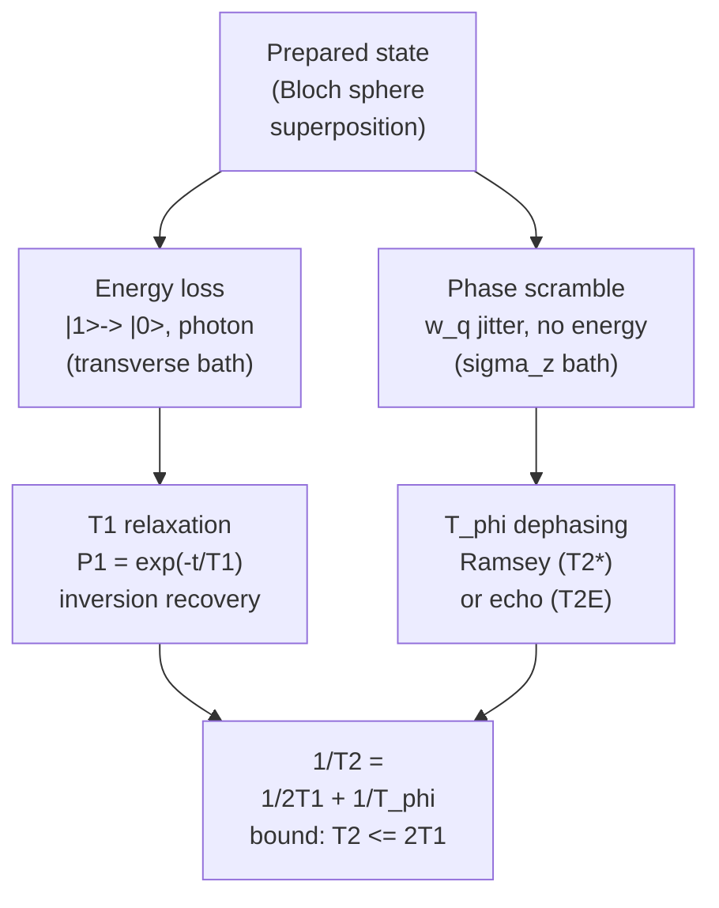

# 09 · Coherence, Noise & Decoherence

A perfect qubit would hold whatever state you put into it forever. Real qubits do not. Couple a quantum system to its environment, wiring, dielectrics, stray fields, the chip itself, and that environment slowly leaks information out and noise in. The state you carefully prepared decays. Understanding *how* it decays, and what causes it, is the whole game when you try to build a useful processor. This chapter is about the two clocks that govern that decay, $T_1$ and $T_2$, the noise that sets them, and the surprisingly beautiful machinery, power spectral densities and filter functions, that connects the two.

## The open-quantum-system picture

A qubit never decoheres on its own. It decoheres because it is weakly coupled to a **bath**, a huge collection of environmental modes it cannot control. How the coupling is oriented relative to the qubit's quantization axis decides *which* clock it spoils:

- **Transverse coupling** (perpendicular to the qubit axis, $\hat\sigma_x$/$\hat\sigma_y$) can exchange *energy* with the bath. The bath can absorb a photon at $\omega_q$ and de-excite the qubit. This drives **$T_1$ relaxation**.
- **Longitudinal coupling** (along the qubit axis, $\hat\sigma_z$) conserves energy but modulates the qubit frequency $\omega_q$. No photon is exchanged; instead the phase is scrambled. This drives **pure dephasing**, $T_\phi$.



> **Intuition.** Energy exchange ($T_1$) is a *photon* problem: does the environment have a mode at $\omega_q$ ready to take your energy? Dephasing ($T_\phi$) is a *frequency-stability* problem: is your clock rate $\omega_q$ steady, or does it wobble?

## The Bloch-Redfield backbone

The formal home for all of this is the **Bloch-Redfield** master equation, which (for weak, near-Markovian coupling) reduces the bath to a handful of decay rates acting on the qubit density matrix $\rho$. Write the qubit state as

$$\rho = \begin{pmatrix} \rho_{00} & \rho_{01} \\ \rho_{10} & \rho_{11} \end{pmatrix}.$$

The **populations** $\rho_{00},\rho_{11}$ live on the diagonal; the **coherence** $\rho_{01}$ (the off-diagonal) is what carries phase information. Bloch-Redfield says these relax with two rates, $\Gamma_1$ (longitudinal) and $\Gamma_2$ (transverse):

$$\Gamma_1 = \frac{1}{T_1}, \qquad \Gamma_2 = \frac{1}{T_2} = \frac{\Gamma_1}{2} + \Gamma_\phi.$$

### Deriving the factor of two, step by step

Why does relaxation contribute *half* its rate to the transverse decay? Here is the chain of reasoning:

1. **Coherence needs two populations.** The off-diagonal $\rho_{01}$ is a product of amplitudes in $|0\rangle$ *and* $|1\rangle$. If either population vanishes, the coherence vanishes too.
2. **Relaxation empties $|1\rangle$ at rate $\Gamma_1$.** The amplitude in $|1\rangle$ scales like the square root of its population, so it decays at rate $\Gamma_1/2$, the "adiabatic" or geometric-mean factor. This is relaxation's *unavoidable* contribution to transverse decay.
3. **Pure dephasing adds independently.** A fluctuating $\omega_q$ randomizes the relative phase of $\rho_{01}$ at rate $\Gamma_\phi$, exchanging no energy.
4. **Rates of independent channels add.** Acting on the same coherence, the two channels give $\Gamma_2 = \Gamma_1/2 + \Gamma_\phi$, i.e. $\tfrac{1}{T_2} = \tfrac{1}{2T_1} + \tfrac{1}{T_\phi}$.
5. **Take the limit.** Set $\Gamma_\phi \to 0$ and you reach the rigorous ceiling $T_2 = 2T_1$. You can never do better.

So the headline relation is a *result*, not an assertion:

$$\boxed{\;\frac{1}{T_2} = \frac{1}{2T_1} + \frac{1}{T_\phi}, \qquad T_2 \le 2T_1.\;}$$

> **Common pitfall.** A *fitted* $T_2$ above $2T_1$ is physically impossible, it always signals a measurement or fitting artifact (drift, the wrong decay model, leakage). Treat it as a bug, not a discovery.

## Noise as a random process: the power spectral density

To go beyond rates we need to describe the noise itself. Let $\lambda(t)$ be a fluctuating environmental parameter (flux, charge, photon number). Its **autocorrelation** measures how long it remembers itself,

$$C(\tau) = \langle \lambda(t)\,\lambda(t+\tau)\rangle.$$

With a bilateral angular-frequency convention, the **Wiener-Khinchin theorem** says the noise **power spectral density (PSD)** is the Fourier transform of that autocorrelation:

$$S(\omega) = \int_{-\infty}^{\infty} C(\tau)\, e^{-i\omega\tau}\, d\tau.$$

$S(\omega)$ tells you how much noise power sits at each angular frequency. **White noise** is flat ($S$ = const, no memory) and produces Markovian, exponential decay. But the noise that limits superconducting qubits is emphatically *not* white. Flux and charge noise follow a **$1/f$ (flicker)** law. Noise amplitudes in superconducting qubits are usually quoted as a one-sided cyclic-frequency PSD:

$$S_\Phi^{(1)}(f) = A_\Phi^2 \left(\frac{1\,\text{Hz}}{f}\right)^{\alpha}, \qquad f>0,\quad \alpha \approx 1,$$

where $A_\Phi$ is the noise amplitude, usually quoted in micro-$\Phi_0/\sqrt{\text{Hz}}$ at 1 Hz. Convert explicitly before inserting it into a bilateral $S_\Phi(\omega)$ formula. Microscopically, a $1/f$ spectrum is what you get when you sum many bistable fluctuators (e.g. surface spins) with a broad distribution of switching rates. The key feature is the **divergence at low frequency**: most of the noise power is in slow drifts. That is exactly why $T_2^*$ is drift-limited, and exactly what echo sequences are built to defeat.

## The filter-function picture: why echo works

Here is the unifying idea of the whole chapter. A pulse sequence acts as a **band-pass filter** on the noise. Whether a given noise frequency hurts you depends on how much the sequence *lets through*.

### Deriving the master formula

1. **Accumulated phase.** During free evolution the qubit picks up phase $\varphi(t) = \int_0^t \delta\omega(t')\,g(t')\,dt'$, where $\delta\omega$ is the frequency noise and $g(t') = \pm 1$ is a **switching function** that flips sign at every $\pi$ pulse.
2. **Gaussian average.** For Gaussian noise, $\langle e^{i\varphi}\rangle = e^{-\langle\varphi^2\rangle/2}$, so the coherence decays as $e^{-\chi(t)}$ with $\chi(t) = \tfrac{1}{2}\langle\varphi^2\rangle$.
3. **To frequency domain.** Writing $\langle\varphi^2\rangle$ as a double time integral of $C(\tau)$ and using Wiener-Khinchin turns the switching function into a squared frequency-domain weighting, the **filter function**.
4. **Result.** The dephasing exponent is the *overlap* of the noise PSD with the filter:

$$G_N(\omega,t)=\int_0^t g_N(t')e^{i\omega t'}dt',$$

$$\chi(t) = \frac{1}{2}\int_0^\infty \frac{d\omega}{\pi}\, S_{\delta\omega}(\omega)\, |G_N(\omega,t)|^2, \qquad \langle\sigma_x\rangle \propto e^{-\chi(t)}.$$

Equivalently, if $Y_N(\omega,t)=i\omega G_N(\omega,t)$ is used as the dimensionless filter numerator, write $|Y_N|^2/\omega^2$ instead of $|G_N|^2$.

The pulse sequence literally shapes which noise frequencies reach the qubit. The explicit weighting functions for the two basic sequences are

$$W_R(f,t) = \frac{\sin^2(\pi f t)}{(\pi f t)^2}, \qquad W_E(f,t) = \frac{\sin^4(\pi f t/2)}{(\pi f t/2)^2}.$$

For **Ramsey**, $g = +1$ throughout, giving a low-pass filter $W_R$ that lets DC noise straight through. For **Hahn echo**, the mid-sequence $\pi$ pulse flips $g$, so $W_E(0,t) = 0$: any noise constant over the sequence is perfectly refocused. *That* is why echo beats $1/f$.

```
  log S, filter
   ^
   |  *                         S(ω) ~ 1/f  (noise lives here, low f)
   |    *
   |      *  __                 Ramsey filter W_R: low-pass lobe
   |   ((((  * ))))             ── big OVERLAP with 1/f → fast dephasing
   |  __ ___  *
   |    /    \  *  __
   |   / echo \  *(    )        Echo filter W_E: NOTCH at ω=0,
   |  /  W_E   \__*__(  )___     passband pushed up → little overlap
   +--+---------+------+----------> log ω
     ω=0     slow     fast
        overlap area = dephasing
```

> **Intuition.** Think of $S(\omega)$ as where the rain falls and the filter as where your bucket sits. Ramsey leaves the bucket right under the downpour at low $f$; echo moves it to higher $f$ where the $1/f$ sky is nearly dry.

## Decay shape follows noise color

The draft's all-exponential story is incomplete: **the color of the noise sets the *shape* of the decay**, not just its rate.

- **White / Markovian noise** (fast compared to the sequence) gives memoryless, **exponential** decay, $e^{-t/T_2}$. $T_1$ relaxation is the canonical example.
- **Quasi-static $1/f$ noise** (frozen during one run, Gaussian-distributed across runs) makes the phase variance grow as $t^2$ rather than $t$, because $\varphi = \delta\omega\cdot t$ with $\delta\omega$ fixed per shot. Then $\langle e^{i\varphi}\rangle = e^{-\langle\varphi^2\rangle/2}$ gives a **Gaussian** envelope:

$$\langle\sigma_x\rangle \propto e^{-(t/T_2^*)^2}, \qquad \frac{1}{T_2^*} \sim \left|\frac{\partial\omega_q}{\partial\Phi}\right| A_\Phi\sqrt{\ln(f_{\rm uv}/f_{\rm ir})},$$
up to the stated one-sided/bilateral convention factors.

| Noise type | Regime | Envelope | Set by |
|---|---|---|---|
| White / Markovian | fast noise, $T_1$ | $e^{-t/T}$ (exponential) | rate $\Gamma$ |
| Quasi-static $1/f$ | Ramsey dephasing | $e^{-(t/T_2^*)^2}$ (Gaussian) | dispersion slope $\times A$ |
| Echo on $1/f$ | refocused | stretched, near-exp, longer | residual fast $1/f$ |

*(Illustrative shapes.)* Note that $1/T_2^*$ carries the **flux-dispersion slope** $\partial\omega_q/\partial\Phi$. Operate where that slope is zero, a **sweet spot**, and the linear sensitivity vanishes.

## Sweet spots: first-order vs second-order sensitivity

If you Taylor-expand $\omega_q$ in the noisy parameter $\lambda$ (flux or charge) around an operating point, the *first*-order term $\partial\omega_q/\partial\lambda$ is what couples slow noise into the qubit frequency. At a **sweet spot** that derivative is zero, so the qubit couples to noise only **quadratically**, dramatically suppressing dephasing. The transmon's famously flat charge dispersion (engineered via large $E_J/E_C$) is precisely this idea applied to charge noise: $\partial\omega_q/\partial n_g \approx 0$ everywhere.

> **Common pitfall.** A sweet spot does *not* eliminate noise, it only kills the **first-order** sensitivity. The quadratic term survives, so dephasing is suppressed, not zero.

## A noise-source cheat sheet

Different mechanisms limit different clocks, with different spectral fingerprints and different fixes. This is the single most useful table to keep nearby:

| Source | Limits | Spectral character | Mitigation |
|---|---|---|---|
| TLS defects | $T_1$ (+ freq. jitter) | resonant / telegraph | better dielectrics, tantalum, smaller participation |
| $1/f$ flux noise | $T_\phi$ | $1/f^{\alpha}$, $\alpha\approx1$ | sweet spot, echo / CPMG |
| Quasiparticles | $T_1$ + $T_\phi$ | bursty / parity jumps | gap engineering, IR shielding, traps |
| Photon shot noise | $T_\phi$ | Lorentzian (set by $\kappa$) | colder readout, photon reset |
| Purcell / readout | $T_1$ | resonator-shaped | large $\Delta$, Purcell filter |
| Charge noise | $T_\phi$ | $1/f$ | transmon flat dispersion |

*(All entries illustrative of typical behavior.)* Two channels deserve a special mention because they are easy to forget. **Participation-ratio / surface loss**: the $T_1$ ceiling is set by the dielectric loss tangent times the *fraction of electric-field energy stored in lossy interfaces*. Shrinking that participation, via geometry, surface cleaning, or low-loss films like tantalum, is *why* materials move the needle, not magic. **Photon-shot-noise dephasing**: residual thermal photons rattling around the readout resonator shift $\omega_q$ through the dispersive (ac-Stark) coupling $\chi$, dephasing an otherwise "quiet" qubit even with no flux or charge noise in sight.

## Measuring it: Ramsey, echo, CPMG

```
time →
Ramsey:  [π/2]───── τ ─────[π/2]·(measure)
Echo:    [π/2]── τ/2 ──[π]── τ/2 ──[π/2]
CPMG:    [π/2]-(t)-[πy]-(2t)-[πy]-(2t)-...-[πy]-(t)-[π/2]
                     └─────── N π-pulses (Y phase) ───────┘
```

**Ramsey** ($\pi/2$ - wait - $\pi/2$) reads out the accumulated phase; its signal oscillates at the qubit-drive detuning $\delta\omega$ and decays with $T_2^*$, sensitive to all noise down to DC:

$$\langle\sigma_x\rangle(t) \propto e^{-(t/T_2^*)^p}\cos(\delta\omega\, t),$$

with $p\!=\!1$ for white noise and $p\!=\!2$ (Gaussian) when quasi-static $1/f$ noise dominates, the case for most flux-tunable qubits off the sweet spot.

**Hahn echo** inserts one $\pi$ pulse, zeroing the $f\!\to\!0$ filter response and rejecting slow noise; $T_2^E \ge T_2^*$ and their *ratio diagnoses the noise color*. **CPMG** uses $N$ equally spaced $\pi$ pulses (along $Y$ to suppress pulse errors), pushing the filter passband to $\sim N/(2t)$ and extending coherence further. Sweeping $N$ and the spacing turns the qubit into a **tunable spectrometer**: each sequence samples $S(\omega)$ at a different center frequency, so you can reconstruct the PSD itself, closing the loop between measurement and noise model.

## Purcell decay as a circuit-level $T_1$ channel

Tie this back to dispersive readout. In the dispersive regime the qubit inherits a small photonic character $\sim g/\Delta$ of the lossy resonator mode (detuning $\Delta = \omega_q - \omega_r$). The probability of being "resonator-like" is $(g/\Delta)^2$, and that fraction leaks out at the resonator rate $\kappa$:

$$\Gamma_{\text{Purcell}} \approx \kappa\left(\frac{g}{\Delta}\right)^2.$$

A **Purcell filter** is an engineered impedance that reflects strongly at $\omega_q$ while staying open in the readout band, cutting the effective $\kappa$ the qubit sees by orders of magnitude.

## A fully worked example (illustrative numbers)

Round numbers, *not* a real device, just to see the levers move.

**Step 1: $T_2$ from $T_1$ and $T_\phi$.** Take $T_1 = 100\,\mu$s and $T_\phi = 60\,\mu$s. Then
$$\tfrac{1}{T_2} = \tfrac{1}{2(100)} + \tfrac{1}{60} = 0.0050 + 0.01667 = 0.02167\ \mu\text{s}^{-1} \Rightarrow T_2 \approx 46\,\mu\text{s}.$$
Since $46\,\mu$s sits well below the ceiling $2T_1 = 200\,\mu$s, this qubit is **dephasing-limited**, not relaxation-limited.

**Step 2: the prize.** Remove dephasing ($1/T_\phi\to0$) and $T_2 \to 200\,\mu$s. The $154\,\mu$s gap is exactly what better dephasing control (sweet spot + echo) can buy.

**Step 3: flux-dephasing magnitude.** Take $A = 1\,\mu\Phi_0/\sqrt{\text{Hz}}$ at 1 Hz and operate *off* the sweet spot on a steep flank where $\partial f_q/\partial\Phi = 10\,\text{GHz}/\Phi_0$. The quasi-static flux std over a Ramsey window is $\sigma_\Phi \sim 2\,\mu\Phi_0$ (the log-bandwidth factor is order a few), so $\sigma_f = |\partial f_q/\partial\Phi|\,\sigma_\Phi = 10^{10} \times 2\times10^{-6} = 20\,\text{kHz}$. For a Gaussian envelope $e^{-(t/T_2^*)^2}$ the variance is $\langle\varphi^2\rangle = (2\pi\sigma_f)^2 t^2$, so $T_2^* = \sqrt{2}/(2\pi\sigma_f) \approx 11\,\mu$s. A tens-of-kHz wobble already caps $T_2^*$ near $10\,\mu$s, small fields matter.

**Step 4: move to the sweet spot.** With $\partial f_q/\partial\Phi = 0$ the linear term vanishes; the residual quadratic coupling shrinks $\sigma_f$ by orders of magnitude, so $T_2^*$ climbs from $\sim10\,\mu$s toward the $T_1$-limited ceiling. This is the single biggest lever for tunable qubits.

**Step 5: echo gain.** Hahn echo zeroes the $f\to0$ part of the spectrum, so for $\alpha\approx1$ noise $T_2^*\sim11\,\mu\text{s} \to T_2^E \sim 40\text{ to }60\,\mu$s. CPMG with $N$ pulses pushes the passband to $\sim N/(2t)$ and extends it further, the basis of the ~50x improvement Bylander *et al.* demonstrated.

**Step 6: Purcell sanity check.** With $\kappa/2\pi = 5\,$MHz, $g/2\pi = 100\,$MHz, $\Delta/2\pi = 1\,$GHz: $\Gamma_{\text{Purcell}} = 2\pi(5\times10^6)(0.1)^2 = 2\pi\times5\times10^4\,\text{s}^{-1}$, i.e. $T_{\text{Purcell}} \approx 3.2\,\mu$s, *far below* our assumed $T_1 = 100\,\mu$s. Without a Purcell filter, this readout choice alone would dominate $T_1$. A filter cutting effective $\kappa$ at $\omega_q$ by ~100x restores $T_{\text{Purcell}}\sim300\,\mu$s, comfortably above target. *(All numbers illustrative.)*

## Materials progress

Because TLS and dielectric loss live at surfaces, coherence has improved largely through *materials* rather than circuit design, exactly the participation-ratio story above.

| Era / platform | Representative published $T_1$ | Note |
|---|---|---|
| Early Nb/Al transmons | ~1-10 µs | illustrative |
| 2D transmons, surface treatment | tens of µs | illustrative |
| 3D / tantalum transmons | $>0.3$ ms (Place 2021); ~0.5 ms (Wang 2022) | published, representative not record |

The lesson: the qubit Hamiltonian was solved long ago; the frontier is the dirty physics of the materials it is made from.

## Common pitfalls

- **"$T_2$ is always exponential."** Under quasi-static $1/f$ noise the Ramsey envelope is **Gaussian**, $e^{-(t/T_2^*)^2}$; fitting a single exponential gives a misleading number.
- **"Echo always crushes Ramsey."** Echo only helps against noise *slow* compared to the sequence. For white noise it barely helps; the $T_2^E/T_2^*$ ratio is a probe of noise color, not a guaranteed win.
- **"$T_2 > 2T_1$ is possible."** It is not, that bound is rigorous.
- **"Sweet spots eliminate noise."** They remove only first-order sensitivity.
- **"More CPMG pulses are always better."** Pulse errors accumulate; past an optimum, added pulses inject more error than the noise they remove.
- **"Published record times are typical."** Quoted 0.3-0.5 ms numbers are best-in-class under specific conditions, a trend, not a spec.

## Key takeaways

- A qubit decoheres because it is weakly coupled to a bath: transverse coupling drives $T_1$, while longitudinal $\sigma_z$ coupling drives $T_\phi$.
- Bloch-Redfield gives $1/T_2 = 1/2T_1 + 1/T_\phi$ as a *result*, with the hard ceiling $T_2 \le 2T_1$.
- Noise is characterized by its PSD $S(\omega)$; flux and charge noise are $1/f$, with most power at low frequency.
- The filter-function formula $\chi(t)=\tfrac12\int_0^\infty(d\omega/\pi)\,S_{\delta\omega}(\omega)|G_N(\omega,t)|^2$ unifies Ramsey, echo, and CPMG and explains *why* echo works.
- Noise color sets decay *shape*: quasi-static $1/f$ → Gaussian, white → exponential.
- Sweet spots kill first-order noise sensitivity; CPMG doubles as noise spectroscopy.
- $T_1$ limiters (TLS, Purcell, quasiparticles) and $T_\phi$ limiters ($1/f$ flux/charge, photon shot noise) need different fixes, match the mitigation to the mechanism.
- Coherence gains come mostly from better materials and interfaces (participation ratio), e.g. tantalum films.

## Go deeper

- P. Krantz *et al.*, "A Quantum Engineer's Guide to Superconducting Qubits," Appl. Phys. Rev. **6**, 021318 (2019), [arXiv:1904.06560](https://arxiv.org/abs/1904.06560), canonical treatment of Bloch-Redfield rates, the PSD/filter-function formalism, $W_R$/$W_E$, $1/f$ noise, sweet spots, and Purcell.
- J. Bylander *et al.*, "Noise spectroscopy through dynamical decoupling with a superconducting flux qubit," Nat. Phys. **7**, 565 (2011), [arXiv:1101.4707](https://arxiv.org/abs/1101.4707), CPMG-as-spectrometer and the ~50x dynamical-decoupling improvement.
- G. Ithier *et al.*, "Decoherence in a superconducting quantum bit circuit," Phys. Rev. B **72**, 134519 (2005), [arXiv:cond-mat/0508588](https://arxiv.org/abs/cond-mat/0508588), free-induction vs echo under $1/f$ noise, sweet spots, and the Gaussian-vs-exponential distinction.
- A. P. M. Place *et al.*, "New material platform for superconducting transmon qubits with coherence times exceeding 0.3 milliseconds," Nat. Commun. **12**, 1779 (2021), [arXiv:2003.00024](https://arxiv.org/abs/2003.00024), the tantalum-transmon materials result.
- C. Wang *et al.*, "Transmon qubit with relaxation time exceeding 0.5 milliseconds," npj Quantum Inf. **8**, 3 (2022), [arXiv:2105.09890](https://arxiv.org/abs/2105.09890), tantalum transmon, $T_1$ approaching 0.5 ms.

---

[← Back to repo README](../README.md) · [Tutorial index](./README.md)
