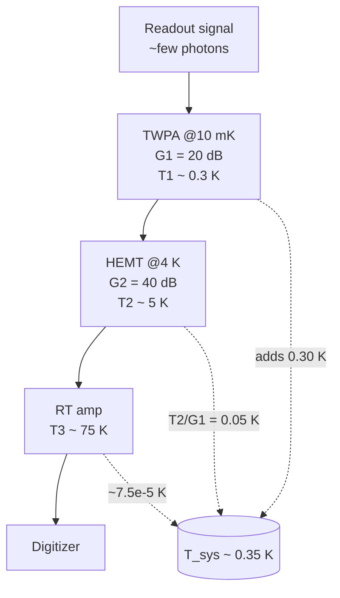
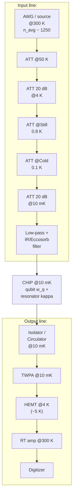

# 10 · The Cryogenic & Microwave Chain

A superconducting qubit is, electrically, just a few-GHz microwave circuit. To read it out and control it, we send microwave tones down a wire to the chip and bring the reflected signal back up to a room-temperature amplifier and digitizer. The catch: the qubit lives near its ground state, with a transition energy $\hbar\omega_q$ that corresponds to a temperature of only $\hbar\omega_q/k_B \approx 0.24\,$K for a 5 GHz qubit. Room-temperature wires carry **thermal photons**, blackbody noise, that would scramble the qubit instantly. The entire cryogenic and microwave chain exists to deliver clean control signals while ruthlessly blocking that noise. This chapter is about how the plumbing achieves that, and why each piece is forced on us by physics rather than chosen for convenience.

The single master figure of merit is the **mean thermal photon occupation** of a mode at frequency $\omega$ and temperature $T$. Everything else, attenuators, filters, isolators, amplifiers, is in service of driving this number, *referred to the chip*, down to $\sim 10^{-2}$ or below at the qubit frequency.

## The master equation: Bose-Einstein occupation

A microwave mode is a quantum harmonic oscillator with energy levels $E_n = \hbar\omega\,(n + \tfrac{1}{2})$. Put it in contact with a thermal bath at temperature $T$ and ask: on average, how many photons $\bar n$ sit in it? Let's derive it, because the answer governs the whole chain.

1. In thermal equilibrium the probability of occupying level $n$ is the Boltzmann factor, $P_n \propto e^{-E_n/k_B T}$.
2. The mean occupation is $\bar n = \sum_n n\,P_n / \sum_n P_n$. Define $x = e^{-\hbar\omega/k_B T}$ so that $P_n \propto x^n$ (the constant $\tfrac12$ in $E_n$ cancels in the ratio).
3. The normalizing denominator is a geometric series: $\sum_{n=0}^{\infty} x^n = \dfrac{1}{1-x}$.
4. The numerator is $\sum_{n=0}^{\infty} n\,x^n = \dfrac{x}{(1-x)^2}$ (differentiate the geometric series).
5. Divide: $\bar n = \dfrac{x}{1-x} = \dfrac{1}{1/x - 1}$, giving

$$\boxed{\;\bar{n}(\omega,T) = \frac{1}{\exp\!\left(\dfrac{\hbar\omega}{k_B T}\right) - 1}\;}$$

**Sanity checks.** When $\hbar\omega \ll k_B T$ (warm/low-frequency), expand the exponential to get $\bar n \approx k_B T/\hbar\omega$, the Rayleigh-Jeans regime, many photons. When $\hbar\omega \gg k_B T$ (cold), $\bar n \approx e^{-\hbar\omega/k_B T}$, exponentially suppressed, essentially vacuum. For a 5 GHz mode, $\hbar\omega/k_B = 0.24\,$K, so the crossover happens right inside the fridge:

| Temperature (illustrative) | $\hbar\omega/k_B T$ at 5 GHz | $\bar n(5\text{ GHz}, T)$ (illustrative) |
|---|---|---|
| 300 K (room) | $8.0\times10^{-4}$ | $\sim 1.25\times10^{3}$ |
| 4 K | $0.060$ | $\sim 16$ |
| 0.8 K (still) | $0.30$ | $\sim 2.8$ |
| 100 mK (cold) | $2.4$ | $\sim 0.09$ |
| 10 mK (MXC) | $24$ | $\sim 4\times10^{-11}$ |

The chain's job, in one line: turn the **~1250 photons** arriving from room temperature into **$\ll 1$** photon at the chip.

> **Intuition aside.** $\bar n$ is not "how cold the metal is", it is "how many junk photons share the qubit's mode." A 10 mK plate is wonderful, but a single warm wire dumping photons into the mode ruins it. We are managing *photons in a mode*, not just temperature of matter.

## The fridge and its thermal budget

A dilution refrigerator gives you a ladder of plates, each colder than the last, and each with a cooling power that collapses by orders of magnitude toward the bottom. The golden rule follows immediately: **dissipate heat as high (warm) on the chain as you can**, because the bottom plate can barely remove any.

| Stage | Temp (illustrative) | Cooling power (order, illustrative) | Input-line attenuation here | Output-line component | Coax material |
|---|---|---|---|---|---|
| Room | 300 K | (plant) | source / AWG | digitizer | Cu |
| 50 K | 50 K | $\sim 30$ W | 0-20 dB | (none) | stainless |
| 4 K | 4 K | $\sim 1$ W | 20 dB | HEMT amp | stainless |
| Still | ~0.8 K | $\sim 10$ mW | 10-20 dB | (none) | NbTi |
| Cold | ~0.1 K | $\sim 100\ \mu$W | (light) | (none) | NbTi |
| MXC | ~10 mK base | model-dependent; $\sim 10$-$50\ \mu$W only at elevated MXC temperature, e.g. ~20 mK, not at base | 20 dB | TWPA, isolators, **chip** | NbTi |

There are **two distinct heat loads** on every coax line, and they pull cable design in opposite directions:

- **Passive (conductive) load**: heat that simply flows down the metal from a warm plate to a cold one, set by Fourier's law.
- **Active load**: signal and attenuator power *dissipated* at a stage (every dB of attenuation dumps power as heat right there).

For the passive load, integrate Fourier's law $q = -\kappa(T)\,dT/dx$ along a coax segment of cross-section $\mathcal A$ and length $L$. In steady state the heat flow $\dot Q$ is constant, so $\dot Q\,dx = -\mathcal A\,\kappa(T)\,dT$; integrating between plate temperatures gives the **thermal-conductivity integral**:

$$\dot{Q}_{\text{cond}} = \frac{\mathcal{A}}{L}\int_{T_{\text{cold}}}^{T_{\text{hot}}} \kappa(T)\,dT.$$

This is why cold-stage coax is **thin, long, and made of low-conductivity metal** (stainless steel, or NbTi, which is superconducting below $T_c$ and a *poor* thermal conductor there, lossless to the signal yet thermally resistive). And it is why you **heat-sink** every conductor and attenuator to its plate: anchoring splits the integral stage by stage so each segment only spans a small $\Delta T$. The active load is the trade-off partner: a more conductive cable lowers signal loss but raises passive heat, so the choice balances the two.

## Input lines: attenuate, then filter (two different jobs)

A perfect lossless cable would be a disaster, it would faithfully deliver all ~1250 room-temperature photons to the qubit. **We want controlled, well-thermalized loss.** The workhorse is the **attenuator**, and the key insight is that it is a *cold thermal load*: a resistive attenuator scales the signal down by $1/A$ **and** re-emits Johnson-Nyquist noise at its own physical temperature.

Model a matched attenuator of power-attenuation factor $A$ (so 20 dB $\Rightarrow A = 100$) at temperature $T_i$. By the fluctuation-dissipation theorem, whatever quanta it removes from the signal it must replace with its own thermal emission. Fraction $1/A$ of the input is transmitted; the complementary fraction $(1-1/A)$ is replaced by the attenuator's bath:

If we use a Rayleigh-Jeans-equivalent noise temperature $T_{\rm RJ}\equiv(\hbar\omega/k_B)\bar n$, then
$$T_{{\rm RJ},\text{out}} = \frac{T_{{\rm RJ},\text{in}}}{A_i} + \left(1 - \frac{1}{A_i}\right)T_{\rm RJ}(T_i), \qquad
T_{\rm RJ}(T_i)=\frac{\hbar\omega}{k_B}\bar n(\omega,T_i).$$
This reduces to the physical temperature $T_i$ only in the classical limit $k_BT_i\gg\hbar\omega$. The exact quantum statement is
$$\bar n_{\text{out}} = \frac{\bar n_{\text{in}}}{A_i} + \left(1 - \frac{1}{A_i}\right)\bar n(\omega, T_i).$$

This is the **rigorous version** of the heuristic $\bar n_{\text{eff}} \approx \sum_i \bar n(\omega,T_i)/A_i^{\text{cum}}$. Cascade it: feed each stage's **full** output (not just its transmitted fraction) into the next, colder attenuator. Each attenuator re-emits at its own temperature, while any warmer residual is suppressed only by the product of the attenuations that *follow* it, so enough total cold attenuation drives the occupation down toward the base-temperature floor.

```
input noise ~16 photons (from 4 K)
        │
   ┌────▼────┐        ┌─────────┐        ┌─────────┐
   │ATT 20dB │        │ATT 10dB │        │ATT 20dB │
   │  @4 K   │──────▶│ @100 mK │──────▶│ @10 mK  │────▶ to chip
   └─────────┘        └─────────┘        └─────────┘
 n = 16/100           n = 16/10           n = 1.7/100
   + 0.99·16            + 0.9·0.09           + 0.99·4e-11
   ≈ 0.16 + 16          ≈ 1.6 + 0.08         ≈ 0.017 + 4e-11
   ≈ 16                 ≈ 1.7                ≈ 0.017
 (resets to 4 K)      (4 K leak through     (4 K leak through the
                       only 10 dB dominates) last 20 dB still dominates)
```
*Each attenuator re-emits at its own temperature, but the surviving 4 K residual is suppressed only by the attenuation downstream of it. Here 50 dB total still leaves $\sim 0.017$ photon, set by residual 4 K leakage rather than the 10 mK stage's own $\sim 4\times10^{-11}$ emission, which is exactly why real input lines pile on 40-60 dB. Numbers illustrative.*

Total staged input attenuation is typically 40-60 dB (illustrative), and the choice per stage is bounded **below by noise** (you need enough *cold* attenuation to reach the floor) and **above by heat** (each dB dumps power on a cold plate). That is why you can't just put 60 dB at one place.

**Filtering is a separate job from attenuation**, and conflating the two is a common mistake. Attenuators are GHz-band devices; they do nothing about radiation far outside that band. Four roles:

| Component | What it blocks | Frequency range | Where placed |
|---|---|---|---|
| Staged attenuators | in-band thermal microwave noise | GHz (readout/qubit band) | every plate |
| Low-pass / band-pass filter | out-of-band drive harmonics & noise | GHz | near chip |
| IR / Eccosorb / lossy-coax filter | photons above the superconducting gap; mm-wave/IR/THz blackbody, **pair-breaking** radiation | mm-wave through infrared | MXC, right at chip |
| Isolator / circulator | **backward** amplifier noise | readout band | between chip and TWPA |

Stray high-frequency photons are dangerous in a way attenuators can't fix: any photon with $h\nu>2\Delta$ can **break Cooper pairs** (for aluminum, the threshold is order 90 GHz), generating quasiparticles that directly limit $T_1$. Hence the separate **IR/Eccosorb** filtering at the coldest stage.

## Output lines: protect, then amplify

The readout signal coming *back* from the chip is a handful of microwave photons. You must amplify it without burying it in noise, and without letting amplifier noise leak *back* onto the qubit.

**Isolators / circulators.** A circulator routes signals one way around a nonreciprocal 3-port junction; terminating a port into a cold load makes it an isolator. Their quantum-information role is not merely to protect equipment: they **dump the backward-propagating amplifier noise into a cold termination** before it can reach the readout resonator (linewidth $\kappa$). Without them, amplifier noise would measurement-broaden the qubit and inject back-action.

**The standard quantum limit.** Why can't we just build a noiseless amplifier? Because a phase-insensitive linear amplifier must add at least half a photon of noise, the **Haus-Caves limit**. The argument is short and beautiful:

1. The output mode must obey bosonic commutation, $[\hat b, \hat b^\dagger] = 1$, exactly like the input mode $\hat a$.
2. Naively setting $\hat b = \sqrt{G}\,\hat a$ gives $[\hat b,\hat b^\dagger] = G \neq 1$, illegal for $G>1$.
3. Restore the commutator by adding an independent ancillary (idler) mode $\hat c$: $\hat b = \sqrt{G}\,\hat a + \sqrt{G-1}\,\hat c^\dagger$. Check: $[\hat b,\hat b^\dagger] = G - (G-1) = 1$. ✓
4. Even with the ancilla in vacuum ($\langle \hat c^\dagger \hat c\rangle = 0$), its zero-point fluctuation adds variance. Referred to input, the added noise is $\tfrac{G-1}{G}(n_c + \tfrac12) \to \tfrac12$ at high gain.

$$\boxed{\;T_{\text{add}}^{\min} = \frac{\hbar\omega}{2 k_B}\qquad\Longleftrightarrow\qquad n_{\text{add}}^{\min} = \tfrac{1}{2}\;}$$

For a 7 GHz readout, $\hbar\omega/2k_B \approx 0.17\,$K. This is a *fundamental quantum limit*, not an engineering shortfall, **only a phase-sensitive amplifier (squeezing) can beat it, and only on one quadrature**, at the cost of the other.

**The amplifier cascade.** First a near-quantum-limited **TWPA** at the MXC (adds close to the half-photon SQL); then a **HEMT** at 4 K (high gain, but $\sim 5$-$10$ K noise temperature); then room-temperature amps. The order is decided by **Friis's formula**, which refers each stage's added noise back to the input:

$$T_{\text{sys}} = T_1 + \frac{T_2}{G_1} + \frac{T_3}{G_1 G_2} + \cdots$$

Derivation in one breath: stage 2's own noise $T_2$ appears at the system output multiplied by $G_2$ but accompanied by $G_1 G_2 T_1$ from stage 1; dividing the total output noise by the total gain $G_1 G_2$ refers stage 2 back as $T_2/G_1$, stage 3 as $T_3/(G_1 G_2)$, and so on. **A large first-stage gain $G_1$ crushes every downstream contribution.**

Passive loss before the first amplifier must be included as a Friis stage with gain $G=1/L$, not ignored. A cold lossy element with power loss $L$ contributes thermal occupation $(L-1)\bar n(\omega,T)$ when referred to its input and, even when its own thermal occupation is negligible, multiplies all downstream input-referred amplifier noise by $L$.



### Full chain, end to end



## Worked example: why the first amplifier dominates

*(All numbers illustrative.)* Readout at $f = 7$ GHz, so $\hbar\omega/k_B = hf/k_B = 0.336\,$K and the half-photon SQL is $0.168\,$K. Cascade: **(1)** TWPA, $G_1 = 20$ dB $= 100$, $T_1 = 0.3\,$K ($\approx 0.9$ photons, near but not at the SQL); **(2)** HEMT, $G_2 = 40$ dB $= 10^4$, $T_2 = 5\,$K; **(3)** room-temp amp, $T_3 = 75\,$K.

$$T_{\text{sys}} = 0.3 + \frac{5}{100} + \frac{75}{100\cdot 10^4} = 0.3 + 0.05 + 7.5\times10^{-5} \approx 0.350\,\text{K}.$$

The TWPA's 0.30 K **dominates**; the 5 K HEMT shrinks to 0.05 K once divided by the TWPA gain; the room-temp amp is utterly negligible. In photons referred to input, $n_{\text{add}} = k_B T_{\text{sys}}/\hbar\omega = 0.350/0.336 = 1.04$ photons. Adding the unavoidable half-photon of vacuum gives total input-referred noise $0.5 + 1.04 = 1.54$ photons, so the **measurement (quantum) efficiency** is

$$\eta = \frac{0.5}{1.54} \approx 0.32 \quad (\sim 32\%, \text{ illustrative}).$$

**Now delete the TWPA.** With the HEMT first, $T_{\text{sys}} = 5 + 75/10^4 = 5.0075\,$K $\Rightarrow n_{\text{add}} = 14.9$ photons, $\eta = 0.5/15.4 \approx 3\%$. The TWPA improves input-referred added noise by **~14x** and efficiency by **~10x**. Since the integration time to reach a fixed single-shot SNR scales roughly with added-noise power, that ~14x cut shortens the readout time by a similar factor, *that* is why a good first amplifier "transforms readout fidelity."

**Input-side sanity check.** A 7 GHz tone entering at 300 K carries $\bar n(7\text{ GHz}, 300\text{ K}) = 1/(e^{0.336/300}-1) \approx 892$ photons. The naive lower bound for reaching $0.01$ photon is $10\log_{10}(892/0.01)\approx49.5\,$dB, but real staged attenuation must include each attenuator's own re-emission. For example, 20 dB at 4 K, 10 dB at 100 mK, and 20 dB at 10 mK gives $\bar n_{\rm out}\approx0.020$ at 7 GHz; changing the middle attenuator to 20 dB gives $\bar n_{\rm out}\approx0.0024$. Thus 50 dB is a lower bound, while about 60 dB is the usual target for few-$10^{-3}$ occupations.

## Wiring discipline as a coherence budget

The chain only works if you respect it. Heat-sink every cable and attenuator firmly to its plate (so the conductivity integral splits stage by stage); use superconducting NbTi coax between cold stages (lossless yet thermally resistive); add magnetic and IR shielding around the chip; avoid ground loops. These are not cosmetic, sloppy thermalization or a missing IR filter shows up *directly* as reduced $T_1$, $T_2$, and degraded readout SNR. The resonator linewidth $\kappa$ and dispersive shift $\chi$ of the readout chapter set how fast the signal builds; the chain here sets how much noise it must outrun.

## Common pitfalls

- **"A lossless cable is ideal."** No, it delivers 300 K noise to the qubit. You *want* controlled, well-thermalized cold loss on the input.
- **"Attenuators only weaken the signal."** They also *emit* Johnson-Nyquist noise at their own temperature; a poorly heat-sunk attenuator is a warm noise source.
- **"Put all attenuation at one stage."** The floor is set by the *coldest, last* attenuator, and each plate has a cooling-power budget, hence staging.
- **"GHz attenuators are enough."** High-frequency photons above the superconducting gap break Cooper pairs; you need separate IR/Eccosorb filtering.
- **"The half-photon limit is a hardware flaw."** It is the fundamental Haus-Caves limit; only phase-sensitive squeezing beats it, on one quadrature.
- **"The 5 K HEMT limits readout."** With a quantum-limited first stage, Friis divides the HEMT noise by $G_1$, the first amplifier dominates.
- **"Noise temperature = physical temperature."** Noise temperature is an equivalent-input bookkeeping quantity; a 10 mK TWPA can have a sub-kelvin *noise* temperature set by quantum noise.

## Key takeaways

- The chain delivers control signals while blocking ~300 K thermal photons; the figure of merit is $\bar n(\omega,T)$, falling from ~1250 (300 K) to $\ll 1$ at the chip.
- Two heat loads, passive conduction ($\dot Q = \frac{\mathcal A}{L}\int\kappa\,dT$) and active dissipation, force thin NbTi/stainless coax and aggressive heat-sinking.
- **Input:** staged attenuators (40-60 dB, illustrative) reset the line to the coldest attenuator's temperature via $\bar n_{\text{out}} = \bar n_{\text{in}}/A + (1-1/A)\bar n(T)$; *separate* low-pass and IR/Eccosorb filters kill out-of-band and pair-breaking radiation.
- **Output:** isolators block backward amplifier noise (back-action); then TWPA → HEMT → RT amps. Friis says the first amplifier dominates $T_{\text{sys}}$.
- A phase-insensitive amplifier adds $\geq \tfrac12$ photon ($T_{\text{add}}^{\min} = \hbar\omega/2k_B$); efficiency $\eta$ links this to single-shot readout fidelity. The worked example shows TWPA-in vs TWPA-out: $\eta \approx 32\%$ vs $\approx 3\%$.

## Go deeper

- Krinner et al., "Engineering cryogenic setups for 100-qubit scale superconducting circuit systems," *EPJ Quantum Technology* **6**, 2 (2019), [arXiv:1806.07862](https://arxiv.org/abs/1806.07862), the canonical practical guide to fridge wiring, passive vs active heat loads, attenuation, and coax materials.
- Krantz et al., "A Quantum Engineer's Guide to Superconducting Qubits," *Appl. Phys. Rev.* **6**, 021318 (2019), [arXiv:1904.06560](https://arxiv.org/abs/1904.06560), broad review with a strong measurement-chain section.
- Blais, Grimsmo, Girvin, Wallraff, "Circuit Quantum Electrodynamics," *Rev. Mod. Phys.* **93**, 025005 (2021), [arXiv:2005.12667](https://arxiv.org/abs/2005.12667), dispersive readout, resonator $\kappa$, measurement back-action and efficiency.
- Clerk, Devoret, Girvin, Marquardt, Schoelkopf, "Introduction to Quantum Noise, Measurement and Amplification," *Rev. Mod. Phys.* **82**, 1155 (2010), [arXiv:0810.4729](https://arxiv.org/abs/0810.4729), the definitive source for the standard quantum limit and noise temperature.
- Macklin et al., "A near-quantum-limited Josephson traveling-wave parametric amplifier," *Science* **350**, 307 (2015), [DOI:10.1126/science.aaa8525](https://doi.org/10.1126/science.aaa8525), the original TWPA.

---

[← Back to project README](../README.md) · [Tutorial index](./README.md)
