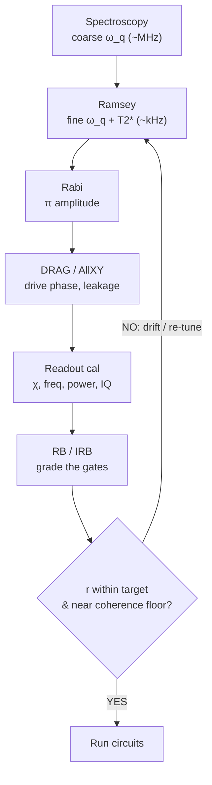

# 11 · Calibration & Benchmarking

We now have a transmon at frequency $\omega_q$, a dispersive readout (Ch. 6), and pulses that implement gates (Ch. 7). But "implement a gate" hides a question: *how good is it, really?* A pulse that looks perfect on an oscilloscope can still leave the qubit slightly over-rotated, slightly off-resonance, or leaking into the $|2\rangle$ state. **Calibration** is the loop that tunes the knobs; **benchmarking** is how we assign an honest number to what we built. This chapter is about both, and about how to read the resulting fidelities without fooling yourself.

## Calibration is a feedback loop, not a checklist

Every gate depends on a handful of physical parameters, each found by a dedicated *sweep-and-fit* experiment. Crucially these parameters **drift**, frequencies wander with temperature and two-level-system noise on hour-to-day timescales, so the whole set is re-run periodically. Calibration and benchmarking are one closed cycle: you tune, you grade, and if the grade slips you tune again.



The individual steps:

- **Qubit frequency $\omega_q$: coarse.** Drive continuously while sweeping the drive frequency and watch the excited-state population. You get a Lorentzian (continuous-wave spectroscopy); its center is $\omega_q$ to ~MHz precision.
- **Qubit frequency $\omega_q$: fine, plus $T_2^*$ (Ramsey).** Two $\pi/2$ pulses separated by a free-evolution delay $\tau$ convert a small detuning $\delta$ into an observable beat. The fringe frequency *is* your frequency error; the envelope decay *is* your dephasing time. This is kHz-level and is how you track drift.
- **Pulse amplitude (Rabi).** Sweep drive amplitude (or duration), fit the Rabi oscillation, pick the amplitude giving exactly a $\pi$ rotation.
- **DRAG & leakage.** A transmon is only weakly anharmonic ($\alpha \sim -200$ MHz, illustrative), so a fast pulse has spectral weight at the $1\!\leftrightarrow\!2$ transition and *leaks* into $|2\rangle$. The **DRAG** technique adds a quadrature component proportional to the derivative of the main pulse to cancel that leakage and the associated phase error; the DRAG coefficient is itself a calibrated knob.
- **AllXY fine-tuning.** A fixed sequence of 21 pairs of $X/Y$, $\pi/\pi/2$ pulses whose ideal outcome is a known staircase. Different error types (amplitude, detuning, DRAG phase) deform the staircase in characteristic, distinguishable ways, a cheap, sensitive diagnostic for the residuals Rabi/Ramsey miss.
- **Readout.** Calibrate $\chi$, choose the readout frequency and power that best separate the $|0\rangle$/$|1\rangle$ pointer states in the IQ plane, and fit the discrimination boundary. (More below, the full story is the *assignment matrix*.)

### The engine underneath: error amplification

A 1% amplitude error is invisible in one $\pi$ pulse but obvious after 50. If a gate over-rotates by a small angle $\epsilon$ per application, repeating it $N$ times grows the residual as $N\epsilon$, so you read the error off the **slope/curvature of survival vs $N$**, far below the single-shot noise floor. Rabi-amplitude fine-tuning, AllXY, and RB itself are all this same trick.

> **Intuition.** Tuning a gate by eye is like checking a clock against one tick. Run it for an hour (apply the gate hundreds of times) and a tiny rate error becomes minutes of visible drift you can correct.

### The Ramsey fringe, derived

$$ P_{\text{Ramsey}}(\tau) = \tfrac{1}{2}\left[\,1 + e^{-\tau/T_2^*}\cos(\delta\,\tau + \phi)\,\right] $$

Step by step:

1. The first $\pi/2$ pulse maps $|0\rangle$ to an equator superposition $(|0\rangle+|1\rangle)/\sqrt{2}$.
2. During the delay $\tau$ the Bloch vector precesses in the rotating frame at the detuning $\delta = \omega_{\text{drive}} - \omega_q$, accumulating phase $\delta\,\tau$.
3. Dephasing randomizes that phase across the ensemble; averaging gives a contrast factor $e^{-\tau/T_2^*}$ (or a *Gaussian* $e^{-(\tau/T_2^*)^2}$ when slow $1/f$ noise dominates).
4. The second $\pi/2$ pulse converts accumulated phase into population: projecting back gives $P=\tfrac12[1+e^{-\tau/T_2^*}\cos(\delta\tau+\phi)]$.
5. **Fit:** the oscillation frequency $\to \delta$ (correct $\omega_q$ by it); the envelope $\to T_2^*$.

## Randomized benchmarking (RB)

The naive way to grade a gate, run it, do tomography, compare to ideal, is contaminated by *state-preparation and measurement* (SPAM) errors, which can dwarf the gate error. RB sidesteps this.

**The recipe.** Choose a set of sequence lengths $m$. For each $m$, draw $K$ random Clifford sequences; append the unique recovery Clifford that inverts the sequence (ideally returning to $|0\rangle$). Measure ground-state survival, average over the $K$ sequences, and fit

$$ F(m) = A\,p^{\,m} + B. $$

Here $A$ and $B$ absorb all SPAM into *offset and amplitude*, so the **decay rate $p$ is SPAM-free**, that is the entire point.

### Why one number? The twirl

The deep reason RB works is *twirling*: averaging an arbitrary error channel $\Lambda$ over the Clifford group collapses it to a **depolarizing channel** described by a single parameter $p$.

$$ \Lambda_{\text{dep}}(\rho) = p\,\rho + (1-p)\,\frac{\mathbb{I}}{d}, \qquad \overline{\Lambda}(\rho) = \int d\mu(C)\, C^{\dagger}\,\Lambda\!\left(C\rho C^{\dagger}\right)C $$

1. A general channel has many parameters (write it as a Pauli transfer matrix).
2. Average it over the group (twirl).
3. The Clifford group is a **unitary 2-design**, so by Schur's lemma the twirled channel must commute with every group element; on the traceless subspace it can only be a scalar multiple of the identity.
4. Hence $\overline{\Lambda}$ is fixed by *one* number $p$, it is exactly depolarizing: keep $\rho$ with probability $p$, replace it by $\mathbb{I}/d$ with probability $1-p$.
5. Composing $m$ such steps multiplies the $p$'s $\Rightarrow p^m$. SPAM enters only as the constants $A$ (initial-state/readout contrast) and $B$ (asymptote, $\sim 1/d$).

The average error per Clifford follows:

$$ r = \frac{(d-1)(1-p)}{d}, \qquad d = 2^{n}, \qquad F_{\text{avg}} = p + \frac{1-p}{d} = 1 - r. $$

> **Pitfall.** $r$ is per **Clifford**, not per physical gate. A Clifford compiles to ~1.5-2 native gates, so per-gate error is roughly $r$ divided by that compiling factor. Always state the assumption.

```
 survival F(m)
 1.0 |*.
     |  '*..        F(m) = A p^m + B
     |     '-*..
     |  o      '-*-..._        good SPAM (large A)
     |   '·o._        '''*----*----*----  → B≈0.50
 0.5 |.......'·--o.._.................... ← same p (parallel)
     |    dashed: o''--o----o----o----    worse SPAM (small A, high B)
     |    "same p, same r → SPAM cancels"
     +------------------------------------ m
      0      50     100    150    200
```

### Interleaved RB (IRB): isolating one gate

Run reference RB (decay $p_{\text{ref}}$), then a second experiment with the **target gate inserted after every random Clifford** (decay $p_{\overline{C}}$):

$$ r_{\text{gate}} = \frac{d-1}{d}\left(1 - \frac{p_{\overline{C}}}{p_{\text{ref}}}\right), \qquad \left|\,r_{\text{gate}}^{\text{est}} - r_{\text{gate}}\,\right| \le E. $$

The point estimate divides out the Clifford "carrier" error. But real errors aren't exactly depolarizing, so Magesan *et al.* (2012) give an explicit **systematic bound $E$** (a function of $p_{\text{ref}}, p_{\overline{C}}$). If $E$ is comparable to $r_{\text{gate}}$, quote the result with that caveat, not to three significant figures.

## Cross-entropy benchmarking (XEB)

RB needs a group structure; for generic gates on many qubits it gets unwieldy. XEB, the metric behind "quantum supremacy", runs **random circuits** and compares the measured bitstring distribution to one an ideal simulator predicts:

$$ F_{\text{XEB}} = 2^{n}\,\big\langle P_{\text{ideal}}(x_{\text{meas}})\big\rangle_{x\sim\text{exp}} - 1 \;\approx\; \prod_{g}(1-e_g). $$

1. A random circuit produces a **Porter-Thomas** output distribution: ideal probabilities are exponentially distributed, so a few bitstrings are strongly favored ("speckle" from constructive interference).
2. Ideal sampling lands preferentially on those favored strings: $\sum_x P_{\text{ideal}}(x)^2 \approx 2/2^n$. Uniform noise gives $\sum_x (1/2^n)P_{\text{ideal}}(x) = 1/2^n$.
3. Defining $F_{\text{XEB}} = 2^n\langle P_{\text{ideal}}\rangle - 1$ sends ideal $\to 1$, uniform noise $\to 0$.
4. Under a **digital error model**, each faulty gate scrambles weight into the uniform background, so surviving coherent weight *multiplies*: $F_{\text{XEB}} \approx \prod_g (1-e_g) \approx e^{-\sum_g e_g}$. This per-cycle product lets you predict full-circuit fidelity from individual gate errors and cross-check.

> **Pitfall.** XEB needs a *trusted classical simulation* of the ideal amplitudes (infeasible past ~50 qubits at depth), assumes the digital error model, and is known to be **spoofable**. It is a statistical test, not a proof of correctness.

## Readout: the assignment (confusion) matrix

The scalar readout fidelity is only the one-qubit shadow of a matrix. Prepare each computational basis state, histogram the discriminated outcomes, and stack those histograms as columns:

$$ M_{ij} = \Pr(\text{measure } i \mid \text{prepared } j), \qquad \vec{p}_{\text{true}} = M^{-1}\,\vec{p}_{\text{meas}}, \qquad F_a = 1 - \tfrac12\big[P(1|0)+P(0|1)\big]. $$

| $M$ | prepared $0$ | prepared $1$ |
|-----|------|------|
| **measured 0** | $0.97$ | $0.06$ |
| **measured 1** | $0.03$ | $0.94$ |

With raw measured $\vec p_{\text{meas}}=[0.55,\,0.45]$, inverting gives $\vec p_{\text{true}}=M^{-1}\vec p_{\text{meas}}\approx[0.538,\,0.462]$, and $F_a = 1-\tfrac12(0.03+0.06)=0.955$ (illustrative).

> **Pitfall.** Naive $M^{-1}$ can return **negative probabilities** and amplifies statistical noise, and the full matrix is $2^n\times 2^n$, exponential to calibrate. Use constrained least-squares / iterative unfolding (keep counts $\ge 0$) and tensor-product or subset approximations. And note: $F_a$ is reported **separately**, RB deliberately cancels readout error from the gate number.

## Coherent vs incoherent errors, the deepest trap

Two gates with identical $r$ can behave completely differently in a deep circuit.

```
   INCOHERENT (depolarize)          COHERENT (over-rotation)
        . - .                            . - .
      / ↓ ↓ ↓ \                        /  ↻    \      rigid tilt
     |  →• ← |  shrunk sphere         |  •—↗   |      by small angle
      \ ↑ ↑ ↑ /                        \       /
        ' - '                            ' - '
   error ~ LINEAR in depth          error ~ QUADRATIC, worst-case large

   error |          coherent (curve)         The two have the SAME r
    vs N  |        ,·'                        at small N but diverge:
          |      ,·'                          coherent accumulates faster.
          |   _,·'____ incoherent (line)
          +----------------------------- N
```

- **Incoherent** (depolarizing/dephasing) errors shrink the Bloch sphere uniformly; in fidelity they add roughly **linearly** with depth.
- **Coherent** (calibration/over-rotation) errors *rotate* the sphere rigidly; amplitudes can interfere constructively, so worst-case error can be much larger and accumulate **quadratically**. For a fixed average $r$, coherent errors are generally the more dangerous.

RB averages over the sphere and is largely **blind** to coherent errors. The SPAM-free tool that separates them is **unitarity (purity) RB**: instead of survival probability, it tracks the *purity* of the output state vs sequence length. Depolarization drains purity; a pure over-rotation does not, so a high $r$ with high unitarity flags a *coherent* error you can calibrate away.

## The coherence floor

Even with perfect control, $T_1$ and $T_2$ cap the fidelity:

$$ F_{\lim} = \frac{1}{6}\left[\,3 + e^{-\tau_g/T_1} + 2\,e^{-\tau_g/T_2}\,\right] \;\Longrightarrow\; r_{\lim} \approx \frac{\tau_g}{6}\left(\frac{1}{T_1} + \frac{2}{T_2}\right). $$

Model the gate as ideal unitary + amplitude damping ($1/T_1$) + dephasing ($1/T_2$) over duration $\tau_g$; averaging the channel fidelity over the Bloch sphere (longitudinal axis $\propto e^{-\tau_g/T_1}$, two transverse axes $\propto e^{-\tau_g/T_2}$) gives $F_{\lim}$. Comparing measured $r$ to $r_{\lim}$ tells you whether you are **control-limited** ($r \gg r_{\lim}$, keep tuning) or **coherence-limited** ($r \approx r_{\lim}$, only longer $T_1/T_2$ or shorter gates help).

## Worked example (all values illustrative)

Single qubit, $n=1$, $d=2$. Fit $F(m)=A\,p^m+B$ → $A=0.49$, $B=0.50$, $p=0.999$.

- **Error per Clifford:** $r=\dfrac{(d-1)(1-p)}{d}=\dfrac{(1)(0.001)}{2}=5\times10^{-4}$, a "99.95%" gate. Check: $F_{\text{avg}}=p+(1-p)/d=0.999+0.0005=0.9995=1-r$. ✓
- **Per physical gate:** if the compiler averages ~1.5 native gates/Clifford, per-gate error $\approx r/1.5 = 3.3\times10^{-4}$.
- **Coherence-limited?** Take $T_1=80\,\mu$s, $T_2=60\,\mu$s, $\tau_g=30$ ns: $r_{\lim}\approx\frac{30\text{ ns}}{6}\left(\frac{1}{80\,\mu s}+\frac{2}{60\,\mu s}\right)=(5.0\times10^{-9})(45833)=2.3\times10^{-4}$. Measured $r=5\times10^{-4}$ is only ~$2.2\times$ the floor, close to coherence-limited. Pushing the pulse harder buys little; longer $T_1/T_2$ is the lever.
- **IRB add-on:** $p_{\text{ref}}=0.999$, interleaved $X$-gate $p_{\overline C}=0.9982$ → $r_{\text{gate}}=\frac12\left(1-\frac{0.9982}{0.999}\right)=\frac12(0.0008)=4.0\times10^{-4}$, quoted with the Magesan bound $E$.
- **XEB sketch:** $n=20$, $2^n=1{,}048{,}576$. If $\langle P_{\text{ideal}}\rangle=1.9\times10^{-6}$, then $F_{\text{XEB}}=1{,}048{,}576\times1.9\times10^{-6}-1=1.99-1=0.99$. Uniform sampling ($\langle P\rangle=1/2^n$) gives exactly $0$.

## Disambiguating the fidelity zoo

| Symbol | Name | Formula | Note |
|--------|------|---------|------|
| $p$ | depolarizing / decay parameter | fit of $A p^m+B$ | **SPAM-free**; this is what RB measures |
| $F_{\text{avg}}$ | average gate fidelity | $p+(1-p)/d$ | $=1-r$ |
| $r$ | avg error per **Clifford** | $(d-1)(1-p)/d$ | per Clifford, not per gate |
| per-gate error | physical-gate error | $\approx r\,/\,1.5\text{–}2$ | divide by compiling factor |
| $F_a$ | readout assignment fidelity | $1-\tfrac12[P(1|0)+P(0|1)]$ | reported **separately** from RB |
| $F_{\text{XEB}}$ | full-circuit XEB fidelity | $2^n\langle P_{\text{ideal}}\rangle-1$ | needs classical simulation |

| Method | Measures | Needs | Scales? | Blind spots |
|--------|----------|-------|---------|-------------|
| **Standard RB** | avg error/Clifford $r$ | Clifford group + recovery | partial | coherent & worst-case errors |
| **Interleaved RB** | one gate's $r_{\text{gate}}$ | reference RB + interleaving | partial | systematic bound $E$ |
| **XEB** | full-circuit $F_{\text{XEB}}$ | random circuits + ideal sim | yes (until sim infeasible) | trusts error model; spoofable |
| **Unitarity/Purity RB** | coherence of the noise | purity estimation | partial | complements, not replaces, $r$ |

## Common pitfalls

- **"RB gives THE gate error."** No, an *average* over the Clifford group, not a single physical gate and not worst-case. Divide by the ~1.5-2 Cliffords/gate factor for per-gate error.
- **"High fidelity = safe gate."** RB is blind to coherent errors; two gates with the same $r$ can diverge in deep circuits. Use unitarity RB and remember the diamond norm exists.
- **"$p$ depends on SPAM."** It doesn't, SPAM lives only in $A$ and $B$. Misreading the offset as the error is a classic slip.
- **"Readout fidelity is part of RB."** It is separate ($F_a$ / the assignment matrix).
- **"Just invert $M$."** Constrained least-squares / unfolding, not naive $M^{-1}$.
- **"Good single-qubit RB ⇒ good multi-qubit."** Isolated RB hides crosstalk; run **simultaneous/correlated RB**.

## Key takeaways

- Calibration is a **closed loop**: spectroscopy → Ramsey → Rabi → DRAG/AllXY → readout → RB/IRB, re-run to track drift; **error amplification** exposes errors below the noise floor.
- RB reports a **SPAM-free** average error per Clifford because the **twirl** (Clifford = unitary 2-design) collapses any error to one depolarizing $p$.
- **IRB** isolates one gate (with a systematic bound $E$); **XEB** scales to large random circuits via the Porter-Thomas product model (but needs simulation and is spoofable).
- A fidelity is meaningful only with context: averaged not worst-case, floored by $T_1/T_2$ ($r_{\lim}$), separate from readout ($F_a$) and crosstalk, and silent about **coherent** errors unless you run unitarity RB.

## Go deeper

- E. Magesan, J. M. Gambetta, J. Emerson, *Scalable and Robust Randomized Benchmarking of Quantum Processes*, Phys. Rev. Lett. **106**, 180504 (2011), [arXiv:1009.3639](https://arxiv.org/abs/1009.3639).
- E. Magesan *et al.*, *Efficient Measurement of Quantum Gate Error by Interleaved Randomized Benchmarking*, Phys. Rev. Lett. **109**, 080505 (2012), [arXiv:1203.4550](https://arxiv.org/abs/1203.4550).
- J. Wallman, C. Granade, R. Harper, S. T. Flammia, *Estimating the Coherence of Noise*, New J. Phys. **17**, 113020 (2015), [arXiv:1503.07865](https://arxiv.org/abs/1503.07865) (unitarity / purity RB).
- S. Boixo *et al.*, *Characterizing Quantum Supremacy in Near-Term Devices*, Nat. Phys. **14**, 595 (2018), [arXiv:1608.00263](https://arxiv.org/abs/1608.00263) (XEB).
- F. Arute *et al.* (Google AI Quantum), *Quantum supremacy using a programmable superconducting processor*, Nature **574**, 505 (2019), [DOI:10.1038/s41586-019-1666-5](https://doi.org/10.1038/s41586-019-1666-5).
- P. Krantz *et al.*, *A Quantum Engineer's Guide to Superconducting Qubits*, Appl. Phys. Rev. **6**, 021318 (2019), [arXiv:1904.06560](https://arxiv.org/abs/1904.06560).

---

← Back to [project README](../README.md) · [Tutorial index](./README.md)
