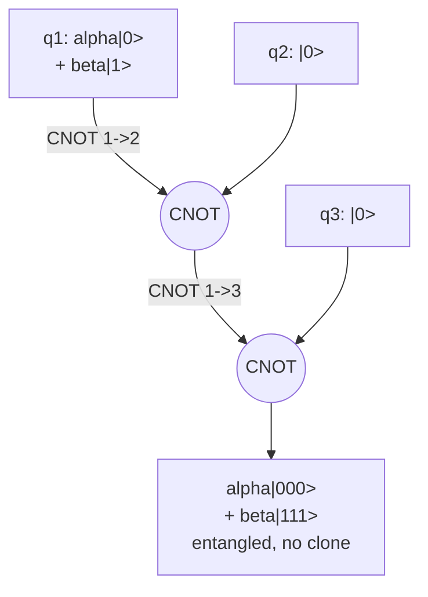
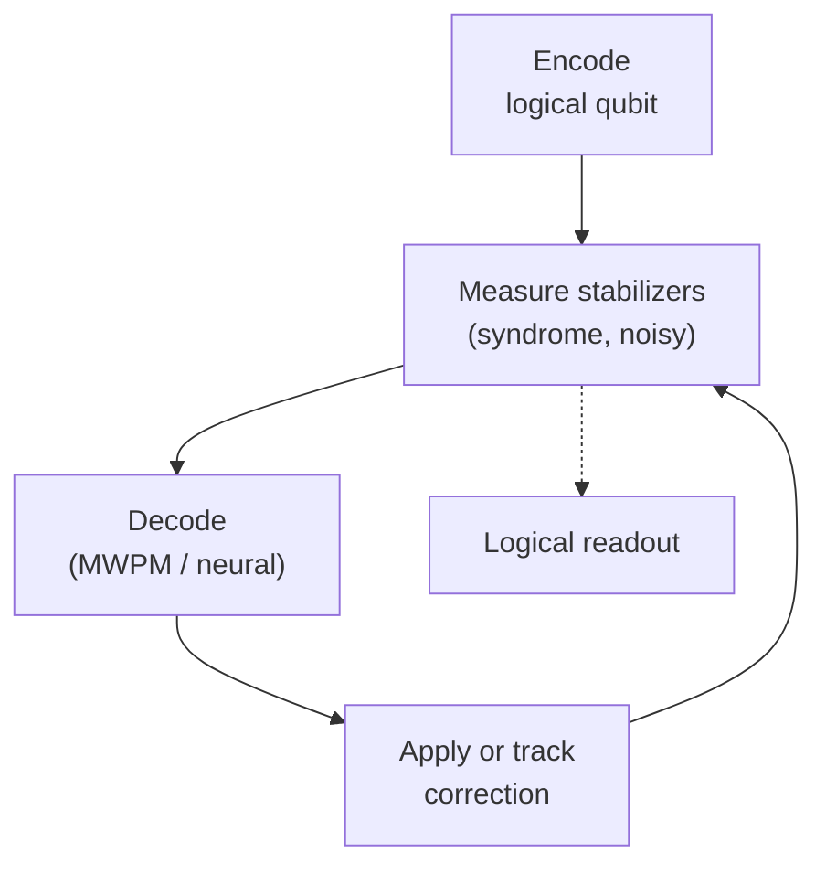

# 12 · A First Look at Quantum Error Correction

By now you've met the transmon, learned how it decoheres with timescales $T_1$ and $T_2$, and seen how we read it out dispersively. Here's the uncomfortable truth: even our best superconducting qubits hold quantum information for only tens-to-hundreds of microseconds (illustrative), and gate errors sit around $10^{-3}$ (illustrative). A useful algorithm needs *billions* of reliable operations, $10^{9}$ or more. We're off by orders of magnitude. Quantum error correction (QEC) is how we bridge that gap, not by building better qubits, but by building a *better-behaved logical qubit* out of many imperfect physical ones.

## Why you can't just copy a qubit

Classical computers fight errors by redundancy: store a bit three times, take a majority vote. Quantum mechanics forbids the naive version of this for two independent reasons:

1. **No-cloning theorem.** There is no unitary that maps $|\psi\rangle|0\rangle \to |\psi\rangle|\psi\rangle$ for an *arbitrary unknown* $|\psi\rangle$. (Linearity of $U$ is incompatible with cloning a general superposition, try it on $|0\rangle$ and $|1\rangle$, then on $\tfrac{1}{\sqrt2}(|0\rangle+|1\rangle)$, and the two predictions disagree.)
2. **Measurement back-action.** Even if you *could* copy, directly *measuring* a qubit to check it collapses its superposition and destroys the amplitude information you were trying to protect.

The escape: encode one **logical** qubit across many physical qubits, and measure only *correlations between qubits*, never the qubits themselves. The Pauli correlation operators are **stabilizers**; their measured eigenvalues are the **syndrome**.

## The three-qubit bit-flip code, built honestly

Consider the simplest example: three qubits protecting against a single bit-flip ($X$) error. We encode

$$|0\rangle_L = |000\rangle, \qquad |1\rangle_L = |111\rangle, \qquad \alpha|0\rangle_L + \beta|1\rangle_L = \alpha|000\rangle + \beta|111\rangle.$$

Read that last expression carefully: it is a *single entangled state*, **not** three copies of $\alpha|0\rangle+\beta|1\rangle$. The amplitudes $\alpha,\beta$ live in the correlations, not in any one qubit, which is exactly why no-cloning is not violated. Let's derive the encoder, step by step:

- **Goal.** Spread one qubit's information across three so that any *single* flip is recoverable, mimicking the classical 3-bit repetition code.
- **Start** from $|\psi\rangle|00\rangle = (\alpha|0\rangle + \beta|1\rangle)|00\rangle$.
- **Apply** $\mathrm{CNOT}(1{\to}2)$: this copies the *computational-basis label* of qubit 1 onto qubit 2, giving $\alpha|00\rangle|0\rangle + \beta|11\rangle|0\rangle$, already entangled.
- **Apply** $\mathrm{CNOT}(1{\to}3)$: we obtain $\alpha|000\rangle + \beta|111\rangle$.
- **Check.** The output is entangled, not a product $|\psi\rangle^{\otimes 3}$, so no cloning occurred. We "copied" only basis labels, never the amplitudes.



### Stabilizers: asking "did an error happen?" without asking "what's the state?"

Instead of measuring any data qubit directly, we measure the eigenvalues of two **parity-check stabilizer operators**:

$$S_1 = Z_1 Z_2, \qquad S_2 = Z_2 Z_3, \qquad [S_1, S_2] = 0.$$

Why these work, step by step:

- **Codewords are $+1$ eigenstates.** Both $|000\rangle$ and $|111\rangle$ have *even parity* on every pair, so $Z_iZ_j|\text{codeword}\rangle = +|\text{codeword}\rangle$. The code space is the joint $+1$ eigenspace of $S_1,S_2$.
- **They reveal only relative parity.** A $\pm1$ outcome says whether neighbours *agree*, never whether they are $0$ or $1$, so $\alpha,\beta$ are never measured and the superposition survives.
- **They detect a flip.** Use $XZ = -ZX$. Apply $X_2$: it anticommutes with both $Z$'s touching qubit 2, so $S_1 X_2 = -X_2 S_1$ and $S_2 X_2 = -X_2 S_2$. Hence $X_2|\psi_L\rangle$ is a $-1$ eigenstate of *both* checks: syndrome $(-1,-1)$.
- **Each single error is unique.** Tabulating all single $X$ errors gives a one-to-one syndrome map, so a classical lookup inverts it.

| Error | $S_1 = Z_1Z_2$ | $S_2 = Z_2Z_3$ | Decoder action |
|-------|:---:|:---:|----------------|
| none  | $+1$ | $+1$ | do nothing |
| $X_1$ | $-1$ | $+1$ | flip q1 |
| $X_2$ | $-1$ | $-1$ | flip q2 |
| $X_3$ | $+1$ | $-1$ | flip q3 |

*Footnote:* the syndrome columns never depend on $\alpha,\beta$, the encoded amplitudes are untouched. The logical operators here are $Z_L = Z_1$ and $X_L = X_1X_2X_3$; both commute with $S_1,S_2$, so correction never disturbs the stored information.

> **Intuition aside.** Stabilizers are like the parity bits on a Sudoku grid. You never reveal the hidden numbers; you only check "does this row still add up?" A violated check localizes the mistake without exposing the solution. QEC is continuous, gentle Sudoku-checking on your quantum data.

### Digitizing continuous errors, the conceptual heart of QEC

A real superconducting qubit doesn't suffer tidy discrete flips; it drifts under *continuous* noise (a small over-rotation, a bit of amplitude damping). How can a finite correction set possibly fix a continuum of errors? Because any single-qubit operation expands in the Pauli basis:

$$E = c_I\, I + c_X\, X + c_Y\, Y + c_Z\, Z.$$

- Within the computational subspace, the four Paulis $\{I,X,Y,Z\}$ are a complete basis for any $2\times2$ operator, so **every** single-qubit error's Kraus operators are linear combinations of them.
- Apply $E$ to an encoded state, then measure the stabilizers. This is a *projective* operation onto syndrome subspaces.
- Each Pauli branch carries a definite syndrome. The measurement **collapses** the superposition of branches onto *one* outcome, with the corresponding probability.
- For a code whose recovery corrects that Pauli set, what's left is a single, *known* Pauli (up to a stabilizer) that the decoder removes.

So the analog noise of the lab gets **digitized** into a discrete $\{X,Y,Z\}$ the moment we look at the syndrome. In a full single-qubit-error-correcting code, correcting those three corrects arbitrary single-qubit errors. This is why a finite code can tame continuous noise.

> **The exception: leakage.** Digitization assumes every error stays inside the computational $\{|0\rangle,|1\rangle\}$ subspace, where the Paulis are a complete basis. A transmon can instead **leak** to $|2\rangle$ and higher (recall the weak anharmonicity of [Chapter 4](04-transmon.md) and the DRAG story of [Chapter 7](07-single-qubit-gates.md)). A leaked state is *not* any combination of $\{I,X,Y,Z\}$, so it escapes the Pauli-digitization argument and corrupts every stabilizer it touches. Real QEC stacks therefore add **leakage-reduction units** or explicit **reset** to pump population back into the qubit subspace, on top of the Pauli correction.

## A genuine code: phase-flips, then Shor's nine

The bit-flip code is blind to **phase** errors ($Z$). Its **Hadamard dual**, the phase-flip code, fixes that by working in the $\pm$ basis:

$$|0\rangle_L = |{+}{+}{+}\rangle,\quad |1\rangle_L = |{-}{-}{-}\rangle,\qquad S_1 = X_1X_2,\ S_2 = X_2X_3,$$

which corrects one $Z$ error but is now blind to $X$. Neither toy code corrects *both*. **Peter Shor's insight:** *concatenate* them. Encode each qubit of the phase-flip code into a bit-flip block. The result is the first full code that corrects an **arbitrary** single-qubit error, the $[[9,1,3]]$ Shor code.

That bracket notation $[[n,k,d]]$ is worth pinning down: **$n$** physical qubits encode **$k$** logical qubits with **distance $d$** = the minimum weight (number of single-qubit Paulis) of any undetectable logical operator. A distance-$d$ code corrects

$$t = \left\lfloor \tfrac{d-1}{2} \right\rfloor$$

arbitrary errors, the quantum analogue of classical sphere-packing: errors of weight $\le t$ live in disjoint "syndrome spheres." So $d=3$ corrects one error, $d=5$ corrects two, $d=7$ corrects three.

| Code | Formal quantum distance | Stabilizers | Corrects | Hardware note |
|------|:---:|---|---|---|
| bit-flip repetition | $[[3,1,1]]$; biased $X$-distance 3 | $Z_1Z_2,\ Z_2Z_3$ | one $X$ only | toy |
| phase-flip repetition | $[[3,1,1]]$; biased $Z$-distance 3 | $X_1X_2,\ X_2X_3$ | one $Z$ only | toy (Hadamard dual) |
| Shor | $[[9,1,3]]$ | 8 checks | any single error | first full code |
| surface, unrotated planar | $[[d^2+(d-1)^2,\,1,\,d]]$ data qubits | local $X$ & $Z$ checks | up to $t$ | simple count, larger footprint |
| surface, rotated planar | $[[d^2,\,1,\,d]]$ data qubits; typically $d^2-1$ measure ancillas | local $X$ & $Z$ checks | up to $t$ | common superconducting layout |

The repetition rows are deliberately biased codes: their distance is 3 only against the one error type each code is designed to correct (three $X$'s flip the bit-flip code's logical state). As a *full quantum* code each has distance $1$, since a single $Z$ on the bit-flip code (or a single $X$ on the phase-flip code) is an undetected logical operator of weight $1$ by the definition above. That is exactly why neither protects a general qubit, and why Shor's $[[9,1,3]]$, which concatenates the two, is the first code with genuine quantum distance $3$.

## The surface code

The surface code is today's front-runner for superconducting hardware, and the reason is mundane but decisive: it only needs **nearest-neighbour** couplings on a 2D grid, exactly what fixed-layout chips provide. **Data** qubits ($D$) sit on a lattice; interleaved **measure** (ancilla) qubits repeatedly measure local stabilizers. Bulk checks are four-body, while boundary checks have lower weight:

$$S_X = X_a X_b X_c X_d, \qquad S_Z = Z_a Z_b Z_c Z_d, \qquad [S_X, S_Z] = 0.$$

Why do these commute (so their eigenvalues can be extracted in the same QEC round)? Step by step:

- On any *single* shared qubit, $X$ and $Z$ anticommute ($XZ = -ZX$), contributing a $-1$ when you slide one stabilizer past the other.
- The geometry forces every $X$-plaquette and $Z$-plaquette to share **0 or 2** data qubits.
- Sliding $S_X$ past $S_Z$ gives $(-1)^{\text{shared}} = (-1)^{\text{even}} = +1$, so $[S_X,S_Z]=0$.
- Commuting stabilizers share an eigenbasis → a well-defined code space; hardware still schedules the shared-qubit gates inside each round.

```
   X     X     X         D = data qubit
 D --- D --- D --- D      X = X-type (vertex) check
   | Z  |  Z |  Z |       Z = Z-type (plaquette) check
 D --- D --- D --- D  · · · · · · · · ·  logical X  (length d)
   | Z  |  Z |  Z |
 D --- D --- D --- D      one Z-check binds its 4
   X     X     X          surrounding D's: Z_a Z_b Z_c Z_d
        :
        :  logical Z  (a vertical chain of D's, length d)
```

A **logical operator** is a chain of single-qubit Paulis stretching all the way *across* the lattice; the shortest such chain has length $d$. Corrupting the logical qubit therefore requires an *undetected* error string spanning the full distance, and the probability of that falls exponentially as $d$ grows.

### Syndromes live in spacetime

One honest complication the toy story hides: **syndrome extraction is itself noisy.** Each bulk weight-4 check is read by *one* ancilla through a sequence of 4 CNOT/CZ gates (one per data qubit in the stabilizer), plus ancilla reset and readout, every one of which can fail. So we cannot trust a single round's syndrome. A distance-$d$ memory needs order-$d$ rounds to build time distance, then repeats for however long the memory or algorithm must run. The fix is to decode the whole **$(2{+}1)$D spacetime volume** at once (two space dimensions plus time).


*One QEC cycle, repeated as long as the memory or computation requires.*

In repeated syndrome extraction, a **defect** or detection event is a change in a check outcome between adjacent rounds, not merely a single $-1$ stabilizer value. A data error usually creates a space-like pair of detection events; a measurement error creates a time-like pair on the same check in neighboring rounds; a boundary can absorb one endpoint. The decoder, classically **minimum-weight perfect matching (MWPM)**, increasingly correlated or neural decoders, infers the most likely chain and applies (or just bookkeeps) a correction. Doing this fast enough is a real frontier: real-time decoding latency must keep pace with the rounds (illustrative ~tens of microseconds).

```
defect pair (harmless, local):     spanning chain (logical FAILURE):
  o-o-*-e-*-o-o                       *-e-e-e-e-e-e-*
        ↑ one data error              defects only at the two boundaries,
   two flipped checks bracket it      error of weight d crosses undetected
```

## The threshold theorem, why this is allowed to work

The obvious worry: more qubits means more places to fail, and the correction circuitry is itself faulty. Does scaling help or hurt? The **threshold theorem** answers: if the physical error rate $p$ per operation is below a code-specific critical value $p_{\text{th}}$, then the **logical** error rate falls fast as you scale up:

$$p_L(d) \;\approx\; A_d\left(\frac{p}{p_{\text{th}}}\right)^{\lfloor (d+1)/2 \rfloor}, \qquad \Lambda \equiv \frac{p_L(d)}{p_L(d+2)} \approx \frac{A_d}{A_{d+2}}\frac{p_{\text{th}}}{p}.$$

The reasoning: distance $d$ corrects up to $t=(d-1)/2$ faults, so the leading failure mechanisms start at $t+1=(d+1)/2$ faults along a minimum logical spacetime path. The actual faults need not themselves span the lattice or occur simultaneously; failure occurs when the faults together with the decoder's recovery form a nontrivial logical operator. A specific weight-$m$ chain has probability $\sim p^m$, and counting distance-dependent configurations gives the scaling above. Take the ratio for consecutive odd distances and $\Lambda$ is roughly $p_{\text{th}}/p$ when prefactors vary slowly, with the more general prefactor ratio shown above. **$\Lambda > 1$ is the operational signature of being below threshold:** every step $d \to d{+}2$ divides logical error by $\Lambda$.

> **Note.** The threshold is *not* one universal number. The often-quoted surface-code $\sim1\%$ is a circuit-level, local-stochastic/depolarizing-ish ballpark with a matched decoder. Code-capacity thresholds can be much higher, phenomenological thresholds differ, and real-device leakage, coherent drift, crosstalk, stray interactions, and rare correlated events can lower the practical pseudo-threshold or create a logical-error floor.

### Worked example (illustrative numbers only)

Numbers chosen for clean arithmetic, **not** measured values. Take $p_{\text{th}} = 1\%$, device $p = 0.1\%$, prefactor $A = 1$.

- **Step 1: ratio per step.** $p/p_{\text{th}} = 0.001/0.01 = 0.1$, so each factor contributes $\times 10$ suppression.
- **Step 2: evaluate by distance:**

| $d$ | exponent $(d{+}1)/2$ | $p_L \sim (0.1)^{\text{exp}}$ | vs. $d{=}3$ | rotated data | measure ancillas | total before leakage |
|:---:|:---:|:---:|:---:|:---:|:---:|:---:|
| 3 | 2 | $1\times10^{-2}$ | $1$ | 9 | 8 | 17 |
| 5 | 3 | $1\times10^{-3}$ | $\div10$ | 25 | 24 | 49 |
| 7 | 4 | $1\times10^{-4}$ | $\div100$ | 49 | 48 | 97 |
| 9 | 5 | $1\times10^{-5}$ | $\div1000$ | 81 | 80 | 161 |

- **Step 3: read off $\Lambda$.** $\Lambda = p_{\text{th}}/p = 0.01/0.001 = 10 > 1$ → below threshold; scaling wins.
- **Step 4: qubit cost.** Reaching $p_L \sim 10^{-5}$ costs $\sim81$ rotated-layout data qubits plus $\sim80$ measure ancillas before leakage/helper qubits. In the larger unrotated planar count the data-qubit number would be $d^2+(d-1)^2=145$.
- **Step 5: contrast above threshold.** If instead $p = 2\% > p_{\text{th}}$, the below-threshold scaling no longer gives a valid probability; its formal growth signals that larger distance no longer provides exponential suppression, so logical errors approach order-one rather than improving. Adding qubits now makes things **worse**, the qualitative meaning of being above threshold.

The same scaling picture explains why below-threshold operation wins exponentially and why above-threshold operation loses; within its valid domain it converts a target $p_L$ into a concrete qubit budget.

## From memory to computation

A **logical qubit** is the protected two-level subspace, manipulated *only* through logical and stabilizer-respecting operations, you never touch the bare physical state. Everything above protects a quantum *memory*. Computing needs **logical gates**, and they don't come for free:

- **Transversal gates** apply the same single-qubit gate to every physical qubit, giving some Clifford operations cheaply and fault-tolerantly.
- **Lattice surgery** merges and splits surface-code patches to realize two-qubit logical operations (e.g. logical $\mathrm{CNOT}$) using only the same nearest-neighbour checks.
- **Magic-state distillation** supplies the non-Clifford gates (the $T$ gate) that no transversal surface-code operation provides, and it is typically the *dominant* resource cost in fault-tolerant estimates.

A recent superconducting milestone (2024-2025) demonstrated $\Lambda > 1$, an illustrative reported $\approx 2.14$, across increasing distances up to $d=7$, with the logical memory *outliving the best physical qubit*. That's the first clear evidence that scaling up suppresses errors as predicted. Treat the numbers as illustrative of the milestone, not values to reproduce. Demonstrating $\Lambda>1$ for a memory is *necessary but not sufficient* for a fault-tolerant computer, universal computation still needs the logical gates above.

## Common pitfalls

- **"QEC copies the qubit three times."** No, $\alpha|000\rangle+\beta|111\rangle$ is one entangled state; the redundancy lives in correlations, not copies.
- **"The stabilizer measurement reveals the logical state."** It returns only parities, independent of $\alpha,\beta$.
- **"Continuous errors need infinitely many corrections."** The syndrome measurement *digitizes* them onto $\{X,Y,Z\}$.
- **"More qubits always means more errors."** Only *above* threshold; below $p_{\text{th}}$, exponential suppression wins.
- **"Measurements are perfect."** They aren't, hence repeated rounds and $(2{+}1)$D decoding.
- **"Distance $d$ corrects $d$ errors."** It corrects $\lfloor(d-1)/2\rfloor$; $d=3$ corrects only one.

## Key takeaways

- No-cloning + measurement collapse forbid classical-style redundancy; QEC instead measures **stabilizers**, parity checks that detect errors without revealing the encoded state.
- Stabilizer measurement **digitizes** continuous noise: for a code that corrects the full single-qubit Pauli set, expanding errors in $\{I,X,Y,Z\}$ and projecting onto a syndrome makes finite recovery possible.
- A **stabilizer code** protects the joint $+1$ eigenspace of commuting Paulis; biased repetition codes lead to Shor $[[9,1,3]]$ and then surface codes, where formal $[[n,k,d]]$ distance gives $t=\lfloor(d-1)/2\rfloor$.
- The **surface code** uses 2D nearest-neighbour local checks, weight-4 in the bulk and lower weight at boundaries; noisy syndromes force $(2{+}1)$D spacetime decoding.
- The **threshold theorem**: under the assumed local-noise and decoder model, below $p_{\text{th}}$, $p_L$ drops exponentially with $d$; empirically $\Lambda>1$ across a controlled family of distances is operational evidence that scaling is winning for that memory experiment.
- A **logical qubit** is the protected subspace; reaching computation needs lattice surgery and magic-state distillation, the dominant fault-tolerance cost.

## Go deeper

- Krantz, Kjaergaard, Yan, Orlando, Gustavsson, Oliver, *A Quantum Engineer's Guide to Superconducting Qubits* (Appl. Phys. Rev. 6, 021318, 2019), [arXiv:1904.06560](https://arxiv.org/abs/1904.06560).
- Blais, Grimsmo, Girvin, Wallraff, *Circuit Quantum Electrodynamics* (Rev. Mod. Phys. 93, 025005, 2021), [arXiv:2005.12667](https://arxiv.org/abs/2005.12667).
- Fowler, Mariantoni, Martinis, Cleland, *Surface codes: Towards practical large-scale quantum computation* (Phys. Rev. A 86, 032324, 2012), [arXiv:1208.0928](https://arxiv.org/abs/1208.0928).
- Terhal, *Quantum error correction for quantum memories* (Rev. Mod. Phys. 87, 307, 2015), [arXiv:1302.3428](https://arxiv.org/abs/1302.3428).
- Google Quantum AI (Acharya et al.), *Quantum error correction below the surface code threshold* (Nature 638, 920, 2025), [arXiv:2408.13687](https://arxiv.org/abs/2408.13687).

---

[← Back to project README](../README.md) · [Tutorial index](./README.md)
